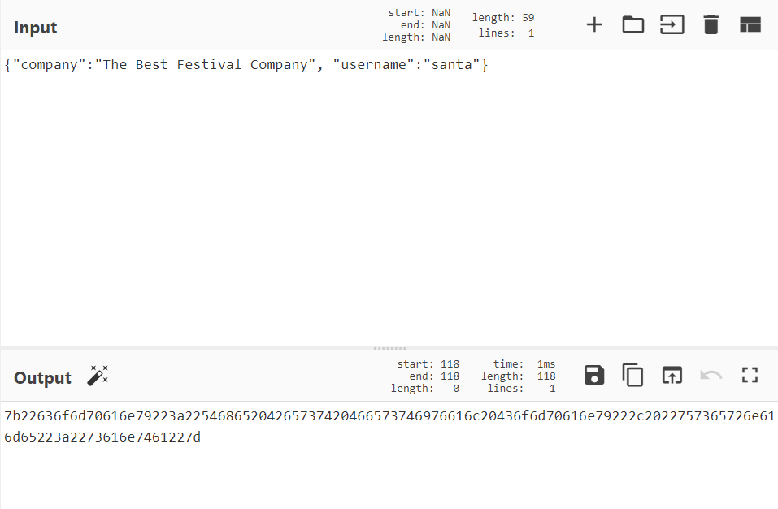

# Day 1 | A Christmas Crisis

`Web Exploitation` `HTTP` `Cookie`

---

## Learning Outcomes

- Learn how the web works and what is http?
- What are website cookies?
- Using CyberChef 
- Escalation of Privilege using cookies

## Summary

tldr;
- Register akun lalu login
- Periksa stored cookie value
- Decode cookie dari hex, hasil decode berupa json 
- Hanya bagian {"username":"value"} yang dinamik.
- Privilege escalation dengan meng*encode* ulang cookie
- Get the flag

## Write up

Tampilan web dari mesin yang di deploy :


### What is the name of the cookie used for authentication?

Untuk mengetahui cookie yang digunakan untuk otentikasi, maka registrasi diperlukan.

- User `fahmi `  
- Password `fahmi`


Setelah login, ditampilkan sebuah dashboard untuk melakukan command control dan linenya dalam keadaan mati.

Mengaktifkan line tersebut adalah objektif dari task ini.


Cookie yang tersimpan dapat dilihat menggunakan developer tools melalui kombinasi `ctrl+shift+i` atau `f12`.


### In what format is the value of this cookie encoded?

Dengan menggunakan CyberChef --> Auto, format cookienya adalah hexadecimal.

### Having decoded the cookie, what format is the data stored in?

Masih menggunakan tools CyberChef
https://gchq.github.io/CyberChef/#recipe=From_Hex('Auto')

Input :
```
7b22636f6d70616e79223a22546865204265737420466573746976616c20436f6d70616e79222c2022757365726e616d65223a226661686d69227d
```

Output :
```
{"company":"The Best Festival Company", "username":"fahmi"}
```

### What is the value of Santa's cookie?

Setelah melakukan dua kali register, ternyata hanya bagian username yang berubah. 

Maka, hal yang bisa dicoba adalah merubah data output dengan username yang berbeda setelah itu encode kembali sebagai hex.





Hasil :

```
7b22636f6d70616e79223a22546865204265737420466573746976616c20436f6d70616e79222c2022757365726e616d65223a226661686d69227d
```

Ganti value yang ada pada browser dengan value baru yang di generate melalui CyberChef

