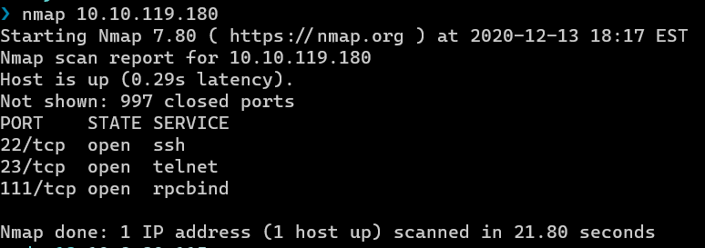
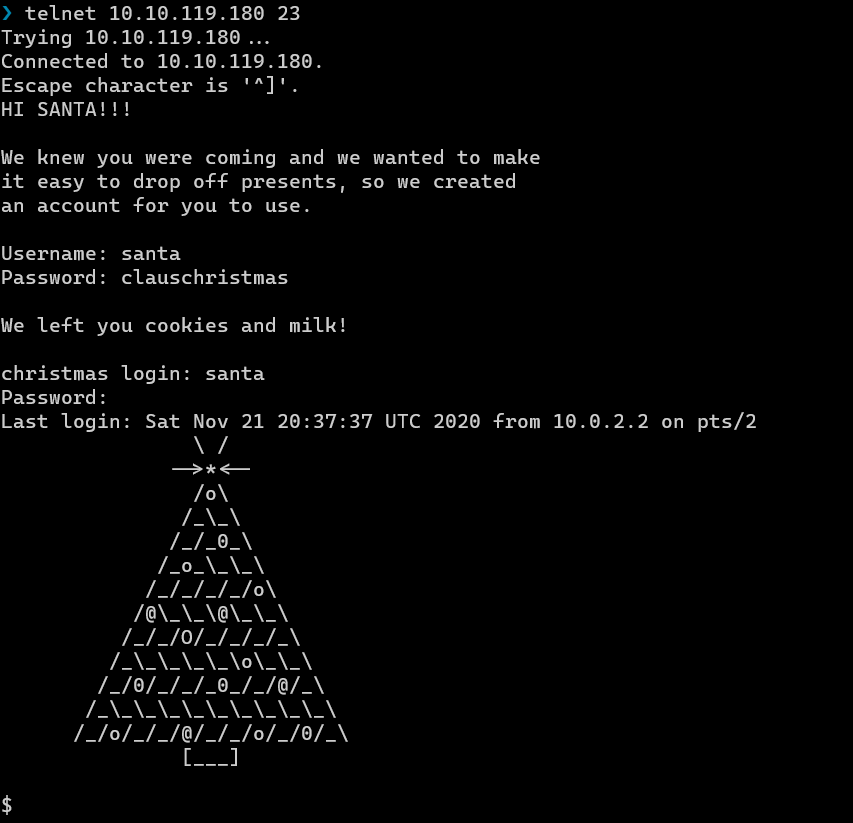
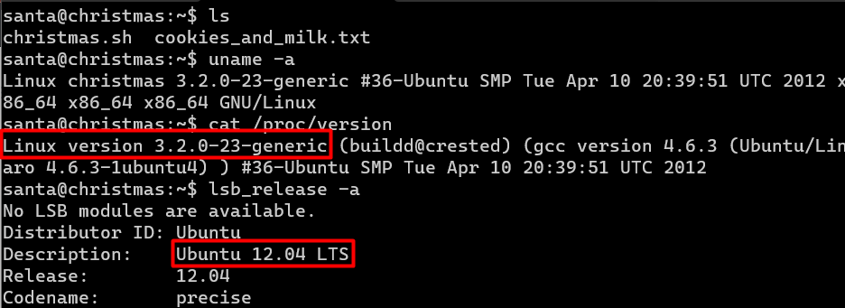
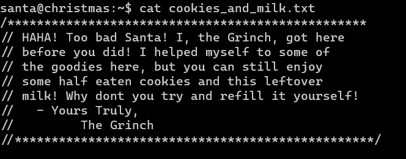
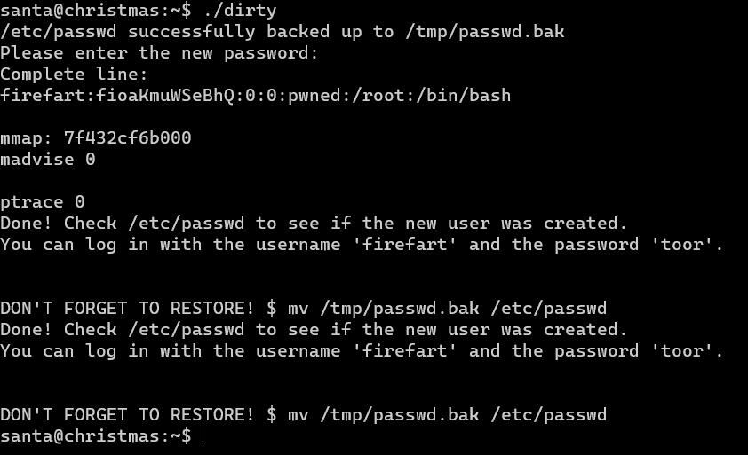
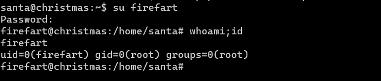
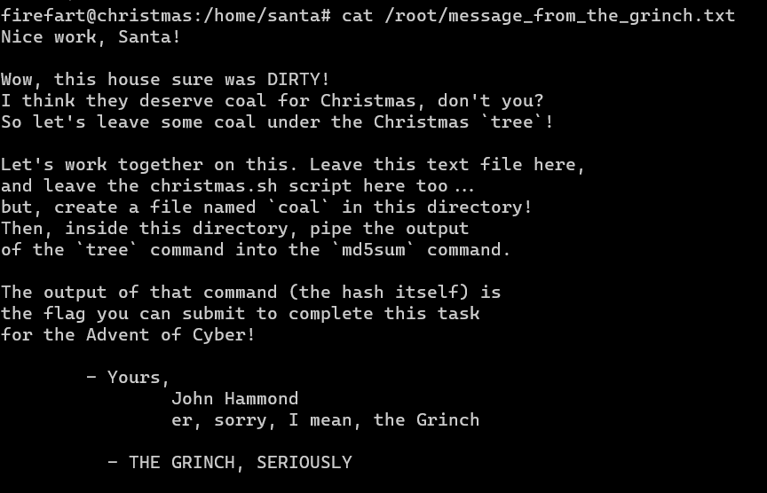
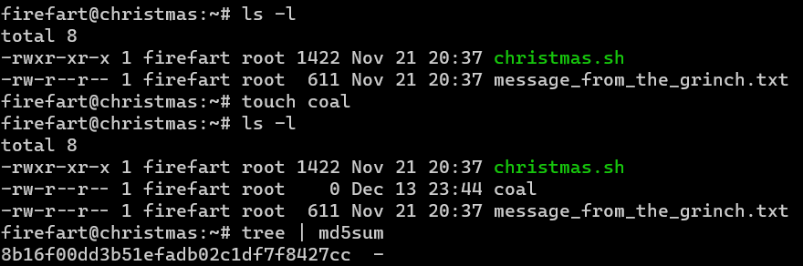

# Day 13 | Coal for Christmas

`TryHackMe` `Dirty COW` `CVE-2016-5195` `Privilege Escalation`

---

## Learning Outcomes

Hasil pembelajaran
- Pendekatan metode penetrasi testing
- Privilege Escalation dengan dirtyCOW 


## Summary

tl;dr
- Login ke telnet melalui port 23 untuk mendapatkan kredensial
- Login ke SSH menggunakan kredensial yang didapatkan pada telnet
- Gunakan [DirtyCOW](https://raw.githubusercontent.com/Gigi4/code/master/dirty.c) untuk privilege escalation 
- Ketikkan perintah `tree | md5sum` pada direktori `/root` setelah membuat file `coal` di direktori tersebut 

## Write-up

Task kali ini akan mengeksploitasi mesin yang di deploy menggunakan kernel linux yang rentan terhadap CVE-2016-5195 (**Dirty COW**).

Berikut penyelesaiannya dengan pendekatan dari fase-fase yang umumnya ada pada penetration testing.

## Port Scannning
Fase ini melakukan pemindaian port pada mesin yang di deploy menggunakan nmap.

```
nmap [IP_MESIN]
```
Hasil pemindaian :



### Q1: What old, deprecated protocol and service is running?

Dari hasil pemindaian diatas, protokol usang yang berjalan ada pada port 23, yaitu `telnet`. 

> Telnet dikembangkan pada tahun 1969. Telnet pada saat itu banyak dipakai oleh institusi akademik, perusahaan swasta, hingga fasilitas penelitian milik pemerintah untuk *remote login*. Pada saat itu juga keamanan belum terlalu menjadi perhatian sampai tahun 1990. 
> Pengunaan telnet seharusnya di hentikan karena beberapa alasan berikut :
> - Tidak ada enkripsi dalam proses pengiriman datanya
> - Umumnya tidak ada otentikasi (user dan password)
> - Banyak celah kerentanan

## Initial Access

Telnet dapat diakses menggunakan **telnet client** (umumnya sudah menjadi bawaan pada distribusi linux) atau **netcat**.

Cara mengaksesnya cukup dengan perintah

```
telnet [ip] [port]
```

### Q2: What credential was left for you?

Saat mendapatkan akses ke telnet, terdapat *banner* yang berisi kredensial dengan, 

`username: santa`   
`password: clauschristmas`  



## Enumeration

Enumerasi secara internal dapat dimulai dengan perintah-perintah untuk mendapatkan informasi dari sistem, seperti

`cat /proc/version`
`uname -a`
`lsb_release -a`



> Referensi :
https://blog.g0tmi1k.com/2011/08/basic-linux-privilege-escalation/

### Q3: What distribution of Linux and version number is this server running?

Hasil enumerasi mendapati versi dan distribusi linux yang berjalan pada mesin tersebut adalah `Ubuntu 12.04` dan kernelnya adalah versi 3.2.0 (2012) 

Mesin tersebut kemungkinan besar rentan terhadap kernel exploit [Dirty COW](https://dirtycow.ninja/) (CVE-2016-5195).

> Take a look at the cookies and milk that the server owners left for you. You can do this with the cat command as mentioned earlier.
> cat cookies_and_milk.txt.

### Q4: Who got here first?



Berdasarkan gambar diatas, jawabannya adalah the `Grinch`.

### Q5: What is the verbatim syntax you can use to compile, taken from the real C source code comments?
File cookies_and_milk.txt mengandung source code asli dari repository berikut:

https://raw.githubusercontent.com/Gigi4/code/master/dirty.c

Yang juga merupakan salah satu dirtyCOW exploit. Cara compile berdasarkan source codenya adalah:

```
gcc -pthread dirty.c -o dirty -lcrypt`
```

## Privilege Escalation
### Q6: What "new" username was created, with the default operations of the real C source code?

Exploit tersebut dapat digunakan untuk privilege escalation dan membuat username baru bernama `firefart`.



Setelah exploit berhasil, pindah akun ke `firefart` dengan perintah `su firefart`

 



Untuk menjawab pertanyaan terakhir, kita perlu membuat file `coal` di direktori `/root`. 

```
$ cd /root
$ touch coal
$ tree | md5sum
```

### Q7: What is the MD5 hash output?



done.


