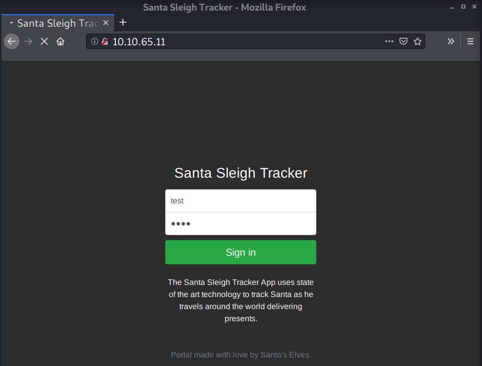
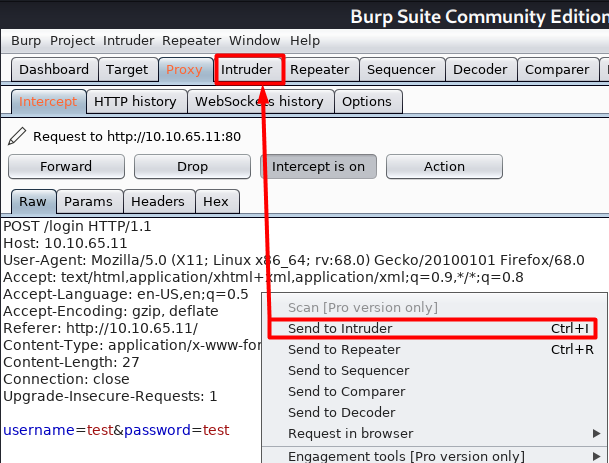
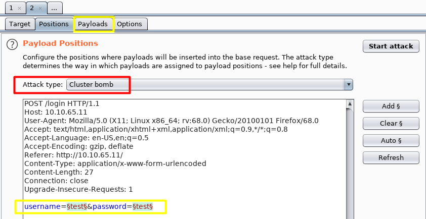
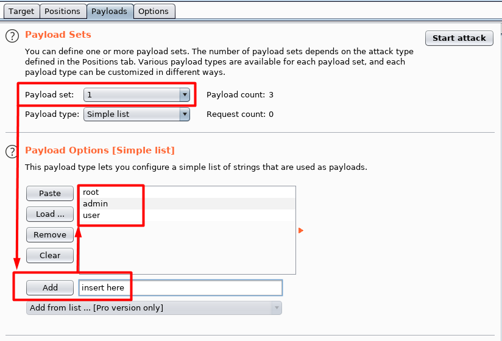
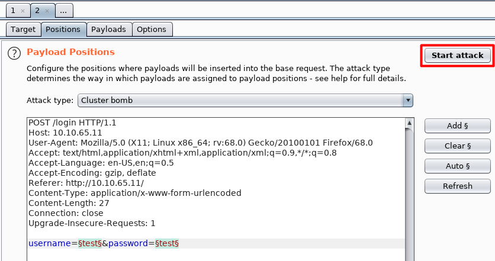
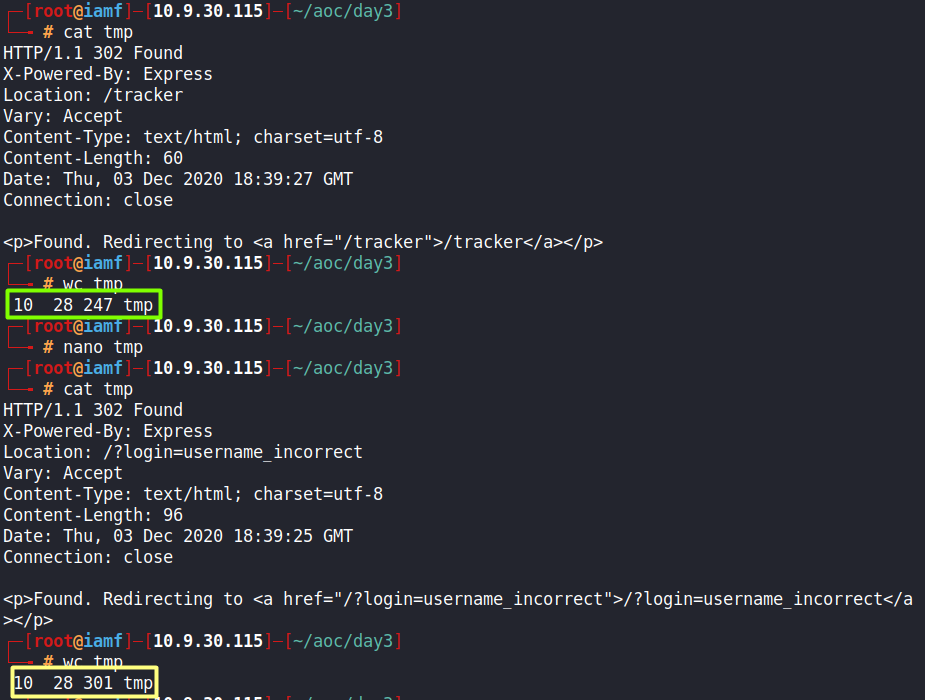
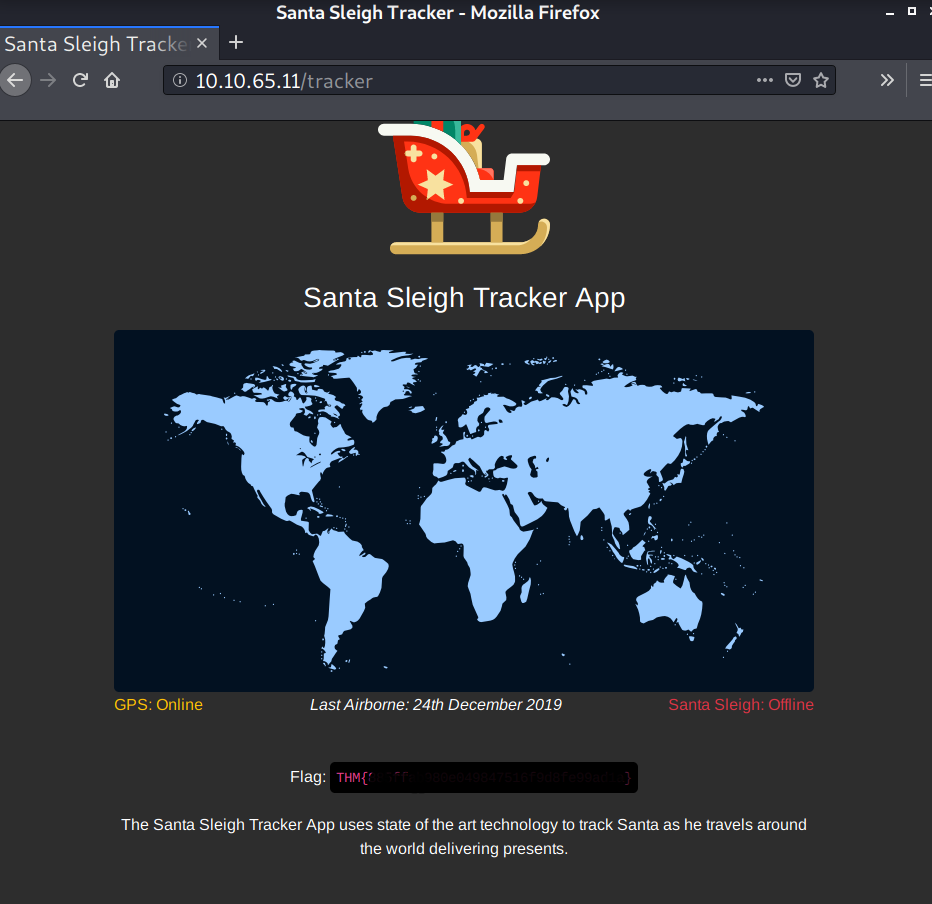

# Day 3 |  Christmas Chaos

`Web Exploitation` `Authentication Bypass` `Bruteforce`

---
## Learning Outcomes

- Understanding Authentication
- Understand the use of default credentials and why they're dangerous
- Bypass a login form using BurpSuite

## Summary

- Intercept login request using Burp suite
- Send the intercepted request to intruder
- Choose attack type and set the payload
- Identify the length or the status response to find a successful login.

## Write up

Mesin yang di deploy dari task pada room ini masih berupa sebuah web server.

Disini, saya dalam posisi sudah mempersiapkan Burp suite untuk melakukan intersep request yang dilakukan pada login page berikut.

Terlihat dua parameter yang dikirim pada body http request.
- username 
- password

Tekan kombinasi `ctrl+i` pada request untuk mengirimnya ke Intruder.

Fitur `Intruder` dari Burp suite dapat digunakan untuk melakukan bruteforce. 

Pada tab positions, kita menentukan tipe serangan yang akan dilakukan. Disini menggunakan cluster bomb, artinya menggunakan semua kombinasi dari Payloads yang di set.

Username dan password yang umum dapat digunakan sebagai payload.

| Username 	| Password 	|
|:---------:|:---------:|
| root		|	root	|
| admin		|	password|
| user		|	12345	|

List username dimasukkan pada payload ke 1, sedangkan password dimasukkan pada payload ke 2.

Setelah payload selesai dibuat, maka attack dapat mulai.

Berhasil atau tidaknya serangan menggunakan payload tersebut dapat diidentifikasi melalui `Status` atau `Length`

`Status` adalah kode status dari HTTP Response, sedangkan `Length` adalah isi dari http response. Berikut untuk lebih jelasnya

Flag didapatkan setelah berhasil melakukan login

## Mitigation

Sebaiknya data-data dummy yang umumnya digunakan pada dev environment usahakan untuk dihapus dan default credentialsnya diganti sebelum deploy ke prod environment.