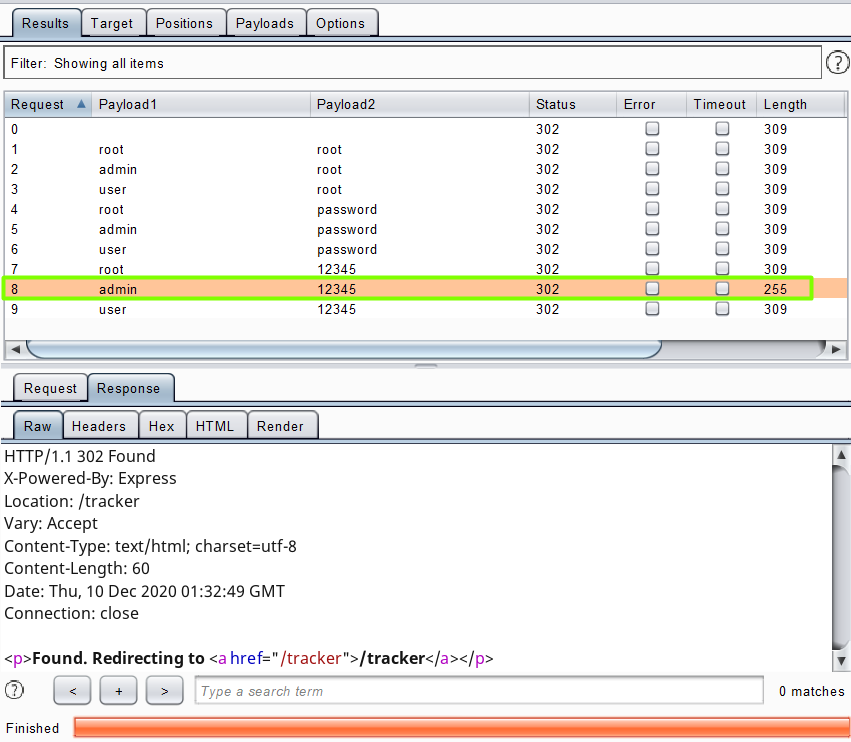
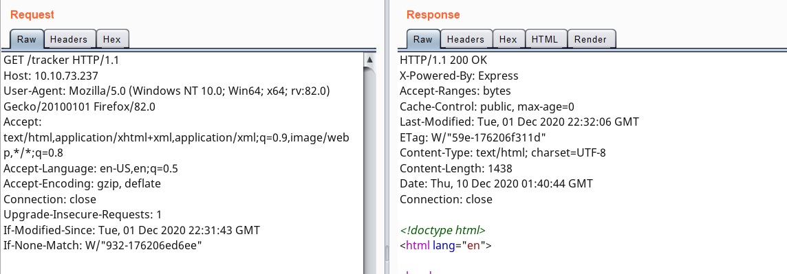

# Day 3 |  Christmas Chaos

`TryHackMe` `Web Exploitation` `Security` `Authentication Bypass` `Bruteforce`

---

## Learning Outcomes

Hasil pembelajaran 

- Mengerti perbedaan antara Authentication dan Authorization
- Mengetahui penggunaan dari default credentials.
- Brute force dan bypass login page dengan Burp Suite

## Summary

tldr;

- Intersep login request dengan Burp Suite
- Gunakan default credential umum yang ada pada task ini
- Lakukan brute force dengan tipe serangan cluster bomb menggunakan intruder
- Identifikasi login yang sukses berdasarkan HTTP Status Code atau Length dari HTTP Response

## Story

>*McSkidy is walking down the corridor and hears a faint bleeping noise, Beep.... Beep.... Beep... as McSkidy gets closer to Sleigh Engineering Room the faint noise gets louder and louder.. BEEP.... BEEP.... Something is clearly wrong! McSkidy runs to the room, slamming open the door to see Santa's sleighs control panel lite up in red error messages! "Santa sleigh! It's been hacked, code red.. code red!" he screams as he runs back to the elf security command center.*
>
>*Can you help McSkidy and his team hack into Santa's Sleigh to re-gain control?*

## Write-up

Mesin yang di deploy dari task pada room ini masih berupa sebuah web server.

### Q1 : What is the flag?

Disini, saya dalam posisi sudah mempersiapkan Burp suite untuk melakukan intersep request yang dilakukan pada login page berikut.

Terlihat dua parameter yang dikirim pada body http request.
- username 
- password

Tekan kombinasi `ctrl+i` pada request untuk mengirimnya ke Intruder.

Fitur `Intruder` dari Burp suite dapat digunakan untuk melakukan bruteforce. 

Pada tab positions, kita menentukan tipe serangan yang akan dilakukan. Disini menggunakan cluster bomb, artinya menggunakan semua kombinasi dari Payloads yang di set.

Username dan password yang umum dapat digunakan sebagai payload.

| Username 	| Password 	|
|:---------:|:---------:|
| root		|	root	|
| admin		|	password|
| user		|	12345	|

List username dimasukkan pada payload ke 1, sedangkan password dimasukkan pada payload ke 2.

Setelah payload selesai dibuat, maka attack dapat mulai.

Berhasil atau tidaknya serangan menggunakan payload tersebut dapat diidentifikasi melalui `Status` atau `Length`

`Status` adalah kode status dari HTTP Response, sedangkan `Length` adalah isi dari http response. `Status 200` atau perubahan pada Length dapat berarti sesuatu. 

Berdasarkan gambar di atas, response yang diberikan mengandung `status 302` tetapi lengthnya tidak sama dengan yang lain. Hal ini bisa diartikan bahwa `admin:12345` adalah username dan password yang valid.

Lihat gambar berikut untuk lebih jelasnya.

Flag didapatkan setelah berhasil melakukan login

Namun ternyata dengan mengakses langsung `/tracker` tanpa username dan password, juga adalah `status 200`.

