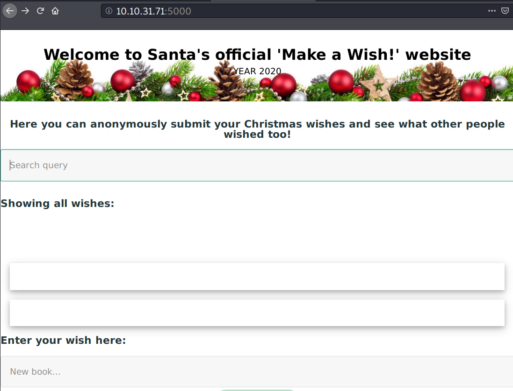
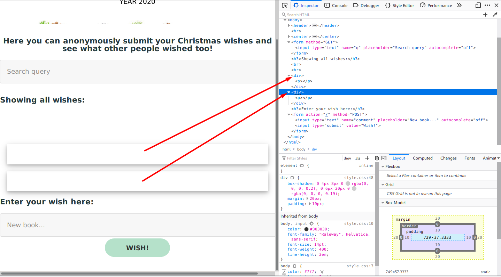

# Day 6 | Be careful with what you wish on a Christmas night

`Web Exploitation` `Cross-Site Scripting` `XSS`

---

## Learning Outcomes

- Understanding what is XSS?
- Types of XSS Attack
- Using OWASP ZAP

## Summary

1. Use OWASP ZAP

## Write up

Pada task kali ini diberikan suatu halaman web dengan dua *input field* dan tidak ada flag.
 
Di field dengan tombol "Wish", ketika tag `<p></p>` di-*submit*, halaman page tersebut menambahkan suatu baris kosong, seperti berikut:



Kedua baris tersebut masih ada bahkan setelah di refresh, artinya web ini memiliki XSS *vulnerability* yaitu tipe *stored* XSS.



Sedangkan pada input field "Search query", *vulnerability*-nya adalah *reflected* XSS.


Selanjutnya, gambar berikut adalah hasil otomatisasi dengan menggunakan OWASP ZAP. Cara instalasi ada diakhir writeup menggunakan docker.


## OWASP ZAP Installation on Docker

1. Pull image
```
docker pull owasp/zap2docker-stable
```

2. Run container
```
docker run -u zap -p 8080:8080 -p 8090:8090 -i owasp/zap2docker-stable zap-webswing.sh
```

3. Open at `http://localhost:8080/zap/`

Reference :
https://www.zaproxy.org/docs/docker/about/