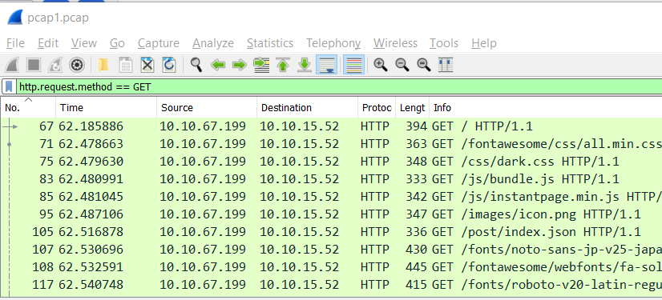
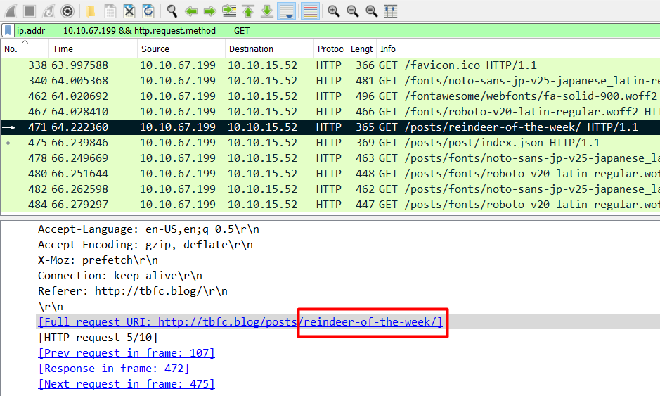
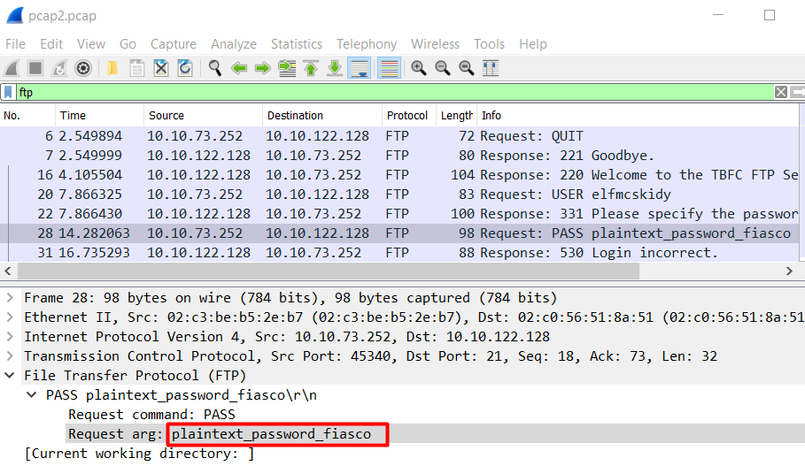
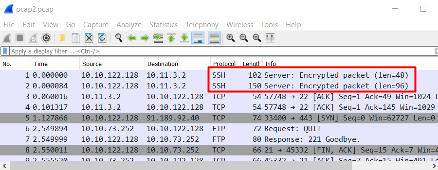

# Day 7 |  The Grinch Really Did Steal Christmas

`Networking` `Wireshark` `Packet Analysis`

---

## Learning Outcomes
- Understanding
	- IP address
	- Network Protocol
	- TCP/IP Three-Way handshake
- Packet analysis using Wireshark
- Extracting file from pcap.

## Summary

1. Download the file provided in this task.
2. Open it on wireshark
3. Use icmp as filter for question 1.
4. Use http as filter for question 2.
5. Use ip address and http as filter for question 3
6. Use ftp as filter for question 4.
7. Use wireshark export feature to recover a captured zip file from a specific packet.

## Write up

Pada task kali ini, writeup akan mengikuti *Challenge* yang diberikan dan menjawab pertanyaan-pertanyaan yang diberikan dibawah.

### Challenge :
*"Download the ZIP file "aocpcaps.zip" that is attached to this task, use a combination of the filters and features of Wireshark we've covered to answer the questions below:"*

#### Open `pcap1.pcap` in Wireshark. What is the IP address that initiates an ICMP/ping?

Dengan menggunakan filter icmp dan melihat urutan nomer paket, kita bisa melihat siapa yang terlebih dulu menginisiasi sebuah ping (request).


#### If we only wanted to see HTTP GET requests in our `pcap1.pcap` file, what filter would we use?

Hal ini cukup dengan menggunakan filter `http.request.method == GET`



#### Now apply this filter to `pcap1.pcap` in Wireshark, what is the name of the article that the IP address `10.10.67.199` visited?

Untuk menjawab pertanyaan ini, kita bisa menggunakan dua filter. Filter yang pertama adalah IP address dan yang kedua adalah http requestnya, karena umumnya metode yang digunakan untuk me-*retrieve* data adalah `GET`



#### Let's begin analysing `pcap2.pcap`. Look at the captured FTP traffic; what password was leaked during the login process?

Untuk menjawabnya cukup dengan menggunakan filter ftp.



#### Continuing with our analysis of `pcap2.pcap`, what is the name of the protocol that is encrypted?




#### Analyse `pcap3.pcap` and recover Christmas! What is on Elf McSkidy's wishlist that will be used to replace Elf McEager?


Berdasarkan gambar tersebut, kita dapat melakukan ekstraksi file yang ada pada paket No. 395 dengan fitur *export* dari wireshark.

```
File -> Export Objects -> HTTP.
```


