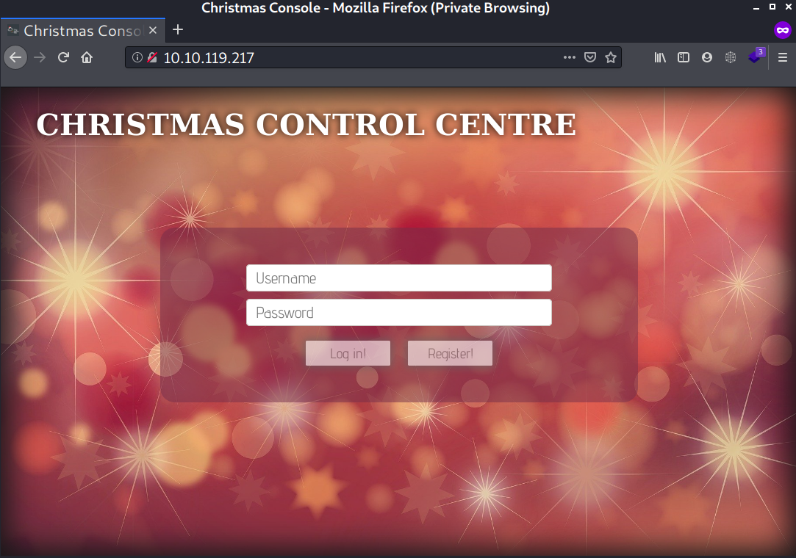
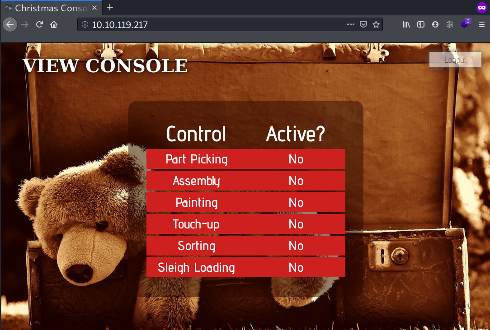
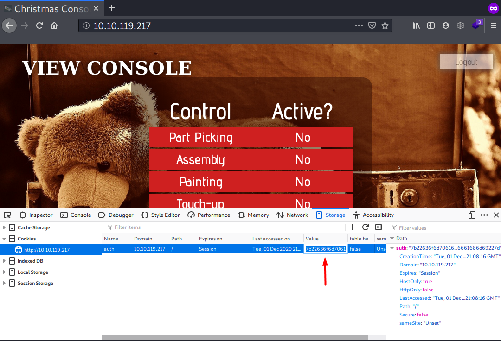
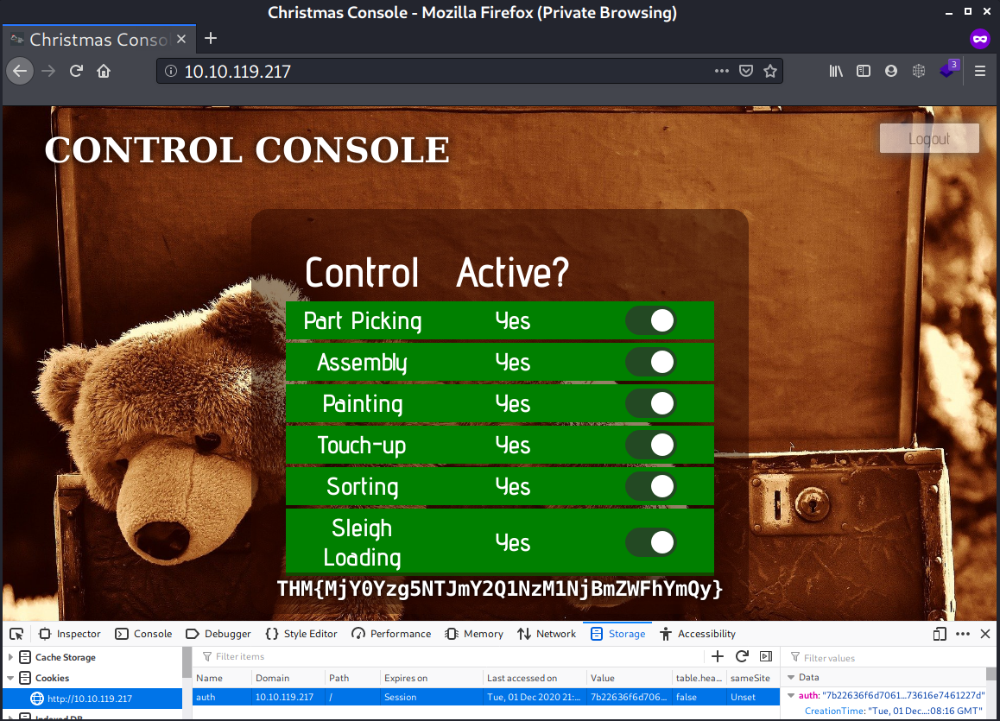

# Day 1 | A Christmas Crisis

`TryHackMe` `Web Exploitation` `Security` `HTTP` `Cookie`

---

## Learning Outcomes

Hasil pembelajaran 

- Memahami bagaimana alur bekerja web 
- Memahami protokol HTTP beserta metode *request*nya.
- Mengerti apa itu dari website cookies
- Mengetahui cara menggunakan *tool* CyberChef
- Menggunakan cookies untuk menaikkan hak akses (*Privilege Escalation*)

## Summary

tldr;

- Akses IP mesin melalui browser, buat akun dan login
- Periksa cookie yang tersimpan lalu decode menggunakan [CyberChef](https://gchq.github.io/CyberChef/)
- Hasil decodenya dalam bentuk JSON dan hanya bagian *username* yang berubah/dinamis.
- Ubah bagian *username* dari cookie untuk Privilege Escalation.
- Hijaukan panel kontrol untuk mendapatkan flag.


## Task Story

> *"The Best Festival Company's brand new OpenVPN server has been hacked. This is a crisis!*  
>
> *The attacker has damaged various aspects of the company infrastructure -- including using the Christmas Control Centre to shut off the assembly line!*
>
> *It's only 24 days until Christmas, and that line has to be operational or there won't be any presents! You have to hack your way  back into Santa's account (blast that hacker changing the password!) and getting the assembly line up and running again, or Christmas will be ruined!"*

## Write-up

Tampilan web dari mesin yang di deploy 




### Q1 : What is the name of the cookie used for authentication?

Registrasi diperlukan untuk mengetahui cookie yang digunakan saat otentikasi (login).

> username:password <-> fahmi:fahmi


Tampilan setelah login



Mengaktifkan panel control tersebut adalah objektif dari task ini.

Cookie yang tersimpan dapat dilihat menggunakan Developer Tools melalui kombinasi `ctrl+shift+i` atau `f12`. Aplikasi browser yang digunakan disini adalah Firefox.



Nama cookie yang digunakan adalah `auth`.

### Q2 : In what format is the value of this cookie encoded?

Dengan menggunakan CyberChef --> Auto, format cookie yang digunakan adalah `hexadecimal`.

### Q3 : Having decoded the cookie, what format is the data stored in?

Masih menggunakan CyberChef.

Input yang diberikan :

```
7b22636f6d70616e79223a22546865204265737420466573746976616c20436f6d70616e79222c2022757365726e616d65223a226661686d69227d
```

Output yang didapatkan 
```
{"company":"The Best Festival Company", "username":"fahmi"}
```

Berdasarkan output yang didapatkan, format data tersebut menggunakan format `JSON`.

### What is the value of Santa's cookie?

Setelah melakukan dua kali register, ternyata hanya bagian `username` yang berubah. 

Berdasarkan hal ini, kita dapat mencoba merubah bagian data `{"username" : "fahmi"}` menjadi `{"username" : "santa"}` lalu encode kembali ke format `hexadecimal`.


Berikut hasil yang didapatkan

```
7b22636f6d70616e79223a22546865204265737420466573746976616c20436f6d70616e79222c2022757365726e616d65223a226661686d69227d
```

Buka kembali Developer Tools untuk merubah value dari cookie yang tersimpan pada browser dengan value yang dibuat menggunakan CyberChef.

