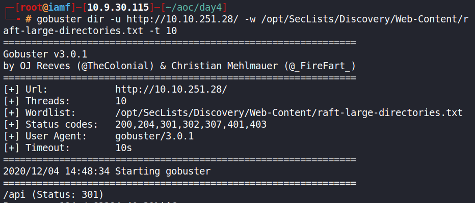
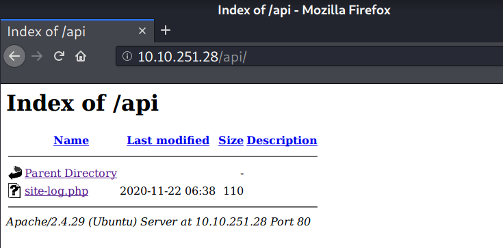
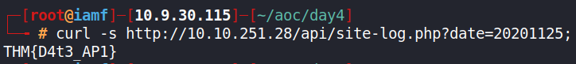

# Day 4 |  Santa's watching

`TryHackMe` `Web Exploitation` `Security` `Fuzzing`

---

## Learning Outcomes

Hasil pembelajaran 

- Mengerti arti dari teknik fuzzing.
- Memahami bahwa sebuah kondisi error dapat memicu penyalahgunaan/clue bagi *hacker*

## Summary

tldr;

- Use directory bruteforce tools to find a hidden directory
- Use wfuzz to get the correct parameter value.

## Story 

> *We're going to be taking a look at some of the fundamental tools used in web application testing. You're going to learn how to use Gobuster to enumerate a web server for hidden files and folders to aid in the recovery of Elf's forums. Later on, you're going to be introduced to an important technique that is fuzzing, where you will have the opportunity to put theory into practice.*
>
>*Our malicious, despicable, vile, cruel, contemptuous, evil hacker has defaced Elf's forums and completely removed the login page! However, we may still have access to the API. The sysadmin also told us that the API creates logs using dates with a format of YYYYMMDD*

## Write-up

Mesin yang di deploy adalah sebuah web yang menurut cerita dari "*event*" ini, telah di *deface*.


### Challenge

> Deploy both the instance attached to this task (the green deploy button) and the AttackBox by pressing the blue "Start AttackBox" button at the top of the page. After allowing 5 minutes, navigate to the website (10.10.73.237) in your AttackBox browser.
>
> It is up to you to decide if you wish to create the wordlist yourself or use a larger wordlist located in /opt/AoC-2020/Day-4/wordlist on the AttackBox. The wordlist is also available for download if you are using your own machine.
>
> In summary, use the tools and techniques outlined in today's advent of cyber; search for the API, find the correct post and bring back Elf's forums!


### Q1 : Given the URL "http://shibes.xyz/api.php", what would the entire wfuzz command look like to query the "breed" parameter using the wordlist "big.txt" (assume that "big.txt" is in your current directory)

Note: For legal reasons, do not actually run this command as the site in question has not consented to being fuzzed!

```
wfuzz -c -z file,big.txt http://shibes.xyz/api.php?breed=FUZZ
```

### Q2 : Use GoBuster (against the target you deployed -- not the shibes.xyz domain) to find the API directory. What file is there?

> Cara instalasi gobuster disertakan diakhir writeup.

```
gobuster dir -u http://10.10.251.28/ -w /opt/SecLists/Discovery/Web-Content/raft-large-directories.txt -t 10
```



> Gobuster memiliki 3 mode, yaitu : `dir`, `dns` dan `vhost`

Ditemukan direktori `/api` dengan code 302 (redirect) dan setelah dikunjungi terdapat file `site-log.php`.





### Q3 : Fuzz the date parameter on the file you found in the API directory. What is the flag displayed in the correct post?

Menurut challengenya, file ini memiliki parameter `date`, namun value yang diinput harus tepat. Diketahui juga format parameter `date` adalah YYYYMMDD. 

Disini saya menggunakan tools wfuzz bawaan dari Kali Linux untuk melakukan fuzzing pada parameter `date` dari `site-log.php` menggunakan wordlist yang disediakan oleh TryHackMe dalam format YYYYMMDD.

```
wfuzz -c -z file,wordlist --hc 404 http://10.10.251.28/api/site-log.php?date=FUZZ

```

Outputnya 

```
********************************************************
* Wfuzz 2.4 - The Web Fuzzer                           *
********************************************************

Target: http://10.10.251.28/api/site-log.php?date=FUZZ
Total requests: 63

===================================================================
ID           Response   Lines    Word     Chars       Payload           
===================================================================

000000006:   200        0 L      0 W      0 Ch        "20201105"        
000000002:   200        0 L      0 W      0 Ch        "20201101"        
000000005:   200        0 L      0 W      0 Ch        "20201104"        
000000004:   200        0 L      0 W      0 Ch        "20201103"        
... <snip>
```
Hasil output diatas memiliki ciri yang sama, yaitu 200,0,0,0 artinya *request* tersebut jika diakses pada browser akan menghasilkan *blank page*.

Kita dapat memberikan *filter* untuk mencari hasil output yang **<u>berbeda</u>**. Untuk kasus ini dengan menambahkan opsi `--hh 0` untuk menyembunyikan semua *request* yang menghasilkan *response* 0 *word*.

```
wfuzz -c -z file,wordlist --hh 0 http://10.10.251.28/api/site-log.php?date=FUZZ

********************************************************
* Wfuzz 2.4 - The Web Fuzzer                           *
********************************************************

Target: http://10.10.251.28/api/site-log.php?date=FUZZ
Total requests: 63

===================================================================
ID           Response   Lines    Word     Chars       Payload           
===================================================================

000000026:   200        0 L      1 W      13 Ch       "20201125"
```

Output diatas menghasilkan Word = 1 W, Chars = 13 Ch, artinya jika request di *kirim* pada url `http://10.10.251.28/api/site-log.php?date=20201125` hasilnya tidak *blank page*. 

Namun disini saya menggunakan curl.




## Misc : Gobuster Installation

**Prerequisite** :

- Golang 
```
apt install golang
```

**Instalation:**

```
$ cd /opt
$ git clone https://github.com/OJ/gobuster.git
$ cd gobuster/
$ go get && go build
$ go install
$ export PATH=$PATH:$GOPATH/bin
```