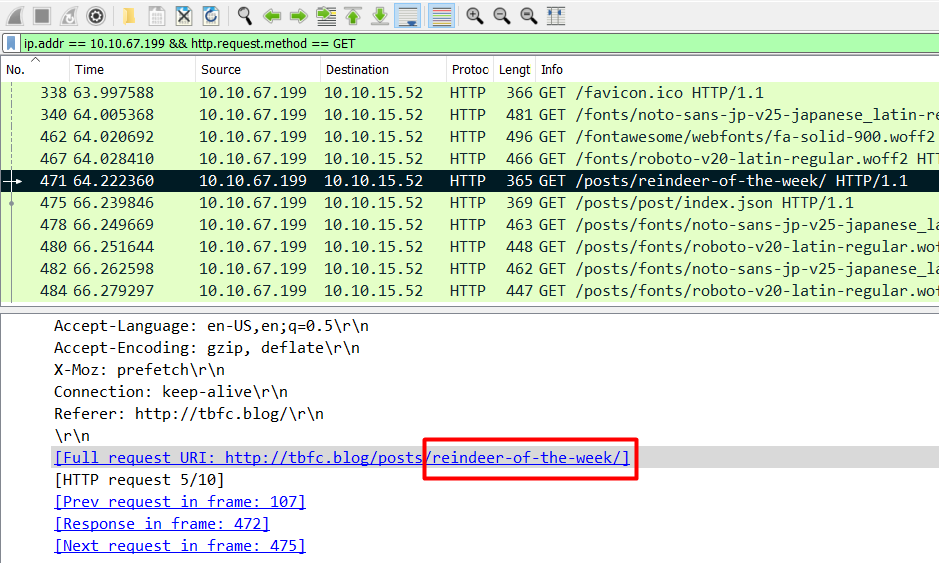

# Day 7 |  The Grinch Really Did Steal Christmas

`TryHackMe` `Networking` `Forensic` `Wireshark` `Packet Analysis`

---

## Learning Outcomes

Hasil pembelajaran

- Memahami :
	- Apa itu IP address
	- Network Protocol
	- TCP/IP Three-Way handshake

- Mempelajari cara menggunakan Wireshark
	- Dasar filtering dan operatornya
	- Network packet analysis

- Melakukan restorasi/ekstraksi file utuh dari paket yang terdapat pada pcap.

## Summary

tldr;

- Download file .pcap yang disediakan.
- Buka pcap dengan Wireshark.
- Gunakan icmp sebagai filter untuk pertanyaan no 1.
- Gunakan http sebagai filter untuk pertanyaan no 2.
- Gunakan kombinasi ip address dan http sebagai filter untuk pertanyaan no 3
- Gunakan ftp sebagai filter untuk pertanyaan no 4.
- Gunakan fitur export Wireshark untuk merecover file zip yang terekam pada salah satu paket di pcap3.

## Story

> It's 6 AM and Elf McSkidy is clocking-in to The Best Festival Company's SOC headquarters to begin his watch over TBFC's infrastructure. After logging in, Elf McEager proceeds to read through emails left by Elf McSkidy during the nightshift.
>
> More automatic scanning alerts, oh look, another APT group. It feels like it's going to be a long, but easy start to the week for Elf McEager.
>
> Whilst clearing the backlog of emails, Elf McEager reads the following: "URGENT: Data exfiltration detected on TBFC-WEB-01". "Uh oh" goes Elf McEager. "TBFC-WEB-01? That's Santa's webserver! Who has the motive to steal data from there?!". It's time for the ever-vigilant Elf McEager to prove his salt and find out exactly what happened.
>
> Unknowingly to Elf McEager, Elf McSkidy made this all up! Fortunately, this isn't a real attack - but a training exercise created ahead of Elf McEager's performance review.

## Write-up

Pada task kali ini, writeup akan mengikuti *Challenge* yang diberikan dan menjawab pertanyaan-pertanyaan yang diberikan dibawah.

### Challenge :
>Download the ZIP file "aocpcaps.zip" that is attached to this task, Use a combination of the filters and features of Wireshark we've covered to answer the questions below:

### Q1 : Open `pcap1.pcap` in Wireshark. What is the IP address that initiates an ICMP/ping?

Dengan menggunakan filter icmp dan melihat urutan nomer paket, kita bisa melihat siapa yang terlebih dulu menginisiasi sebuah ping (request).


### Q2 : If we only wanted to see HTTP GET requests in our `pcap1.pcap` file, what filter would we Gunakan?

Hal ini cukup dengan menggunakan filter `http.request.method == GET`


### Q3 : Now apply this filter to `pcap1.pcap` in Wireshark, what is the name of the article that the IP address `10.10.67.199` visited?

Untuk menjawab pertanyaan ini, kita bisa menggunakan dua filter. Filter yang pertama adalah IP address dan yang kedua adalah http requestnya, karena umumnya metode yang digunakan untuk me-*retrieve* data adalah `GET`



### Q4 : Let's begin analysing `pcap2.pcap`. Look at the captured FTP traffic; what password was leaked during the login process?

Untuk menjawabnya cukup dengan menggunakan filter ftp.


### Q5 : Continuing with our analysis of `pcap2.pcap`, what is the name of the protocol that is encrypted?


### Q6 : Analyse `pcap3.pcap` and recover Christmas! What is on Elf McSkidy's wishlist that will be Gunakand to replace Elf McEager?


Berdasarkan gambar tersebut, kita dapat melakukan ekstraksi file yang ada pada paket No. 395 dengan fitur *export* dari wireshark.

```
File -> Export Objects -> HTTP.
```


