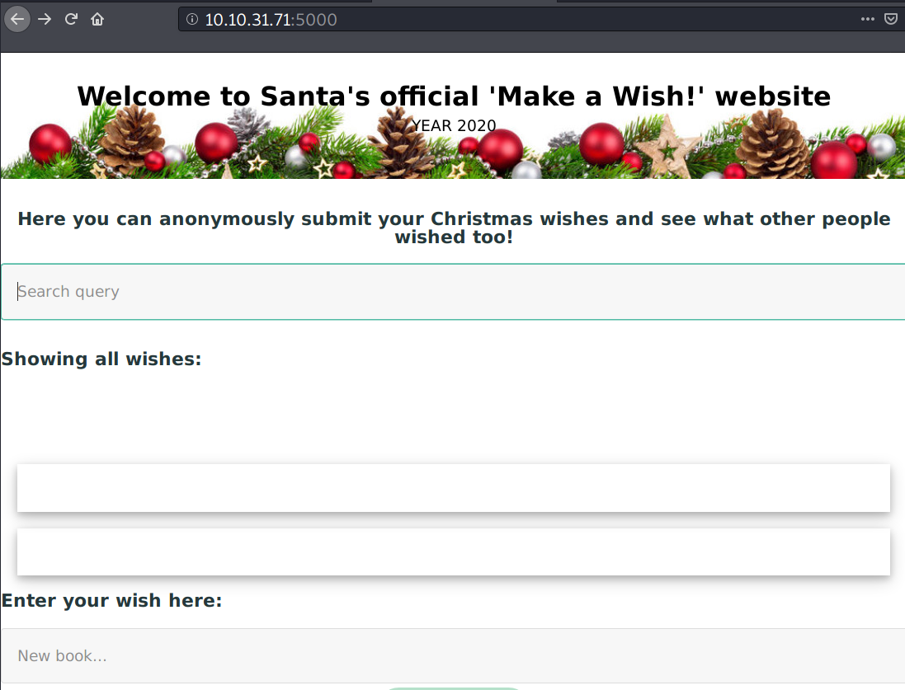
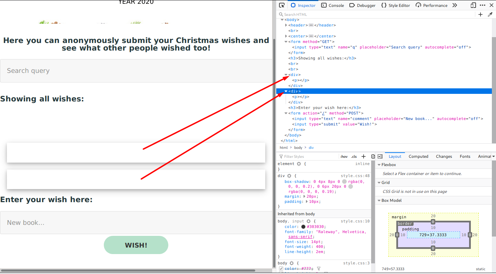
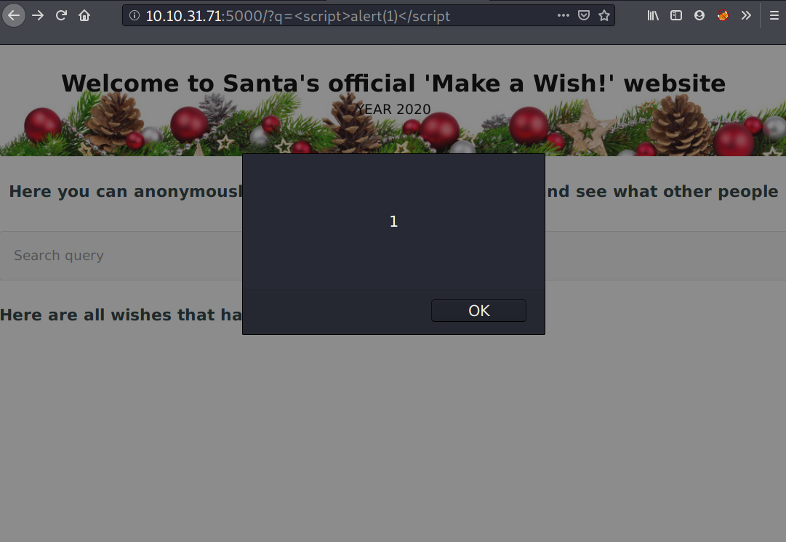
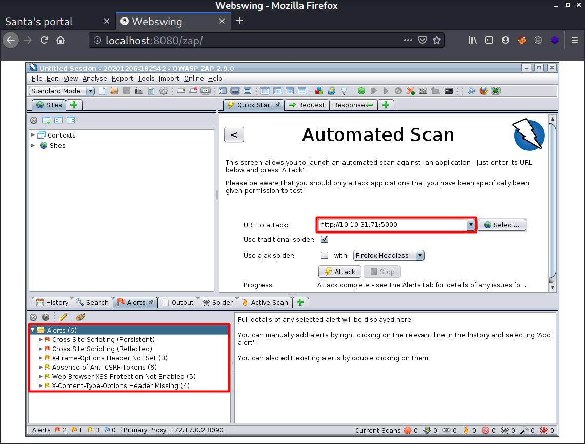

# Day 6 | Be careful with what you wish on a Christmas night

`TryHackMe` `Web Exploitation` `Security` `Cross-Site Scripting` `XSS`

---

## Learning Outcomes

Hasil pembelajaran

- Memahami apa itu XSS
- Mengerti tipe-tipe XSS
- Mengerti cara menggunakan OWASP ZAP

## Summary

tldr; 

- Gunakan OWASP ZAP

## Write-up

Pada task kali ini diberikan suatu halaman web dengan dua *input field* dan tidak ada flag.

### Q1 : What vulnerability type was used to exploit the application?
Di field dengan tombol "Wish", ketika tag `<p></p>` di-*submit*, halaman page tersebut menambahkan suatu baris kosong, seperti berikut:



Kedua baris tersebut masih ada bahkan setelah di refresh, artinya web ini memiliki XSS vulnerability yaitu tipe `stored XSS`.



### Q2 : What query string can be abused to craft a reflected XSS?
Sedangkan pada input field "search query", vulnerability-nya adalah `reflected XSS`.



### Q3 : Launch the OWASP ZAP Application

Launched below

### Q4 : Run a ZAP (zaproxy) automated scan on the target. How many XSS alerts are in the scan?

Gambar berikut adalah hasil otomatisasi dengan menggunakan OWASP ZAP. Cara instalasi ada diakhir writeup menggunakan docker.



### Q5 Explore the XSS alerts that ZAP has identified, are you able to make an alert appear on the "Make a wish" website?

```
<script>alert("yes iam");</script>
```
## Resources

Check out this awesome guide about XSS:  
[swisskyrepo/PayloadsAllTheThings](https://github.com/swisskyrepo/PayloadsAllTheThings/tree/master/XSS%20Injection)

Common payload list for you to try out:  
[payloadbox/xss-payload-list](https://github.com/payloadbox/xss-payload-list)

For more OWASP Zap guides, check out the following room:  
[Learn OWASP Zap](https://tryhackme.com/room/learnowaspzap)

## OWASP ZAP Installation on Docker

1. Pull image
```
docker pull owasp/zap2docker-stable
```

2. Run container
```
docker run -u zap -p 8080:8080 -p 8090:8090 -i owasp/zap2docker-stable zap-webswing.sh
```

3. Open at `http://localhost:8080/zap/`

Reference :  
https://www.zaproxy.org/docs/docker/about/