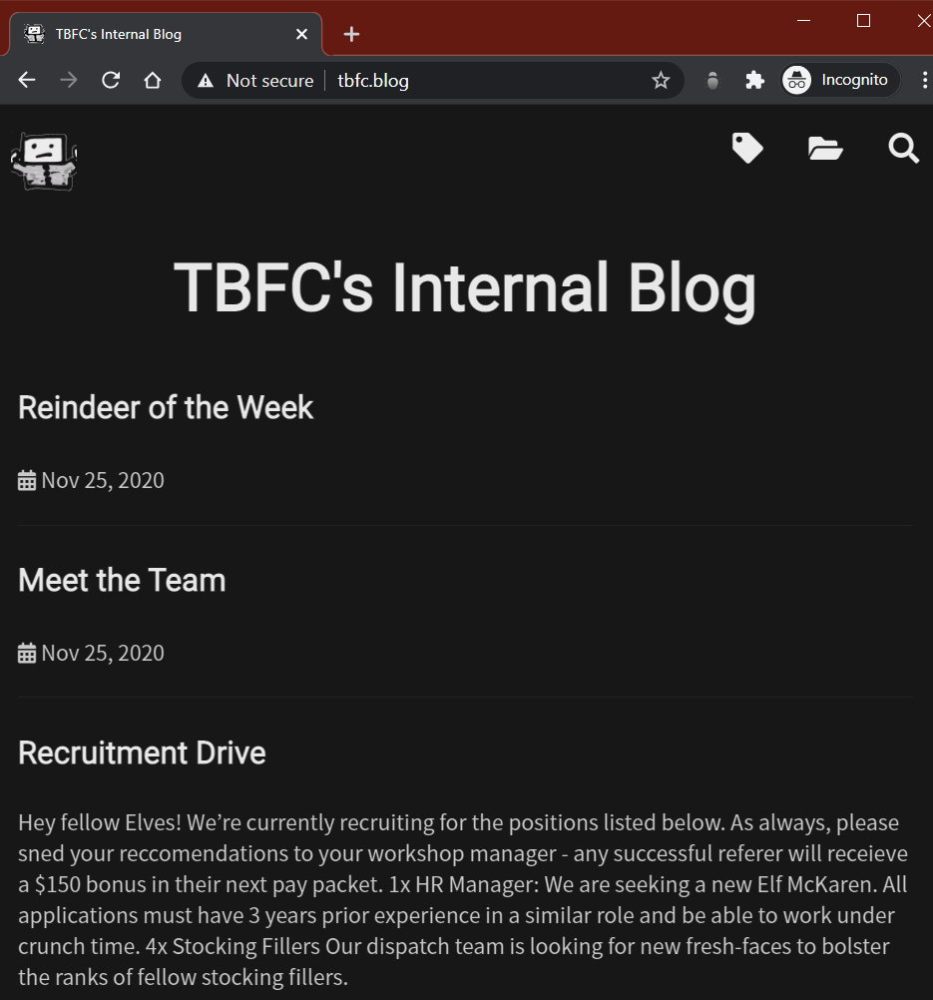

# Day 8 | What's Under the Christmas Tree?

`TryHackMe` `Networking` `Nmap`

---

## Learning Outcomes

- Understanding how does Nmap works?
- Defense againts Nmap scans

## Summary

tldr;

- Run this script to answer the question
```
nmap --min-rate 10000 -O -A -oN scan-2 10.10.73.227 -v
```

## Write up

Sama seperti kemarin, task kali ini modelnya step-by-step, tidak ada flag, jadi kayaknya kurang *sreg* kalau dibilang writeup.

Intinya, pada task kali ini adalah melakukan eksperimen dengan opsi-opsi yang ada pada Nmap.

> *BAIKNYA JANGAN DIGUNAKAN PADA WEBSITE PUBLIK TANPA IZIN KARENA BISA MENYEBABKAN WEBSITE YANG DIPINDAI DOWN*

## Story 

> After a few months of probation, intern Elf McEager has passed with glowing feedback from Elf McSkidy. During the meeting, Elf McEager asked for more access to The Best Festival Company's (TBFC's) internal network as he wishes to know more about the systems he has sworn to protect.
>
> Elf McSkidy was reluctant to agree. However, after Elf McEager's heroic actions in recovering Christmas, Elf McSkidy soon thought this was a good idea. This was uncharted territory for Elf McEager - he had no idea how to begin finding out this information for his new responsibilities. Thankfully, TBFC has a wonderful up-skill program covering the use of Nmap for ElfMcEager to enrol in.
### Challenge

*Deploy and use Nmap to scan the instance attached to this task. Take a note of the IP address that you will need to scan: (MACHINE_IP) and enumerate it for Elf McEager!
Optional bonus: As a result of Elf McEager managing to recover christmas in "Day 8 - The Grinch Really Did Steal Christmas", TBFC's website has been restored for all the elves to visit. Can you find it? I hear it's quite the read... You must add10.10.73.227 tbfc.blog to your /etc/hosts file*


### Q1 : When was Snort created?

Berdasarkan hasil pencarian google, Snort dibuat pada tahun `1998`.

### Q2 : Using Nmap on 10.10.73.227, what are the port numbers of the three services running?  (Please provide your answer in ascending order/lowest -> highest, separated by a comma)

Untuk menjawab pertanyaan ini dan dua pertanyaan dibawahnya, saya menggunakan dengan satu kali pindai.

```
nmap -sC -sV -A --min-rate 10000 -oN initial-scan 10.10.73.227
```

Hasilnya :
```
Starting Nmap 7.80 ( https://nmap.org ) at 2020-12-08 15:29 EST
Nmap scan report for 10.10.73.227
Host is up (0.23s latency).
Not shown: 997 closed ports
PORT     STATE SERVICE       VERSION
80/tcp   open  http          Apache httpd 2.4.29 ((Ubuntu))
|_http-generator: Hugo 0.78.2
|_http-server-header: Apache/2.4.29 (Ubuntu)
|_http-title: TBFC&#39;s Internal Blog
2222/tcp open  ssh           OpenSSH 7.6p1 Ubuntu 4ubuntu0.3 (Ubuntu Linux; protocol 2.0)
| ssh-hostkey:
|   2048 cf:c9:99:d0:5c:09:27:cd:a1:a8:1b:c2:b1:d5:ef:a6 (RSA)
|   256 4c:d4:f9:20:6b:ce:fc:62:99:54:7d:c2:b4:b2:f2:b2 (ECDSA)
|_  256 d0:e6:72:18:b5:20:89:75:d5:69:74:ac:cc:b8:3b:9b (ED25519)

3389/tcp open  ms-wbt-server xrdp
Aggressive OS guesses: Linux 3.1 (95%), Linux 3.2 (95%), AXIS 210A or 211 Network Camera (Linux 2.6.17) (94%), ASUS RT-N56U WAP (Linux 3.4) (93%), Linux 3.16 (93%), Adtran 424RG FTTH gateway (92%), Linux 2.6.32 (92%), Linux 2.6.39 - 3.2 (92%), Linux 3.1 - 3.2 (92%), Linux 3.2 - 4.9 (92%)
No exact OS matches for host (test conditions non-ideal).
Network Distance: 2 hops
Service Info: OS: Linux; CPE: cpe:/o:linux:linux_kernel

TRACEROUTE (using port 22/tcp)
HOP RTT       ADDRESS
1   234.46 ms 10.9.0.1
2   234.46 ms 10.10.73.227

OS and Service detection performed. Please report any incorrect results at https://nmap.org/submit/ .
Nmap done: 1 IP address (1 host up) scanned in 101.00 seconds
```

### Q3 : Use Nmap to determine the name of the Linux distribution that is running, what is reported as the most likely distribution to be running?

Berdasarkan hasil nmap scan pada Q2, maka jawabannya adalah `Ubuntu`.

### Q4 : Use Nmap's Network Scripting Engine (NSE) to retrieve the "HTTP-TITLE" of the webserver. Based on the value returned, what do we think this website might be used for?

Webnya digunakan untuk blog.



