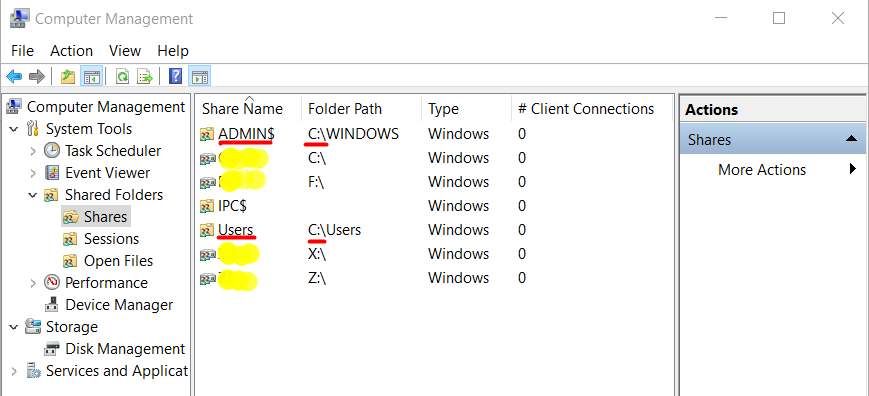
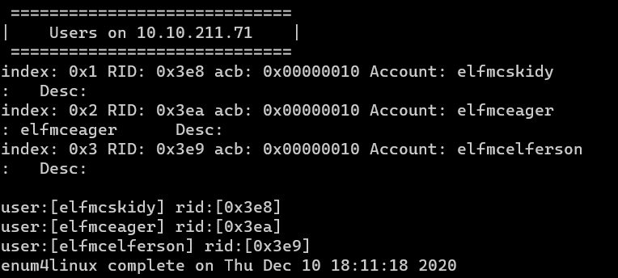
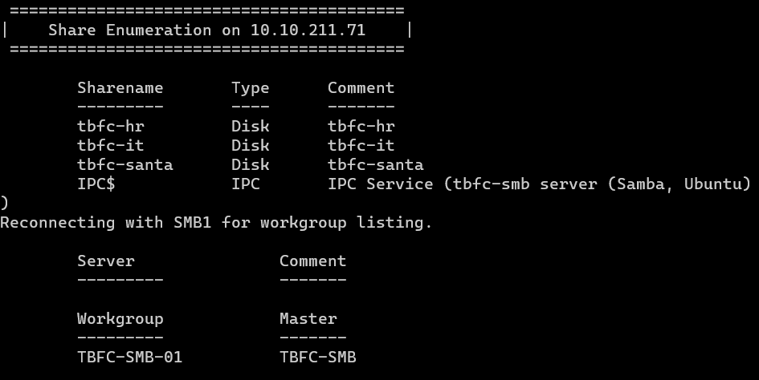
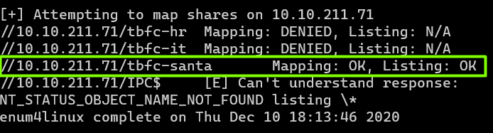
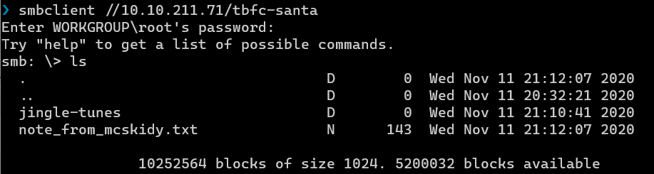

# Day 10 | Don't be sElfish!
 
`TryHackMe` `Networking` `SMB` `NFS` `Samba`

---

## Learning Outcomes

- Mengetahui protokol file sharing
- Mengetahui cara enumerasi pada file sharing dengan enum4linux

## Story 

>*The Best Festival Company (TBFC) has since upscaled its IT infrastructure after last year's attack for all the other elves to use, including a VPN server and a few other services. You breathe a sigh of relief..."That's it, Me, Elf McEager saved the Christmas of 2020! I can't wait to---"*
>
> *But suddenly, a cold shiver runs down your spine, interrupting your monologue...*

>You suddenly recall that Elf McSkidy had set up a Samba file server just before the attack occurred - could this have been hacked too?!  What about our data...Oh no, quick! Find out what usernames may have been leaked and attempt to login to the server yourself, noting down any vulnerabilities found to report back to Elf McSkidy.

## Summary

- Gunakan tool enum4linux untuk melakukan enumerasi pada Samba shares
- Anonymous login/akses ke Samba share **tbfc-santa**

## Write-up

Pada task kali ini tidak terdapat flag melainkan mempelajari bagaimana melakukan enumerasi pada Samba *share*.

Sedikit tentang Samba, Samba ini adalah semacam software untuk melakukan resources sharing pada jaringan komputer, modelnya adalah client-server. 

Resources dinaungi oleh semacam 'folder' virtual yang disebut **share** dan **share** ini tidak selalu folder, tetapi bisa juga device seperti printer.



Umumnya untuk mengakses **share** cukup dengan mengetikkan `//ipaddress/sharename` pada file explorer. 

<br>

Writeup kali ini mempelajari cara menggunakan tool enum4linux untuk melakukan enumerasi terhadap Samba server pada mesin yang di deploy.

### Q1 : Using enum4linux, how many users are there on the Samba server (10.10.211.71)?

Untuk menjawab ini, gunakan opsi `-U` pada enum4linux
```
$ enum4linux -U 10.10.211.71
```



### Q2 : Now how many "shares" are there on the Samba server?

Untuk menjawab ini, gunakan opsi `-S` pada enum4linux

```
$ enum4linux -S 10.10.211.71
```



### Q3 : Use smbclient to try to login to the shares on the Samba server (10.10.211.71). What share doesn't require a password?

Pada Q2, enum4linux melakukan mapping terhadap shares yang di enumerasi tanpa akun (anonymous access) dan pada salah satu share, yaitu `tbfc-santa`, status mappingnya adalah `OK`. Artinya share tersebut dapat diakses tanpa suatu password.




### Q4 : Log in to this share, what directory did ElfMcSkidy leave for Santa?



Berdasarkan dari `note_from_mcskidy.txt`

> Hi Santa, I decided to put all of your favourite jingles onto this share - allowing you access it from anywhere you like! Regards ~ ElfMcSkidy

Maka jawabannya adalah `jingle-tunes`.