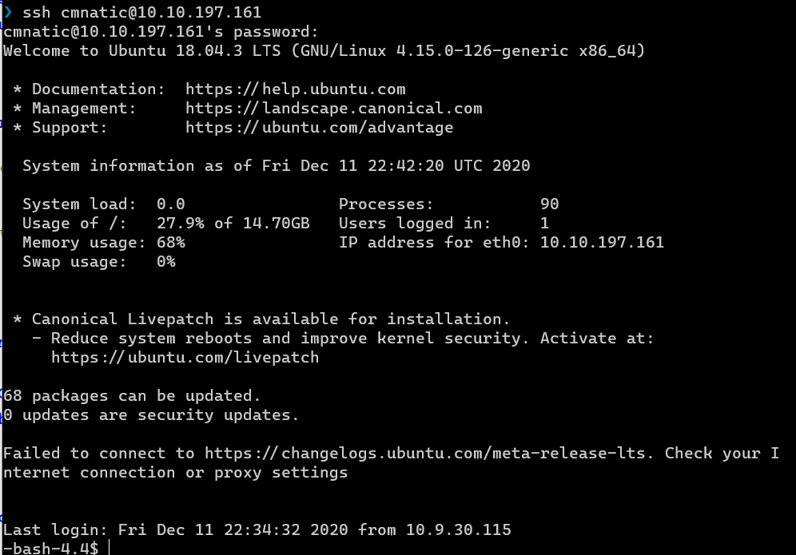
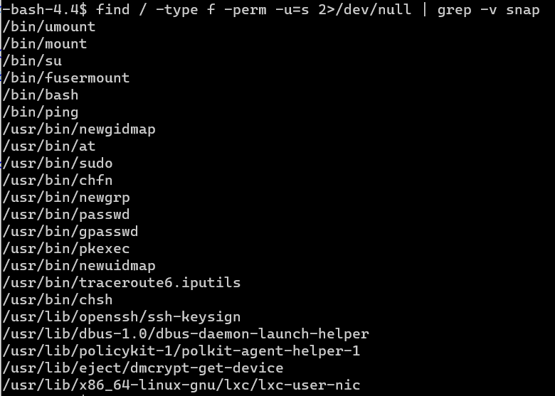
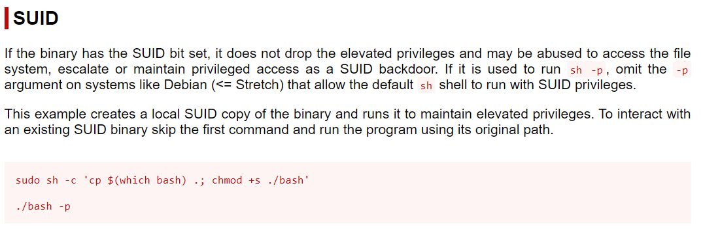
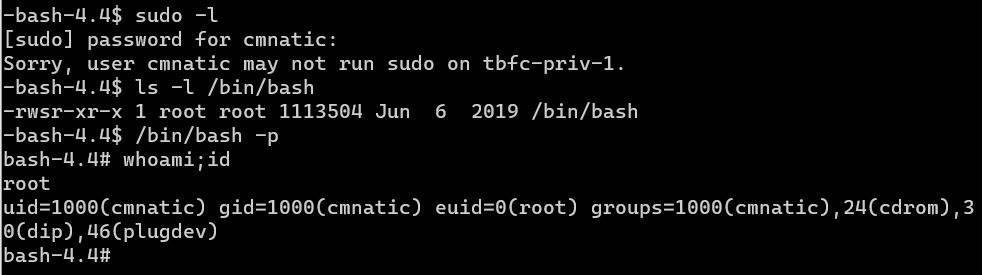
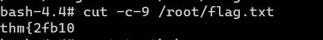

# Day 11 | The Rogue Gnome

`TryHackMe` `Networking` `SUID` `Privilege Escalation` 

---

## Learning Outcomes

- Mengetahui tipe Privilege Escalation
	- Vertical Privilege Escalation
	- Horizontal Privilege Escalation
- Mengeksploitasi miskonfigurasi binari SUID

## Story 

> This is it - the moment that Elf McEager has been waiting for. It's the final exam of the Nmap course that he enlisted on during "Day 8 - What's Under the Christmas Tree?". It looks like all that hard work of hitting the books has paid off..."Success!" Elf McEager screams..."the exploit worked! Yippeee!"
> 
> Elf McEager has successfully managed to create a reverse shell from the target back to his computer. Little did he know, the real exam begins now...The last stage of the exam requires Elf McEager to escalate his privileges! He spent so much time studying Nmap cheatsheets that he's now drawing a blank...Can you help Elf McEager?
>
> *To be the good guy, sometimes you gotta be the bad guy first...*
> 
## Summary

tldr; 
- Login ke mesin yang di deploy melalui ssh dengan username: **cmnatic**,  password : **aoc2020**
- Ketikkan perintah `bash -p`
- Ambil flag di /root/flag.txt

## Write-up

Task kali ini mencakup salah satu topik dari common privilege escalation pada OS Linux, yaitu sebuah miskonfigurasi pada file binari yang memiliki bit SUID.

Sedikit penjelasan, SUID adalah sebuah tipe permission pada Linux yang cara kerjanya mirip dengan `sudo` , yaitu memperbolehkan **user lain** yang mengeksekusi suatu file binari sebagai **owner** dari file binari tersebut ( `Run as` ).

### Challenge

> Ensure that you have deployed the instance attached to this task and take note of the IP address (10.10.197.161). Answer Question #1 and #2 before proceeding to log into the vulnerable instance. You have already been provided with the credentials to use to log into the vulnerable instance in Question #3.
>
> Apply your newly found knowledge from this task to escalate your privileges! Study the hints carefully if needed - everything to complete this day has been discussed throughout today's task.

### Q1 : What type of privilege escalation involves using a user account to execute commands as an administrator?

Tipe ini disebut sebagai `vertical` privilege escalation

### Q2 : What is the name of the file that contains a list of users who are a part of the sudo group?

File ini disebut dengan `sudoers`, lokasi tepatnya di  `/etc/sudoers`


### Use SSH to log in to the vulnerable machine like so: ssh cmnatic@10.10.197.161. Input the following password when prompted: **aoc2020**



### Q3 : Enumerate the machine for executables that have had the SUID permission set. Look at the output and use a mixture of GTFObins and your researching skills to learn how to exploit this binary.

Perintah `find` dapat digunakan untuk mencari executable file yang memiliki SUID permission.
```
$ find / -type f -perm -u=s 2>/dev/null
```
Mudahnya dibaca : 

- `find /`, cari pada direktori root (/)
- `-type f`, tipe yang dicari adalah file.
- `-perm -u=s`, kriterianya filenya harus memiliki SUID.
- `2>/dev/null`, jika terdapat error (`2`), redirect outputnya ke `/dev/null`

Berikut hasilnya setelah di filter dengan perintah `grep`.



Dari hasil tersebut, yang menarik adalah `bash` pada direktori `/bin`.  

Lalu berdasarkan pencarian dari website [GTFO Bins](https://gtfobins.github.io/gtfobins/bash/#suid), `bash` yang memiliki SUID dapat digunakan untuk privilege escalation dengan contoh berikut.



Namun, karena user saat ini tidak terdaftar pada file **sudoers**, sehingga eksploitasinya cukup dengan `/bin/bash` ditambah dengan opsi `-p`.




### Q4 : Use this executable to launch a system shell as root. What are the contents of the file located at /root/flag.txt?




## References

https://www.hackingarticles.in/linux-privilege-escalation-using-suid-binaries/

https://en.wikipedia.org/wiki/Privilege_escalation#Vertical