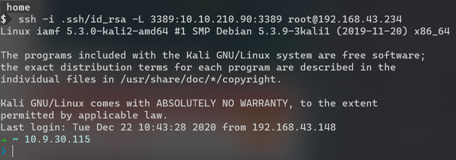
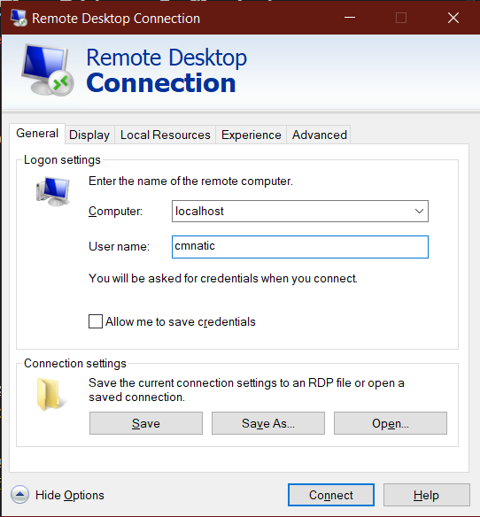
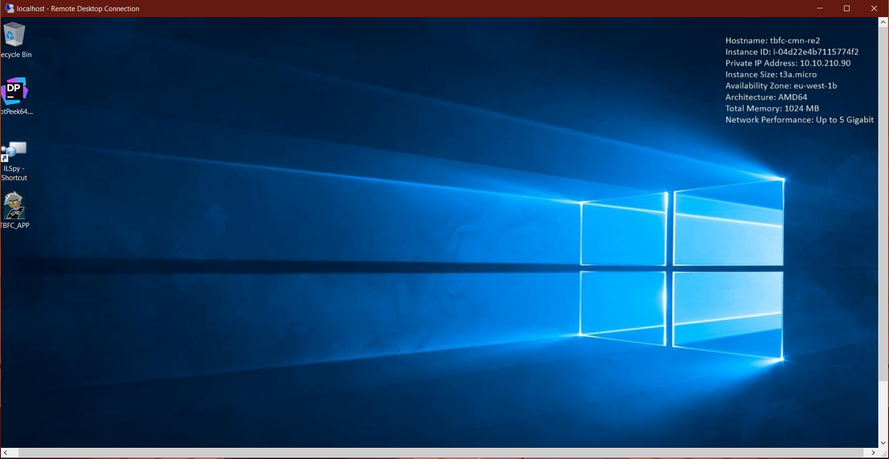
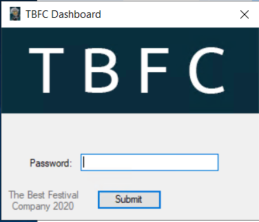
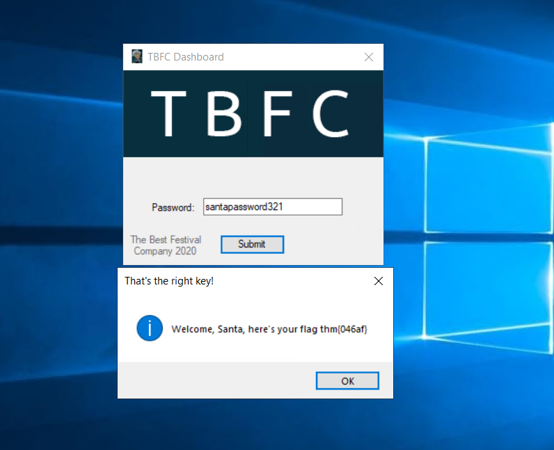

# Day 18 | The Bits of Christmas
`TryHackMe` `Reverse Engineering` `.NET`

---

## Learning Outcomes

## Story 
>"Silly Santa...Forgetting his password yet again!" complains Elf McEager. However, it is in fact Elf McEager who is silly for not creating a way to reset Santa's password for the TBFC dashboard.
>
> Santa needs to get back into the dashboard for Christmas! Can you help Elf McEager reverse engineer TBFC's application to retrieve the password for Santa?!

## Summary

## Write-up

Task hari ke 18, kita akan mengeksplorasi bagaimana melakukan reverse engineering pada aplikasi yang berbasis .NET (baca: dot net). 

Menurut wikipedia, .NET adalah sebuah framework software yang umumnya berjalan pada sistem operasi Microsoft Windows. Aplikasi-aplikasi yang dibuat di atas .NET (C#, F#, VB.NET) dieksekusi dalam sebuah virtual machine bernama Commmon Languange Runtime (CLR), mirip seperti jvm milik Java.

### Challenge

> Deploy the instance attached to this task and log in using the Remote Desktop Protocol (RDP). Open the application "TBFC_APP.exe" on the Desktop and enter the correct password!*
>
>You can use "Remmina" on the TryHackMe AttackBox to connect to the instance with the following credentials, or any RDP client such as Microsofts if you wish to connect to the TryHackMe VPN:
>
>**IP Address**: `MACHINE_IP`
>
>**Username:**`cmnatic`
>
>**Password**: `Adventofcyber!`

Berdasarkan dari challenge, kita perlu melakukan RDP login dengan kredensial di atas ke mesin yang disediakan pada task ini dan bagi pengguna THM AttackBox, tersedia aplikasi Remmina untuk melakukan RDP tersebut, tetapi disini saya melakukan tunneling SSH dari komputer host (windows) ke guest (kali linux) di port 3389, port default RDP. 

Karenanya disini saya dapat menggunakan Windows Remote Desktop Connection untuk login ke mesin yang di deploy melalui localhost.

Tampilannya:

### Open the "TBFC_APP" application in ILspy and begin decompiling the code

TBFC_APP:

ILSpy adalah salah satu tools yang digunakan untuk me-reverse aplikasi yang berbasis .NET. 
Untuk membuka aplikasi pada ILSpy, bisa dengan drag & drop icon dari TBFC_APP.

### Q1: What is Santa's password?

Password Santa dapat ditemukan dengan mudah menggunakan fitur pencarian yang ada pada ILspy.

Hal inilah yang menjadi alasan mengapa hardcoded bukan hal yang baik untuk diterapkan pada aplikasi.

### Q2: Now that you've retrieved this password, try to login...What is the flag?

Flag didapat~

