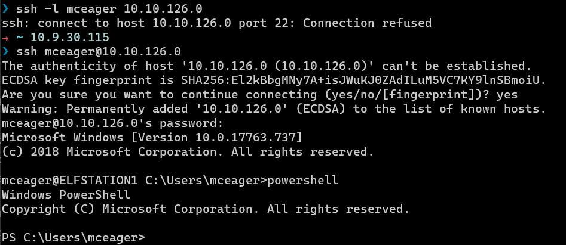
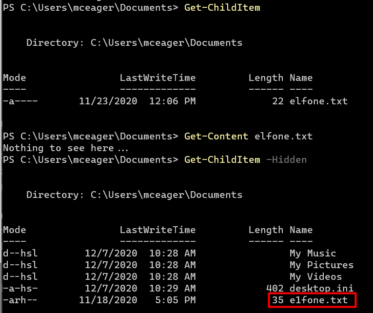
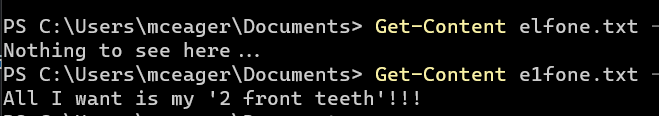
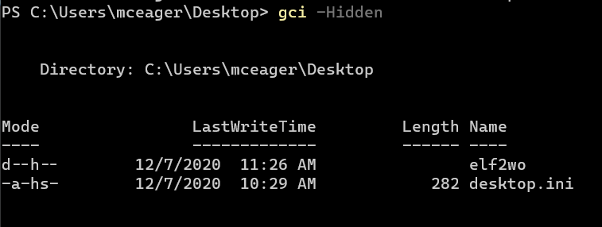
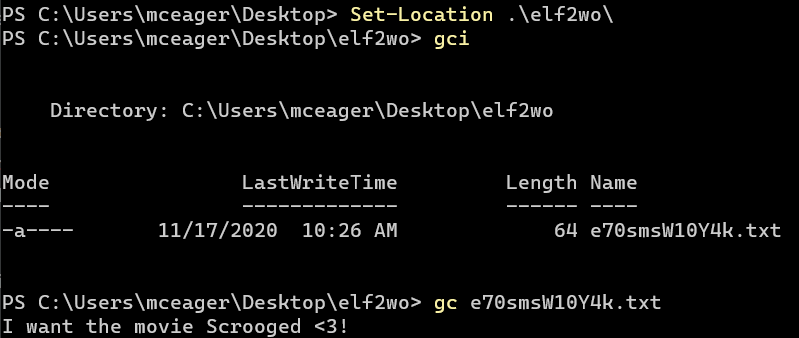
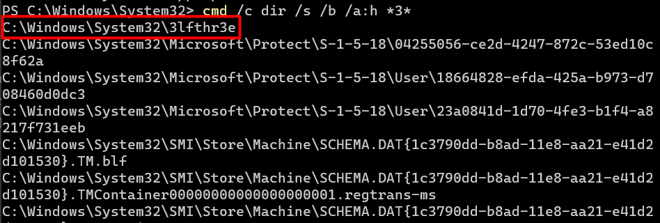
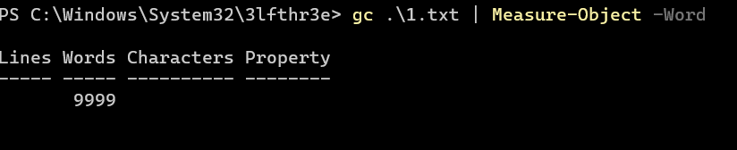
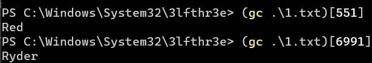
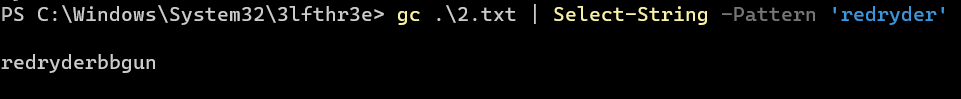

# Day 20 |  PowershELlF to the rescue

`TryHackMe` `Powershell`

---

## Learning Outcomes

## Summary

## Story
Someone is mischievous at The Best Festival Company. The contents within the stockings have been removed. A clue was left in one of the stockings that hints that the contents have been hidden within Elfstation1. McEager moves quickly and attempts to RDP into the machine. Yikes! He is unable to log in.

Luckily, he has been learning PowerShell, and he can remote into the workstation using PowerShell over SSH.

## Write-up

### Challenge
Use the PowerShell console to navigate throughout the endpoint to find the hidden contents to reveal what was hidden in the stockings.


```
ssh -l mceager 10.10.126.0
r0ckStar!
```



### Q1: Search for the first hidden elf file within the Documents folder. Read the contents of this file. What does Elf 1 want?





### Q2: Search on the desktop for a hidden folder that contains the file for Elf 2. Read the contents of this file. What is the name of that movie that Elf 2 wants?





### Q3: Search the Windows directory for a hidden folder that contains files for Elf 3. What is the name of the hidden folder? (This command will take a while)

```
gci -Path C:\Windows\ -Filter '*3*' -Hidden -Directory -Recurse

```



### Q4: How many words does the first file contain?



### Q5: What 2 words are at index 551 and 6991 in the first file?


### Q6: This is only half the answer. Search in the 2nd file for the phrase from the previous question to get the full answer. What does Elf 3 want? (use spaces when submitting the answer)

