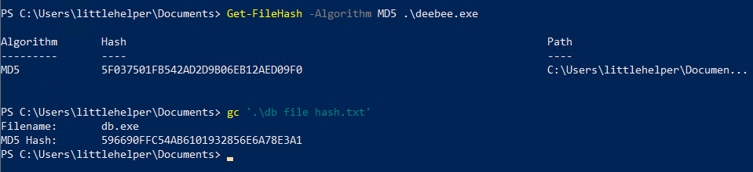
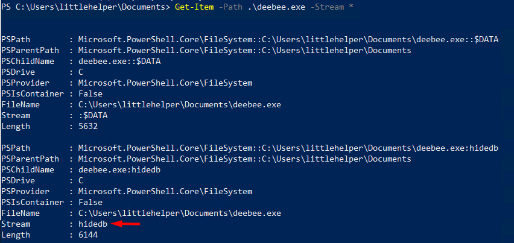
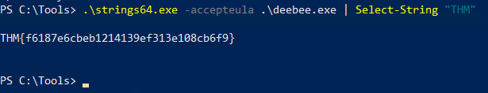
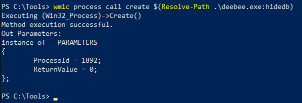

# Day 21 | Time for some ELForensics

`TryHackMe` `Powershell` `Forensics` `Alternate Data Stream`

---

## Learning Outcomes

## Summary

## Story

One of the 'little helpers' logged into his workstation only to realize that the database connector file has been replaced, and he can't find the naughty list anymore. Furthermore, upon executing the database connector file, a taunting message was displayed, hinting that the file was moved to another location.

McEager has been notified, and he will put the pieces together to find the database connector file.

## Write-up

### Q1: Read the contents of the text file within the Documents folder. What is the file hash for db.exe?

`Get-FileHash -Algorithm MD5`

### Q2: What is the file hash of the mysterious executable within the Documents folder?

### Q3: Using Strings find the hidden flag within the executable?

### Q4: What is the flag that is displayed when you run the database connector file?

