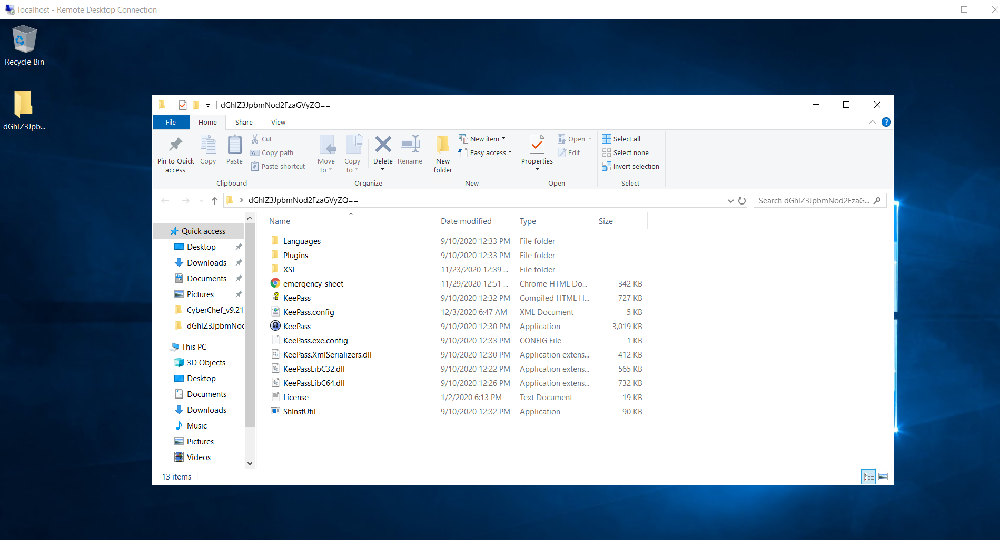
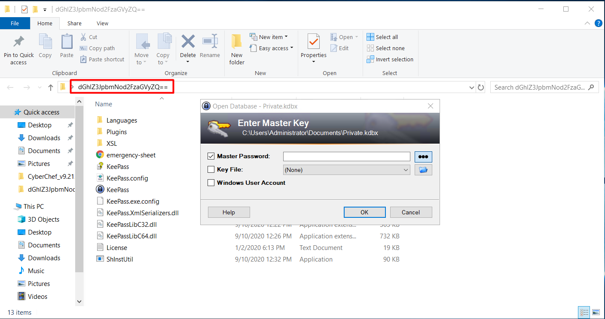
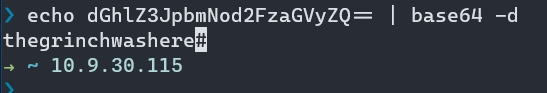
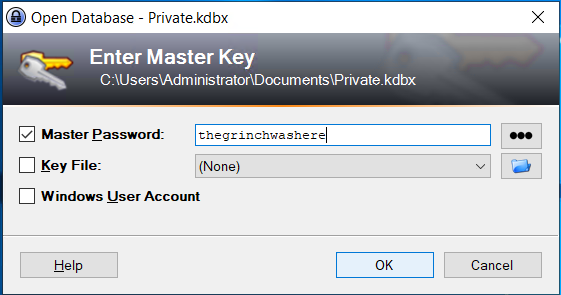
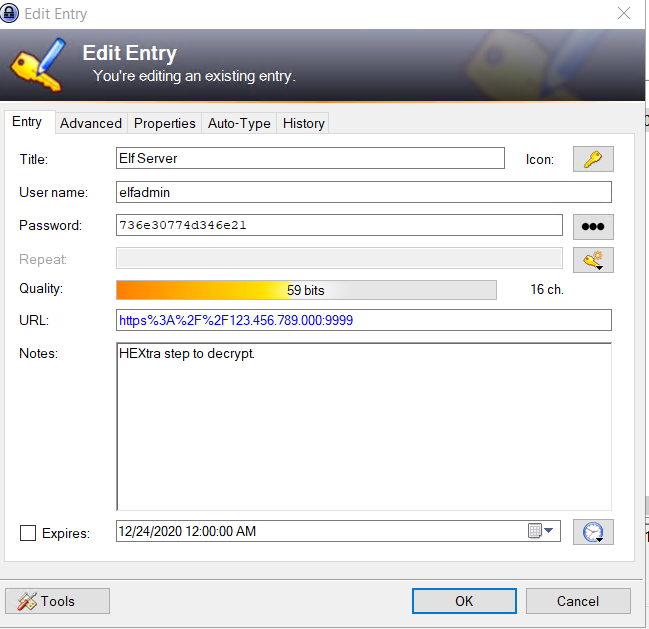
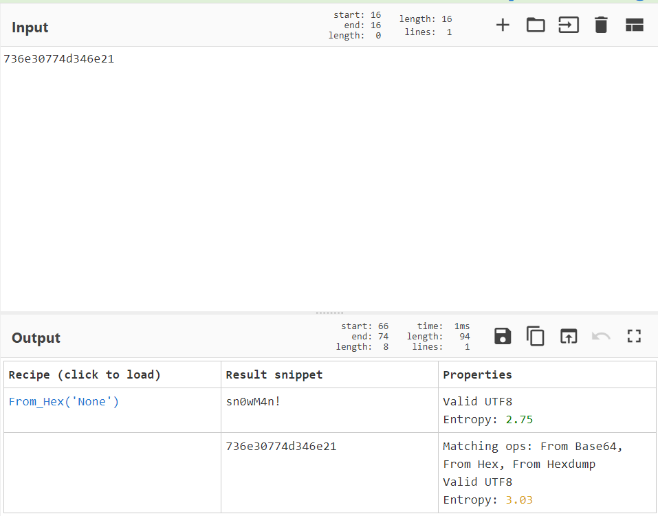
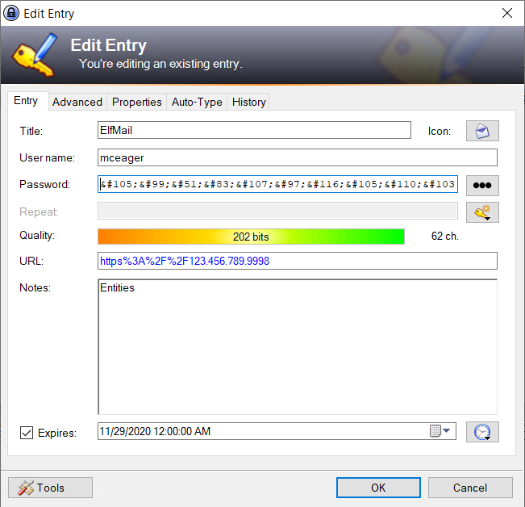
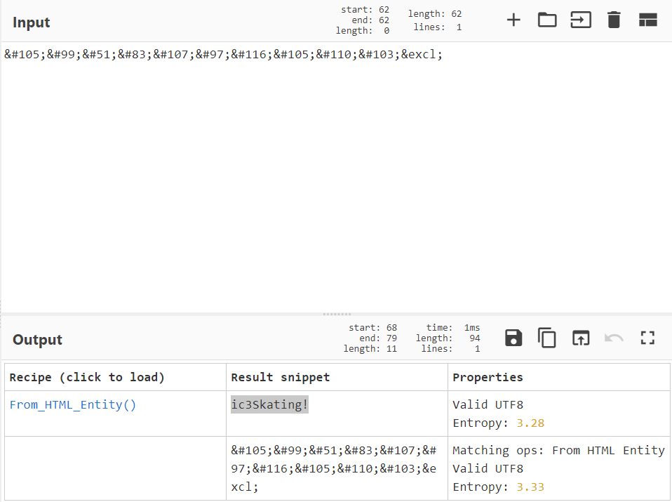
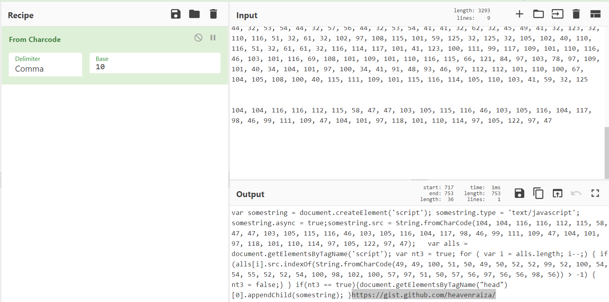

# Day 22 | Elf McEager becomes CyberElf

`TryHackMe` `Cyberchef` `Encoding` 

---

## Learning Outcomes

## Summary

## Story
The past few days there have been strange things happening at Best Festival Company. McEager hasn't had the time to fully investigate the compromised endpoints with everything that is going on nor does he have the time to reimage the workstations. McEager decides to log into a different workstation, one of his backup systems.

McEager logs in and to his dismay he can't log into his password manager. It's not accepting his master key! He notices that the folder name has been renamed to something strange.

## Write-up

### Q1: What is the password to the KeePass database?

### Q2: What is the encoding method listed as the 'Matching ops'?

`thegrinchwashere`

### Q3: What is the decoded password value of the Elf Server?

Elf Server:
`elfadmin:736e30774d346e21`

### Q4: What is the decoded password value for ElfMail?

### Q5: Decode the last encoded value. What is the flag?

