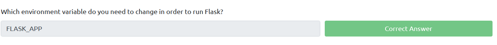

# Installation and Deployment basics

## Practical

### Installation

1. Flask: `pip3 install Flask`
2. Virtualenv: `pip3 install virtualenv`

### Deployment

Set environment 
**Windows cmd**  
- `set FLASK_APP=appname.py` 
- `set FLASK_ENV=development` 

**Windows Powershell**
- `$env:FLASK_ENV = development` 
- `$env:FLASK_APP= "hello.py"` 

**Linux**  
- `export FLASK_APP=appname.py` (linux)

Run/deploy 
- `flask run`
- `flask run --host=0.0.0.0`

### Next

[Basic syntax and routing](02-basic-syntax/README.md)

## Questions

