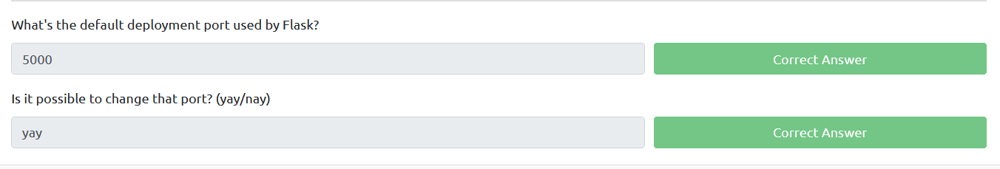

# Basic Syntax and Routing

## Practical

Code  
```
from flask import flask

app = Flask(__name__)

@app.route('/')
def hello_world():
    return 'Hello, World!'
```

This route the web root directory to hello_world() function and return a 'Hello, World!' as a response.

### Next

[HTTP Methods and Template Rendering](../03-HTTP-methods-and-template-rendering/README.md)

## Questions

