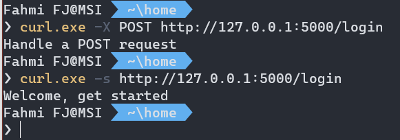
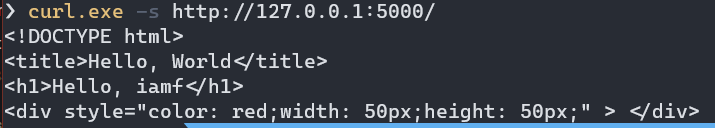

# HTTP Methods and Template Rendering 

## Practical

### HTTP methods
Code:
```python
from flask import Flask, request

app = Flask(__name__)

def do_login():
    return 'Handle a POST request'
def show_home():
    return 'Welcome, get started'

@app.route('/login', methods=['GET', 'POST'])
def login():
    if request.method == 'POST':
        return do_login()
    else:
        return show_home()
```

Test the method



### Template Rendering

Code:

```
from flask import Flask, render_template

app = Flask(__name__, template_folder='template')

@app.route('/')
def home(name=None):
    name='iamf'
    return render_template('index.html', name=name)
```

Template:

```
<!DOCTYPE html>
<title>Hello, World</title>
<h1>Hello, {{name}}</h1>
<div style="color: red;width: 50px;height: 50px;" > </div>
```

Result



### Next
  
[Upload File](04-file-upload/README.md)