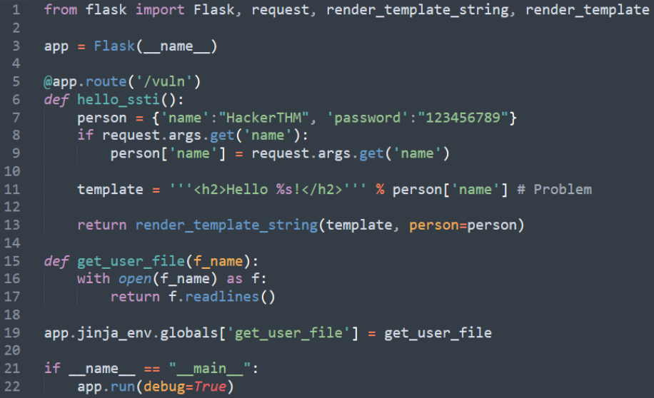
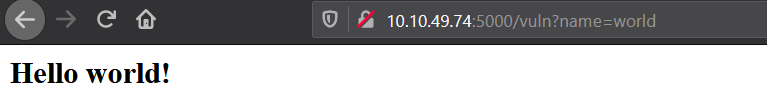
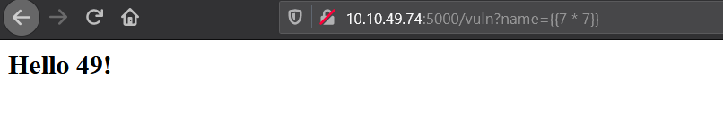
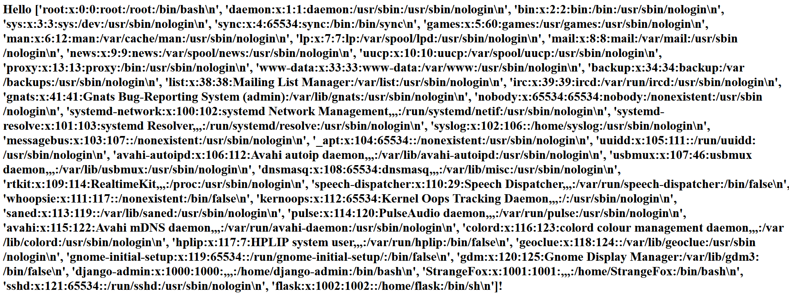

# Flask Injection 

Injection in flask template engine categorized as Server-Side Template Injection vulnerabilities,

It occurs when an unsanitized user input is passed  directly into the application templating process. This allows attackers interfere the templating process by injecting the native template syntax.

## Practical

Vulnerable code:

This is how the app supposed to work.

Below is not.

Example Local File Inclusion :

