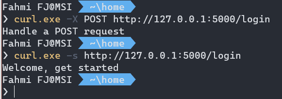
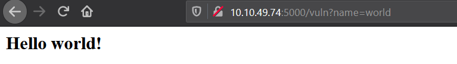
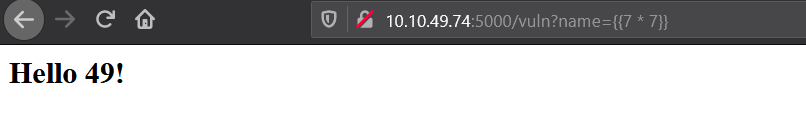

# TryHackMe - Flask

"**Flask** is a micro web framework written in Python. It is classified as a microframework because it does not require particular tools or libraries. It has no database abstraction layer, form validation, or any other components where pre-existing third-party libraries provide common functions. However, Flask supports extensions that can add application features as if they were implemented in Flask itself. Extensions exist for object-relational mappers, form validation, upload handling, various open authentication technologies, and several common framework related tools. "
[Source: Wikipedia]

## Skills Learned

- Basic Flask
- Server Side Template Injection on Flask

---
# Tasks

## Installation and Deployment basics

### Installation

1. Flask: `pip3 install Flask`
2. Virtualenv: `pip3 install virtualenv`

### Deployment

Set environment 

Windows:

- Windows cmd 
  - `set FLASK_APP=appname.py` 
  - `set FLASK_ENV=development` 

- Windows Powershell
  - `$env:FLASK_ENV = development` 
  - `$env:FLASK_APP= "hello.py"` 

Linux:
- `export FLASK_APP=appname.py` (linux)

Run/deploy 
- `flask run`
- `flask run --host=0.0.0.0`

## Basic syntax and routing

### Routing

Code  

```python
from flask import flask

app = Flask(__name__)

@app.route('/')
def hello_world():
    return 'Hello, World!'
```

This route the web root directory to `hello_world()` function and return a 'Hello, World!' as a response.

## HTTP Methods and Template Rendering

### HTTP Methods

Code:

```python
from flask import Flask, request

app = Flask(__name__)

def do_login():
    return 'Handle a POST request'
def show_home():
    return 'Welcome, get started'

@app.route('/login', methods=['GET', 'POST'])
def login():
    if request.method == 'POST':
        return do_login()
    else:
        return show_home()
```

Test the method



### Template Rendering

Code:

```python
from flask import Flask, render_template

app = Flask(__name__, template_folder='template')

@app.route('/')
def home(name=None):
    name='iamf'
    return render_template('index.html', name=name)
```

Template:

```html
<!DOCTYPE html>
<title>Hello, World</title>
<h1>Hello, {{name}}</h1>
<div style="color: red;width: 50px;height: 50px;" > </div>
```

Result


## Upload File 

Code:

```python
from flask import Flask, request
from werkzeug.utils import secure_filename
app = Flask(__name__, template_folder='template')

@app.route('/upload', methods=['GET', 'POST'])
def upload_file():
    if request.method == 'POST':
        f = request.files['the_file']
        f.save('/z/Shared' + secure_filename(f.filename))
```

Html template:

```html
<!DOCTYPE html>
<title>Upload</title>
<form action="/upload" enctype="multipart/form-data" method="POST">
    <input type="file" id="myFile" name="filename">
    <input type="submit">
  </form>
```


## Flask Injection

### Server-Side Template Injection

Injection in flask template engine categorized as Server-Side Template Injection vulnerabilities,

It occurs when an unsanitized user input is passed  directly into the application templating process. This allows attackers interfere the templating process by injecting the native template syntax.

Vulnerable code:


This is how the app supposed to work.



Below is not.



Example Local File Inclusion :


