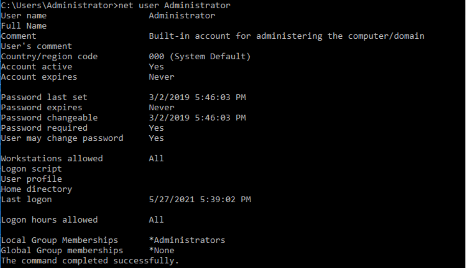
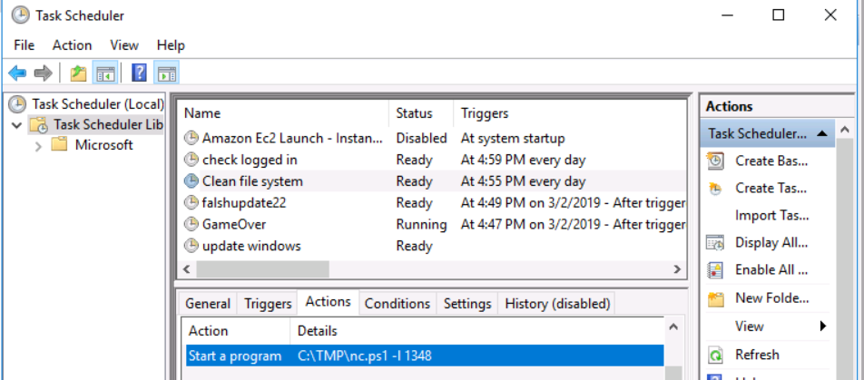

# TryHackMe - Investigating Windows

<fieldset>

<legend>Room Information </legend>

- **Name:**  Investigating Windows
- **Category:** Forensics
- **Difficulty:** 
- **Tools:**
  - Windows default utilities
- **Skills Learned**:
  - Windows Forensics

</fieldset>

## Description

> A windows machine has been hacked, its your job to go investigate this  windows machine and find clues to what the hacker might have done.

---

## Task 1: Investigating Windows

Available users 


Last logon of user Jenny is never. Jenny is an Administrator


Last logon of user John is 3rd February 2019 (3/2/2019).


Last logon of user Administrator is today (27th May 2021)



There is also a Guest account, which surprisingly an Admin


There is a malicious task opening a bind shell on port 1348 using netcat version of PowerShell.



There is a malicious task harvesting logon password. Judging from the syntax, it can be `mimikatz`.


According to the event logger, there is no log from 2020. The logs start from 3/2/2019.


Digging into app and services logs, there is a RDP session from 88.104.10.206


The attacker uses TMP folder in C:\ to store data


The computers trying to connect to `20.54.89.106` on port 443.


The DNS has been poisoned


With dig, I can verify that IP is not Google's IP.


There is also interesting Firewall rules that allows inbound connection on port 1337


---

## Commands log

Cmd

```
systeminfo
net users
net user [username]
netstat -ano
ipconfig /displaydns
```


PowerShell

```
Get-WmiObject -Class Win32_OperatingSystem
Get-WmiObject -Class win32_UserAccount
```

