# TryHackMe - Yara

<fieldset>

<legend>Room Information</legend>

- **Name:** [Yara](https://tryhackme.com/room/yara)

- **Category:** Forensics

- **Difficulty:** Easy

- **Tools**:
  - Yara - https://github.com/virustotal/yara/releases
  
- **Skills Learned**
  - Threat Hunting with Yara
  - DFIR

</fieldset>

## Description

> Learn the applications and language that is Yara for everything threat intelligence, forensics, and threat hunting!

---

## Task 2: What is Yara?

- Yara is a tool that can be used to identify and classify malware samples using a set of description called rule.
- Yara rule consists a set of strings and boolean expressions.
- Yara identify malware based on their textual (string) or binary pattern (in hex)

## Task 3: Installing Yara

- Package manager: `sudo apt update -y && sudo apt install yara`
- From source:   https://github.com/virustotal/yara
- Binary:  https://github.com/virustotal/yara/releases

## Task 5: Introduction to  Yara Rules

- Usage: `yara [rules] [sample(pid|dir|file)]`
- `.yar` is the standard extension for Yara rules

Sample rule

```
rule sample1_rule {
        condition: true
}
```

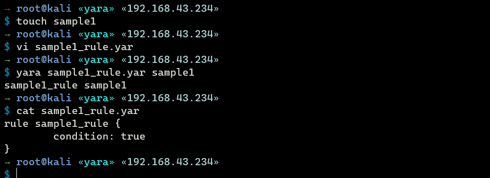

## Task 6:  Expanding Yara Rules

Example other Yara rules that can be defined (https://yara.readthedocs.io/en/stable/writingrules.html):

- Keyword
- Desc
- Meta
- Strings
- Condition
- Weight

Example of rule to find string of "Hello World!", lower case or upper case version will not match:

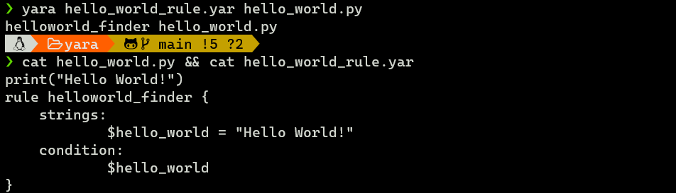

Solve problem above by setting condition with `any of them` and add more strings

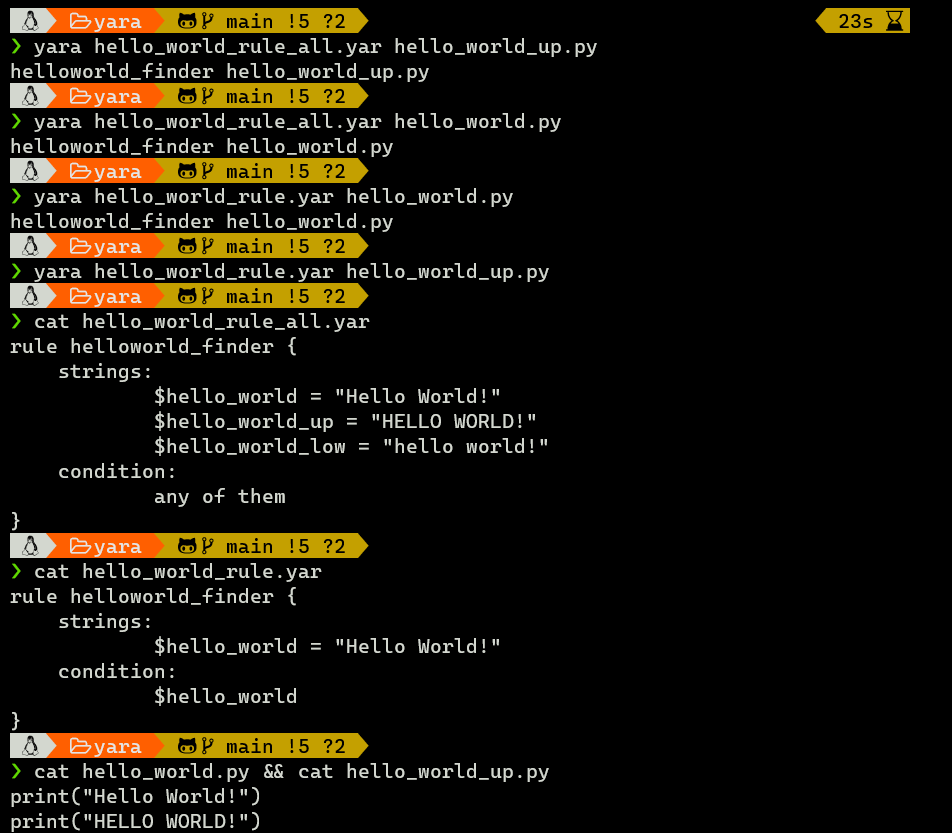

Beside `true` and `any of them`, condition can be used with other boolean expressions:

- `<=` or `>=`, determine the occurrences
- `!=`

## Task 7: Yara Modules

There are frameworks to automatically generate Yara rules based on specific behaviours.

- Cuckoo
- Python PE

## Task 8: Other tools and Yara

Tools that has been integrated with Yara

- LOKI
- THOR
- Fenrir
- YAYA

## Task 9: Using LOKI and its Yara rule set

### Scanning file1 - ind3x.php

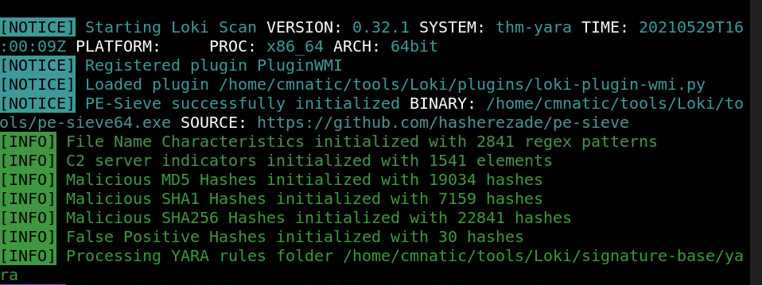

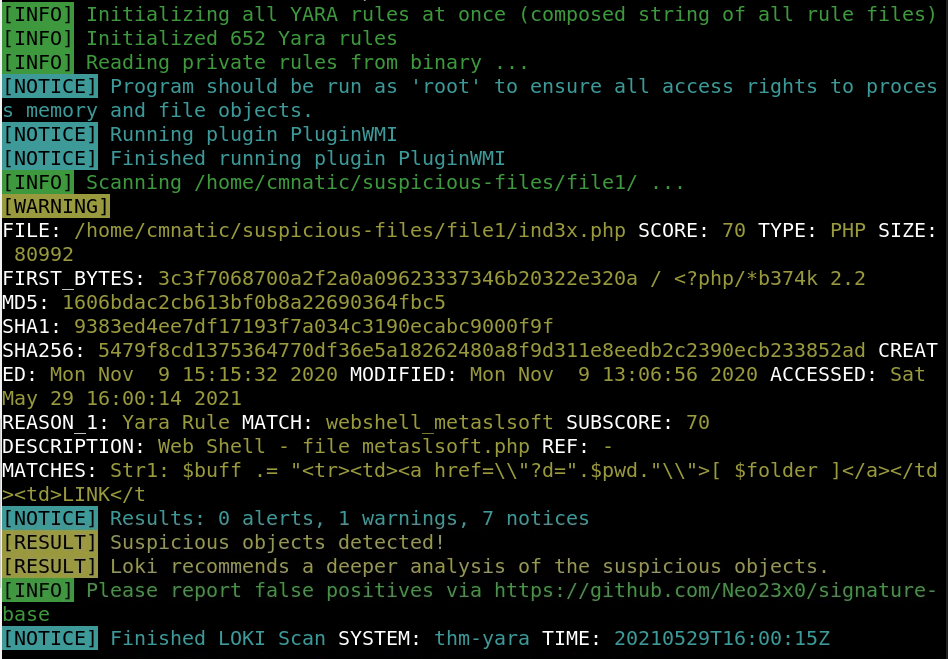  

Rule match with file 1

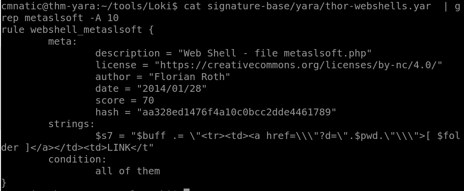

### Scanning file 2 - 1ndex.php

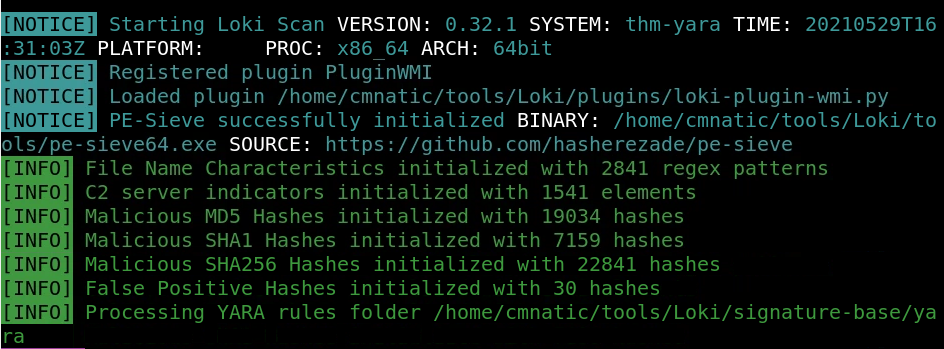

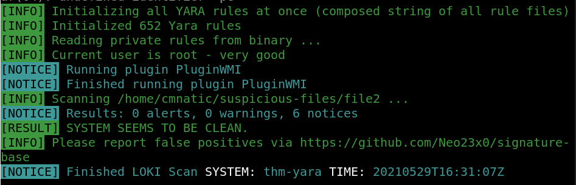

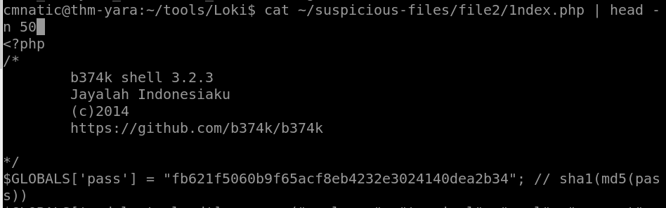

## Task 10: Creating Yara rules with yarGen

Generating rules from file2/1ndex.php

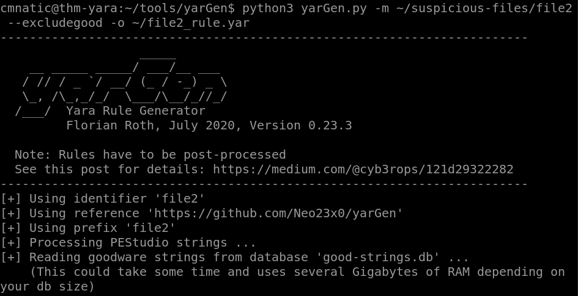

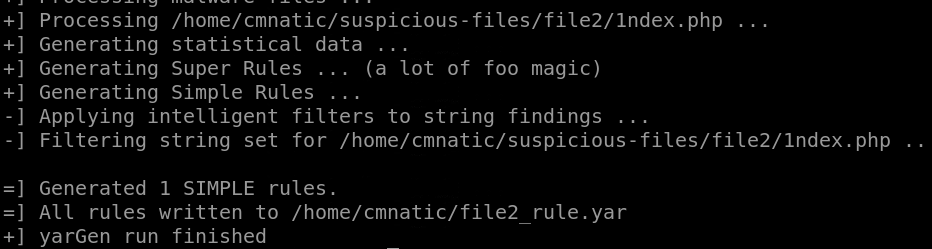

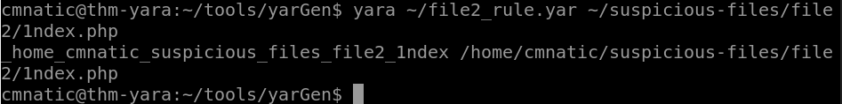

## Task 11:  Valhalla 

sha256 of file 1:

```
5479f8cd1375364770df36e5a18262480a8f9d311e8eedb2c2390ecb233852ad 
```

File 1 result:

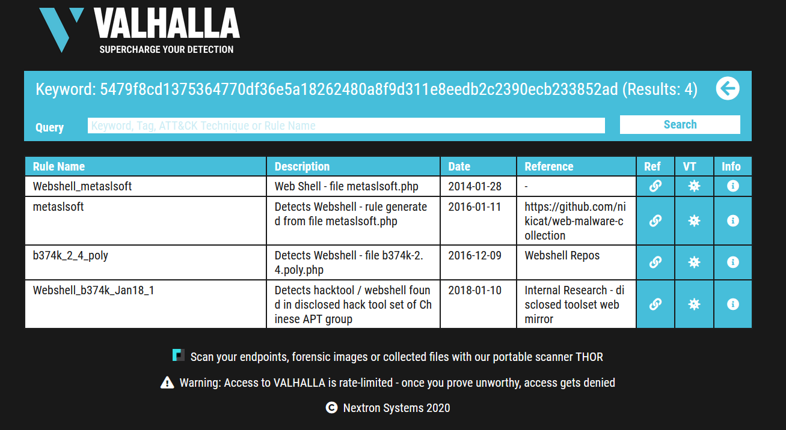

sha256 of file2:

```
53fe44b4753874f079a936325d1fdc9b1691956a29c3aaf8643cdbd49f5984bf
```

File 2 result:

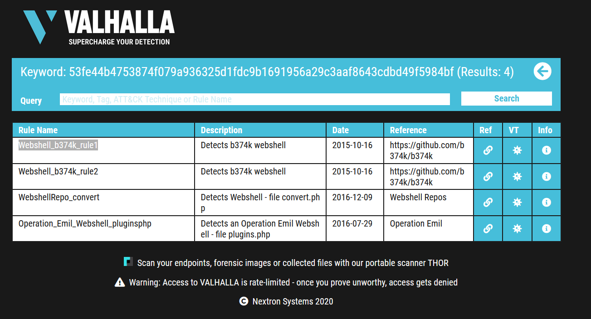


---

## Command Logs

```
apt install yara
touch sample1
vi sample1_rule.yar
cat sample1_rule.yar
    rule sample1_rule {
            condition: true
    }
yara hello_world_rule_all.yar hello_world_up.py
yara hello_world_rule_all.yar hello_world.py
cat hello_world_rule_all.yar
rule helloworld_finder {
    strings:
            $hello_world = "Hello World!"
            $hello_world_up = "HELLO WORLD!"
            $hello_world_low = "hello world!"
    condition:
            any of them
}
cat hello_world.py && cat hello_world_up.py
print("Hello World!")
print("HELLO WORLD!")
python loki.py -p ~/suspicious-files/file1/
python loki.py -p ~/suspicious-files/file2/
python3 yarGen.py -m ~/suspicious-files/file2 --excludegood -o ~/file2_rule.yar
cp ~/file2_rule.yar ~/tools/Loki/signature-base/
sha256sum ~/suspicious-files/file1/
sha256sum ~/suspicious-files/file2/
```


