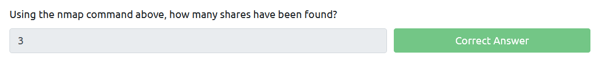
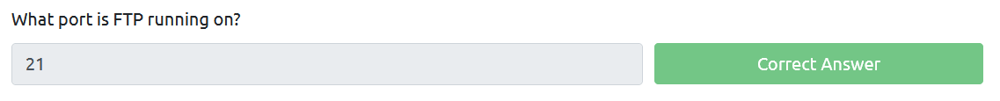
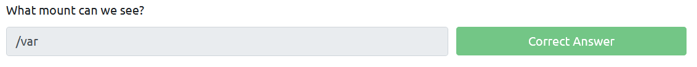

# Task 2: Enumerating Samba for shares 

## Practical

SMB enumeration with nmap:
```
$ nmap -p 445 --script=smb-enum-shares.nse,smb-enum-users.nse -oA scans/15-smb-enum 10.10.1.171
... <snip> ...
PORT    STATE SERVICE
445/tcp open  microsoft-ds

Host script results:
| smb-enum-shares:
|   account_used: guest
|   \\10.10.1.171\IPC$:
|     Type: STYPE_IPC_HIDDEN
|     Comment: IPC Service (kenobi server (Samba, Ubuntu))
|     Users: 1
|     Max Users: <unlimited>
|     Path: C:\tmp
|     Anonymous access: READ/WRITE
|     Current user access: READ/WRITE
|   \\10.10.1.171\anonymous:
|     Type: STYPE_DISKTREE
|     Comment:
|     Users: 0
|     Max Users: <unlimited>
|     Path: C:\home\kenobi\share
|     Anonymous access: READ/WRITE
|     Current user access: READ/WRITE
|   \\10.10.1.171\print$:
|     Type: STYPE_DISKTREE
|     Comment: Printer Drivers
|     Users: 0
|     Max Users: <unlimited>
|     Path: C:\var\lib\samba\printers
|     Anonymous access: <none>
|_    Current user access: <none>
|_smb-enum-users: ERROR: Script execution failed (use -d to debug)
... <snip> ...
```

Inspect `anonymous` shares
```
$ smbclient -N //10.10.1.171/anonymous 
smb: \> ls
  .                                   D        0  Wed Sep  4 06:49:09 2019
  ..                                  D        0  Wed Sep  4 06:56:07 2019
  log.txt                             N    12237  Wed Sep  4 06:49:09 2019

                9204224 blocks of size 1024. 6877108 blocks available
smb: \> mget log.txt
Get file log.txt? y
getting file \log.txt of size 12237 as log.txt (11.7 KiloBytes/sec) (average 11.7 KiloBytes/sec)
```

Inspect `log.txt` file
```
$ cat log.txt
Generating public/private rsa key pair.
Enter file in which to save the key (/home/kenobi/.ssh/id_rsa):
Created directory '/home/kenobi/.ssh'.
Enter passphrase (empty for no passphrase):
Enter same passphrase again:
Your identification has been saved in /home/kenobi/.ssh/id_rsa.
Your public key has been saved in /home/kenobi/.ssh/id_rsa.pub.
The key fingerprint is:
SHA256:C17GWSl/v7KlUZrOwWxSyk+F7gYhVzsbfqkCIkr2d7Q kenobi@kenobi
The key's randomart image is:
+---[RSA 2048]----+
|                 |
|           ..    |
|        . o. .   |
|       ..=o +.   |
|      . So.o++o. |
|  o ...+oo.Bo*o  |
| o o ..o.o+.@oo  |
|  . . . E .O+= . |
|     . .   oBo.  |
+----[SHA256]-----+
... <snip> ...
```

NFS enumeration with nmap 
```
$ nmap -p 111 --script=nfs-ls,nfs-statfs,nfs-showmount 10.10.1.171
Starting Nmap 7.80 ( https://nmap.org ) at 2021-03-26 16:24 EDT
Nmap scan report for 10.10.1.171
Host is up (0.36s latency).

PORT    STATE SERVICE
111/tcp open  rpcbind
| nfs-ls: Volume /var
|   access: Read Lookup NoModify NoExtend NoDelete NoExecute
| PERMISSION  UID  GID  SIZE  TIME                 FILENAME
| rwxr-xr-x   0    0    4096  2019-09-04T08:53:24  .
| rwxr-xr-x   0    0    4096  2019-09-04T12:27:33  ..
| rwxr-xr-x   0    0    4096  2019-09-04T12:09:49  backups
| rwxr-xr-x   0    0    4096  2019-09-04T10:37:44  cache
| rwxrwxrwt   0    0    4096  2019-09-04T08:43:56  crash
| rwxrwsr-x   0    50   4096  2016-04-12T20:14:23  local
| rwxrwxrwx   0    0    9     2019-09-04T08:41:33  lock
| rwxrwxr-x   0    108  4096  2019-09-04T10:37:44  log
| rwxr-xr-x   0    0    4096  2019-01-29T23:27:41  snap
| rwxr-xr-x   0    0    4096  2019-09-04T08:53:24  www
|_
| nfs-showmount:
|_  /var *
| nfs-statfs:
|   Filesystem  1K-blocks  Used       Available  Use%  Maxfilesize  Maxlink
|_  /var        9204224.0  1836524.0  6877104.0  22%   16.0T        32000

Nmap done: 1 IP address (1 host up) scanned in 10.44 seconds
```


## Questions




