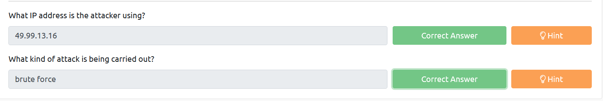

# Insufficient Logging and Monitoring 

The information stored in logs should include:

- HTTP status codes
- Time Stamps
- Usernames
- API endpoints/page locations
- IP addresses

## Practical
Example log
```
200 OK           12.55.22.88 jr22          2019-03-18T09:21:17 /login
200 OK           14.56.23.11 rand99        2019-03-18T10:19:22 /login
200 OK           17.33.10.38 afer11        2019-03-18T11:11:44 /login
200 OK           99.12.44.20 rad4          2019-03-18T11:55:51 /login
200 OK           67.34.22.10 bff1          2019-03-18T13:08:59 /login
200 OK           34.55.11.14 hax0r         2019-03-21T16:08:15 /login
401 Unauthorised 49.99.13.16 admin         2019-03-21T21:08:15 /login
401 Unauthorised 49.99.13.16 administrator 2019-03-21T21:08:20 /login
401 Unauthorised 49.99.13.16 anonymous     2019-03-21T21:08:25 /login
401 Unauthorised 49.99.13.16 root          2019-03-21T21:08:30 /login
``` 

401 means an unauthorised attempt. An IP address `49.99.13.16` attempting to login with different username in each request, this is probably a brute force attack.

## Questions
