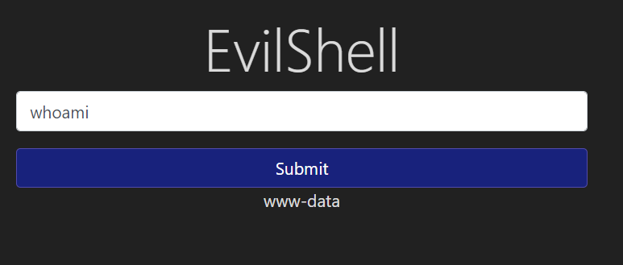
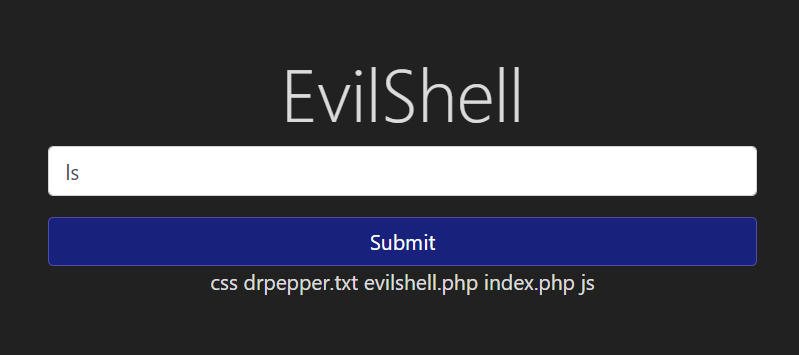
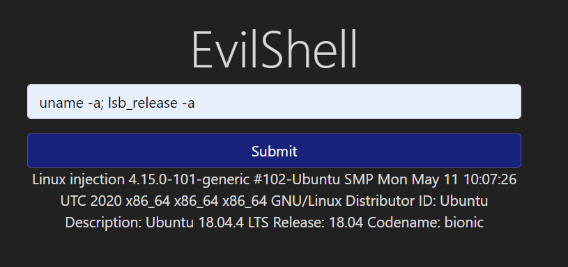
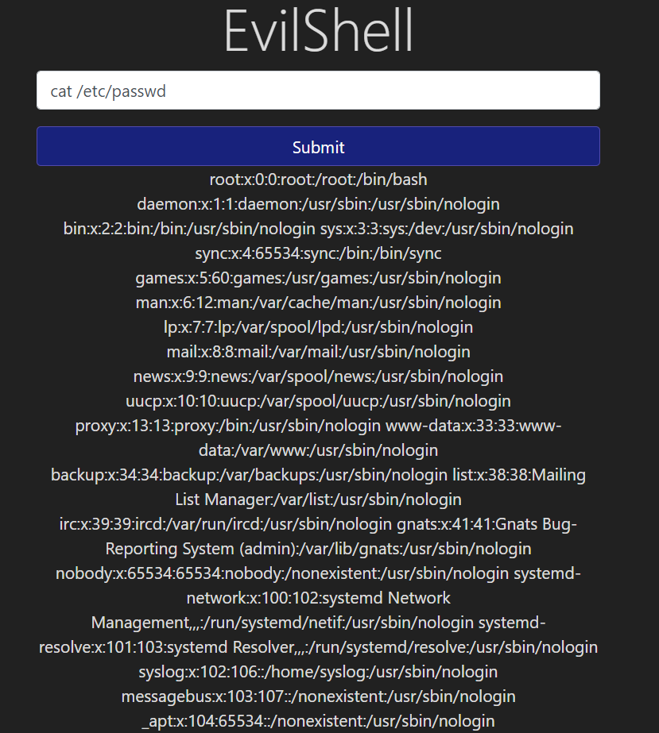
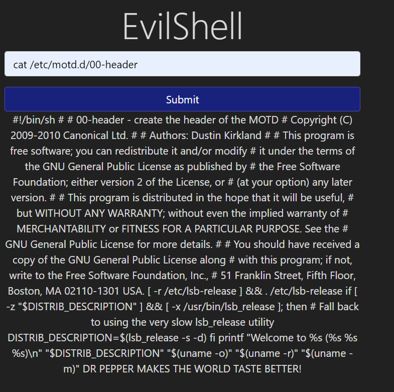
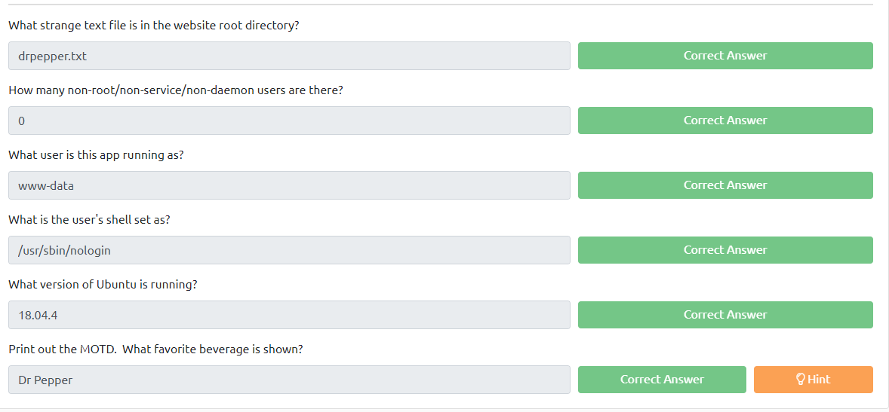

# Command Injection
Notes:
Active command injection returns the reponse, visible in user.
Blind command injection does not return the error/hidden/not visible in the html page.

Example vulnerable code.
```
<?php 	
	if (isset($_GET['commandString'])) {
		$command_string = $_GET['commandString'];
		
		try {
			passthru($command_string);
		} catch (Error $error){
			echo "<p class=mt-3><b>$error</b></p>";
		}
 	}
?>
```


## Practical





```
uname -a; lsb_release -a
```



```
cat /etc/passwd
```



```
cat /etc/update-motd.d/00-header
```


## Question

