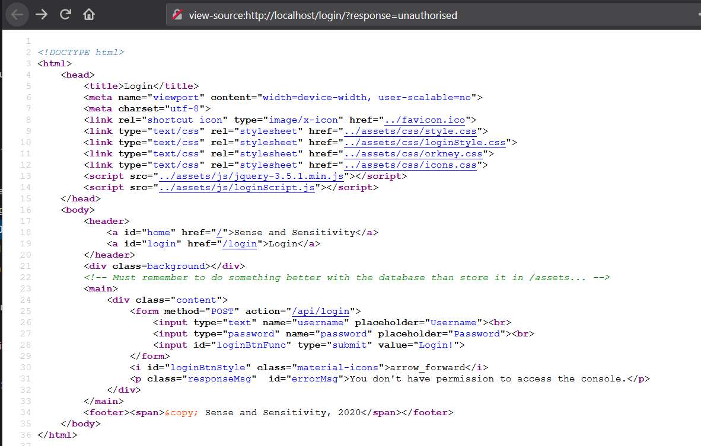
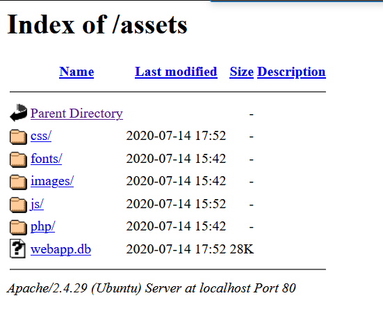
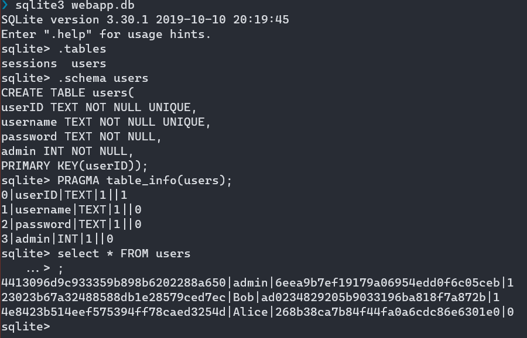
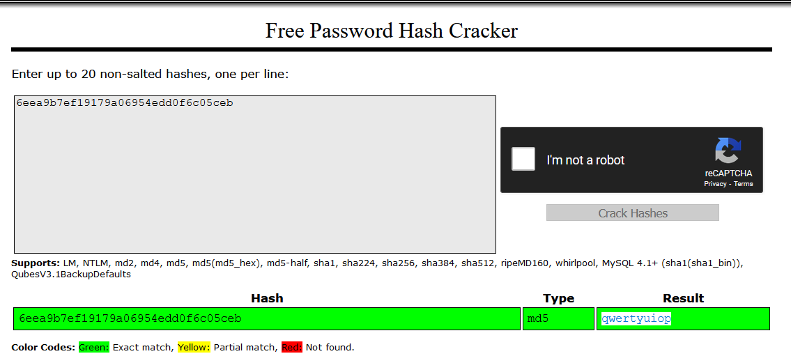
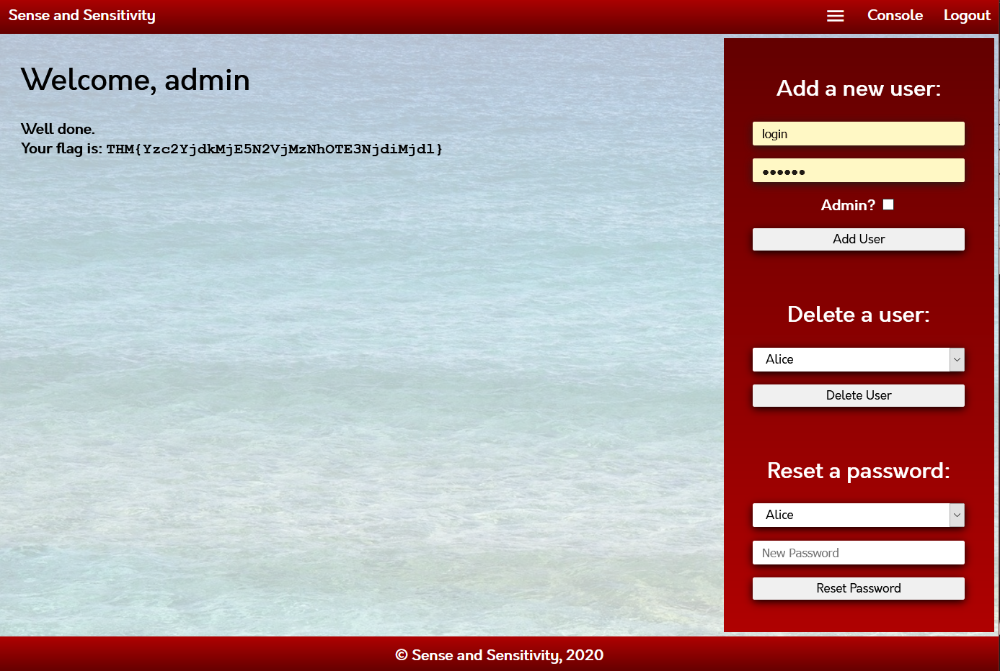
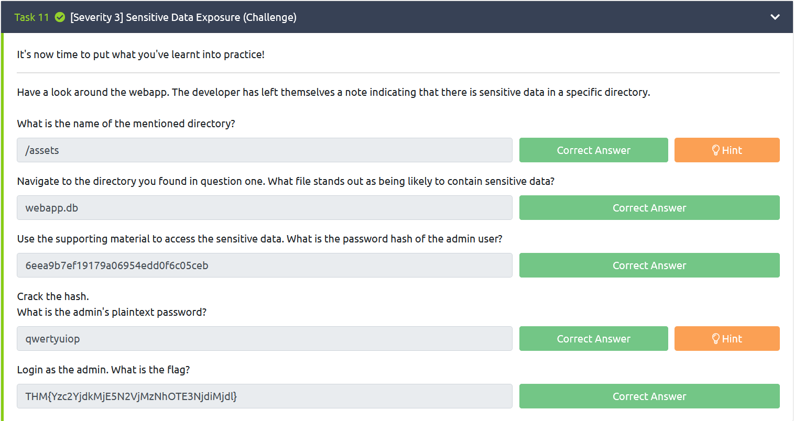

# Sensitive Data Exposure

Note:
- When web apps accidentally divulges sensitive data (e.g. username, password, email, banking-related information, etc), it referred as "Sensitive Data Exposure"
- In network level, an attacker who can sniffs / eavesdropping to the network packet/traffic (Man-in-the Middle) may obtains a sensitive data as well as intercepting data. 

### sqlite3 note

Accessing database 
```
$ sqlite filename.db
```

Get all tables
```
sqlite>.tables
```

Get table columns
```
sqlite> PRAGMA table_info(tablename)
```


## Practical / Challenge

> Have a look around the webapp. The developer has left themselves a note indicating that there is sensitive data in a specific directory. 

Leaving to do note in html comment is bad.



Directory listing found in /assets



Sensitive data from webapp.db



Cracked password



Logged in




## Questions
