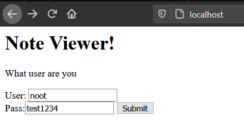
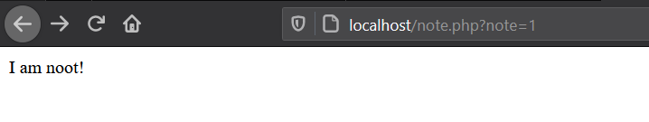
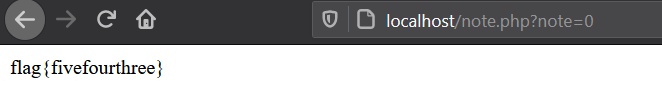
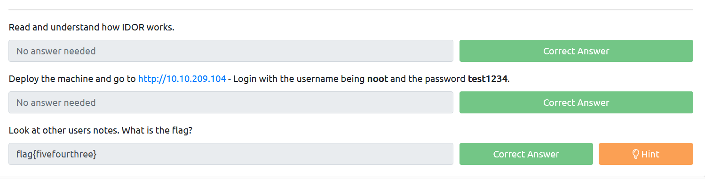

# Broken Access Control

Broken access control is a vulnerability that allows an unauthorized user to view or access a protected page/pages.

Example:

UserA is a normal user and is logged in to a web app 

`http://example.com/home?id=1000`

Suppose that id = 1 belongs to a admin user, if the apps didn't properly configured the access control logic.
It might be possible an attacker could just change the id from 1000 to 0.

`http://example.com/home?id=0`
 
## Practical 
 
### Insecure Direct Object Reference
 
IDOR is a type of access control vulnerability that allows a user accessing other users resources.

Another example is an unauthorized user can access  

http://example.com/username/file?fileId=2820 -> thesis.pdf 
to
http://example.com/username/file?fileId=100 -> alloreillybookspirated.pdf

## Questions

