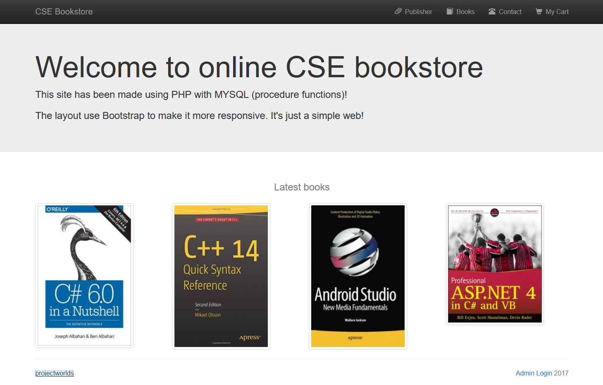
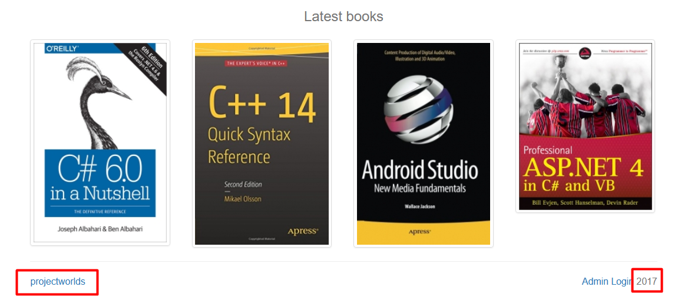
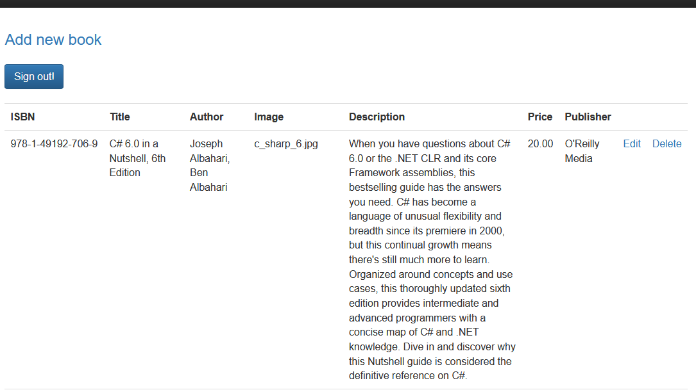
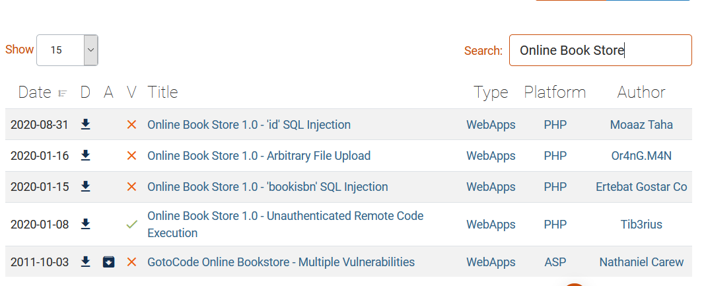
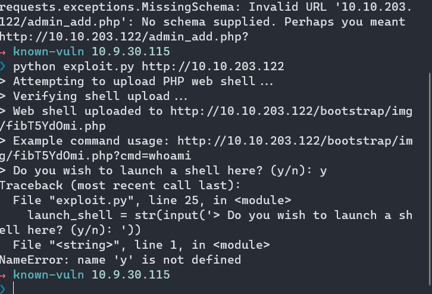
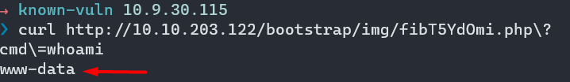
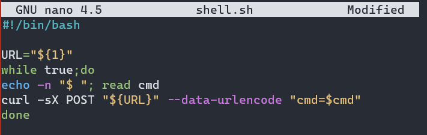
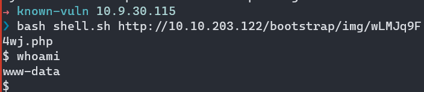

# Components With Known Vulnerabilities

A public exploit (PoC) of CVEs sometimes can be used and is work against an unupdated/old software version.

With this known vulnerabilities, the attackers only need to gather enough related information of the app.

Note:
- Most public exploit will just tell what arguments you need to provide, but some may not or even need a bit modification to get it work.

## Practical

### Gathering information

First, let's take a look into the footer section

Note:
- `projectworlds` - is the developers  
- `2017` - probably year of software release/made.

It's a free software.

https://projectworlds.in/free-projects/php-projects/online-book-store-project-in-php/

We can login with the default username and password   

- username : `admin@admin.com`
- password : `admin`
  

exploitdb search results

Let's see how we can fix this.

But since the webshell was already uploaded

We could make a pseudo-shell after we change the `$_GET` to `$_REQUEST`

