# TryHackMe - Pickle Rick

A Rick and Morty CTF. Help turn Rick back into a human!

## Skills Learned

- Common enumeration 
  - Inspecting Page Sources
  - Directory Brute Force
- Use of alternative binary to read file content

# Tasks

## Pickle Rick

### Identify Web technologies

- Web server: apache
- Language used: php
- Host: Ubuntu

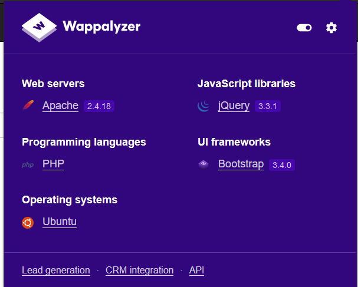

### Inspection Page Source

Undeleted comment on HTML codes.

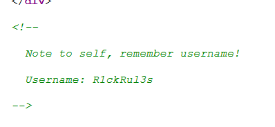

### Directory Brute Force

Finding hidden web path/directory

```bash
gobuster dir -u http://10.10.240.27/ -w raft-large-directories.txt -x php,html,txt -t 20
```

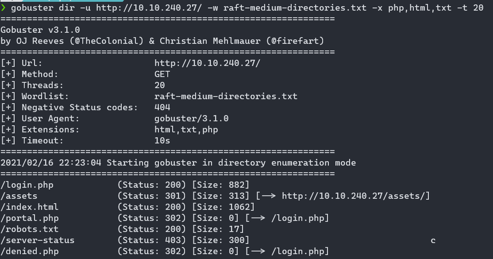

```bash
$ curl -s http://10.10.240.27/robots.txt
Wubbalubbadubdu
```


### Access on `/portal.php`

`R1ckRul3s:Wubbalubbadubdub`


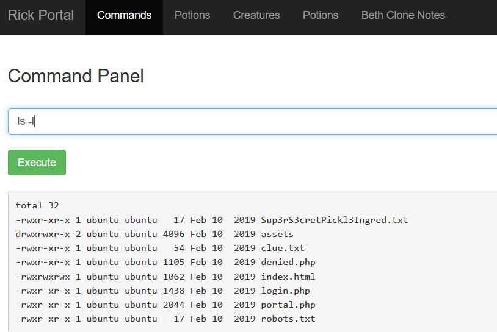

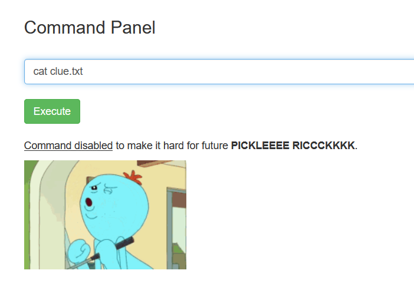

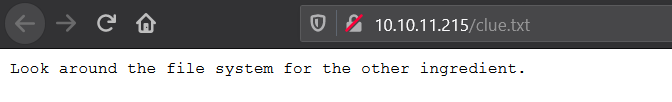

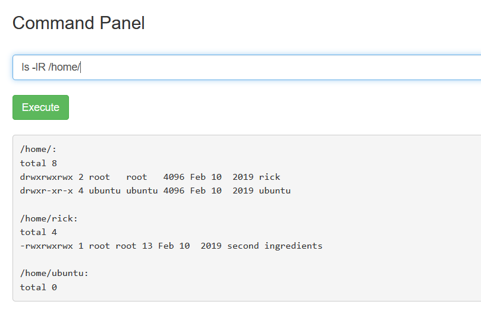


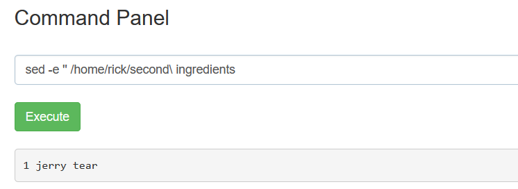

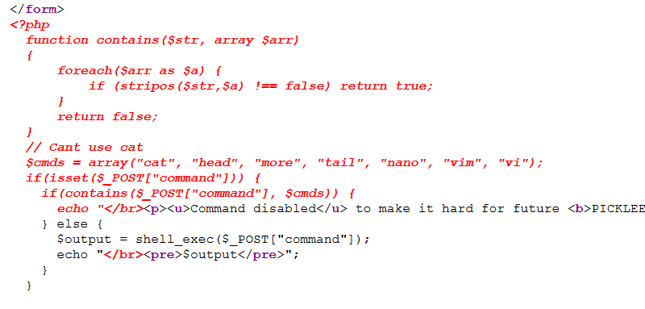

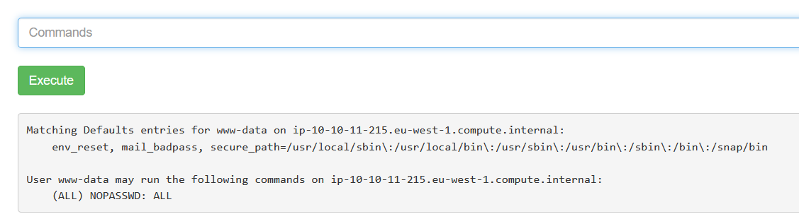

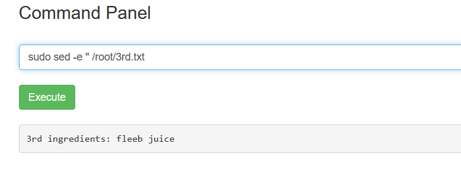